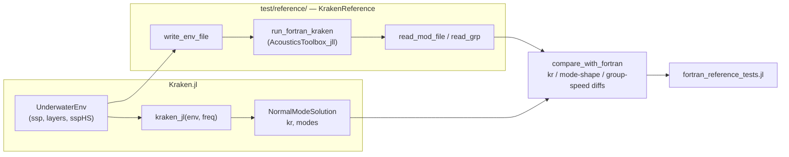
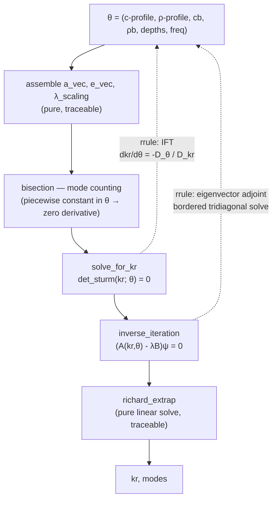

# Plan: Kraken.jl Revival — Trustworthy Solver, Fortran Oracle, Reverse-Mode AD

| Field | Value |
|-------|-------|
| Status | in-progress |
| Created | 2026-08-07 |
| Ticket | N/A |
| Branch | `revival` (off `master`) |

## Context

Kraken.jl is a pure-Julia normal-mode solver that has drifted: the documented test command errors out,
the suite aborts partway through on a stale rename, 9 of 21 declared dependencies are unused, and the
Fortran comparison layer is dead code referencing symbols that exist nowhere. This plan restores a
green, honest test suite; establishes unmodified Fortran KRAKEN as a first-class reference oracle;
delivers reverse-mode AD via implicit-function-theorem rules; and then closes the three highest-value
feature gaps against the original KRAKEN (attenuation, boundary conditions / SSP interpolation,
pressure-field computation).

Everything below the first two milestones depends on being able to *trust* the forward solve, which is
why the Fortran oracle lands before the AD work.

## Development Workflow (applies to every task in this plan)

**Use the Julia MCP (`kaimon`) as the default tool for anything Julia-related.** It runs against a live,
persistent REPL with Revise attached, which is dramatically faster than spawning `julia -e ...` per check and
lets the user watch what is being run. Specifically:

| Instead of | Use |
|---|---|
| `julia -e '...'`, `julia --project=. -e '...'` via Bash | `ex(e="...")` — persistent REPL, Revise auto-reloads `src/` edits, no startup cost per call |
| `Pkg.test()` through Bash | `run_tests(project_path="/Users/arielv/programs/29.02-KRAKEN.jl")` — spawns the correct test env and streams results |
| `grep`/`rg` for a symbol you can name | `grep_code(pattern="...")` — repo-scoped, and every hit carries its enclosing function/struct |
| `grep` when you can only *describe* the code | `search_code(query="...")` — semantic search; the right default when hunting unfamiliar code |
| Reading a file to find a type's fields or a function's methods | `type_info("...")`, `search_methods("...")`, `list_names("Kraken")` — reflection on the live module |
| `julia -e 'using JuliaFormatter; format(".")'` | `format_code(path="...")` |
| `Pkg.add(...)` | `pkg_add(packages=[...])` |

### Sessions

**Spawn the sessions you need; do not wait to be given one.** `start_session(project_path=...)` creates a
REPL for any allowed project, and `ping` / "No session matched" is the signal to call it. Two sessions are
worth keeping alive for this repo, because they are *different environments*:

| Session | `project_path` | Why |
|---|---|---|
| package | `/Users/arielv/programs/29.02-KRAKEN.jl` | `src/` work, solver experiments, the analytic Pekeris cross-checks |
| test env | `/Users/arielv/programs/29.02-KRAKEN.jl/test` | `ForwardDiff`, `FiniteDiff`, `BenchmarkTools`, `Roots` live **only** in `test/Project.toml` — `include`ing `test/automatic_differentiation_tests.jl` or `test/performance_tests.jl` in the package session fails with `ArgumentError: Package ForwardDiff not found in current path` |

Pass the 8-character key explicitly (`ex(e="...", ses="…")`) once more than one session is connected —
tools error out with the available keys rather than guessing. Shut a session down with
`manage_repl(command="shutdown")` when its project is no longer in play, so the key list stays short and
unambiguous; `manage_repl(command="restart")` (same key, fresh state) is the fast fix for world-age or
stale-state errors after a structural change (new `include`, changed `__init__`, added extension).

**Revise is attached and is the whole point of a long-lived session.** Edit `src/`, then immediately re-run
the test file in the same session — no restart, no reload, no re-precompilation. Never call
`Revise.revise()` yourself (it is a stripped no-op), and never `Pkg.activate()` inside a shared REPL (it
changes the user's environment out from under them). Adding a new `export` is one of the few edits Revise
handles cleanly *only* on a fresh `using` — if a name still reads as undefined after you exported it,
restart rather than debugging the export.

### Other rules of thumb

`println` output is stripped, so return a final expression with `q=false` when you need a value back.
Evaluations past ~30 s auto-promote to background jobs; poll `check_eval` at ~30 s intervals rather than
blocking, and do useful work in between instead of spinning on it — a cold session's first
`using Kraken, ForwardDiff, FiniteDiff` takes ~1 minute, and the AD suite ~70 s. `format_code` needs
JuliaFormatter installed *in that session's* environment; when it is not, fall back to
`julia -e 'using JuliaFormatter; format_file(...)'` from the global env rather than adding JuliaFormatter as
a project dependency. Bash remains appropriate for git operations, file moves, non-Julia tooling, and for
the `Pkg.test()` runs that must be verified as a *subprocess from the root env* exactly as documented.

## Verified Baseline (measured 2026-08-07, commit `753875f`)

These are facts established by running the code, not assumptions. Tasks below reference them.

| Observation | Evidence |
|---|---|
| `julia --project=test -e 'Pkg.test()'` (the command in `CLAUDE.md`) **errors immediately** | `ERROR: The Project.toml of the package being tested must have a name and a UUID entry` — `test/Project.toml` has neither; `Pkg.test()` must be run from the *root* env, which then picks up `test/Project.toml` automatically |
| Suite **aborts** before AD tests ever run | `UndefVarError: one_layer_env not defined` at `test/integration_tests.jl:129` |
| 2 pre-abort failures, both **wrong assertions, not solver bugs** | `test/environment_tests.jl:98` asserts Munk `min(c) < 1490` but canonical Munk minimum is exactly 1500.0 m/s; `:106` computes `depths = -ssp[:,1]` then asserts `min_depth > 1000` — sign error |
| `test/fortran_interface_tests.jl` is **dead code** | references `EnvKRAKEN` and `kraken`, which exist in neither `Kraken` nor `KrakenFortran` |
| Tests call an API that does not exist | `one_layer_env(g=1.0)` — no `g` kwarg anywhere; source name is `one_layer_test_dict_KRAKEN` |
| 9 unused deps | `DSP`, `FFTW`, `JLD2`, `QuadGK`, `Parameters`, `ProgressMeter`, `Distributed`, `FiniteDiff` are referenced by no file in `src/`; `CairoMakie` only by `kraken_plots.jl`, which `Kraken.jl` does not `include` |
| Root `Project.toml` has **both** `[extras]`/`[targets]` and a separate `test/Project.toml` | contradictory; `test/Project.toml` wins, `[extras]` is dead weight |
| `Makefile` is dead | targets `src_fortran/source/*.f90`, a directory moved out to KrakenFortran.jl in commit `49d9343`. `CLAUDE.md` still documents `make` as a working command |
| `docs/make.jl` cannot run | `using Documenter, KRAKEN` — module is named `Kraken` |
| No CI whatsoever | no `.github/` directory |
| `soundspeed`, `maxsoundspeed`, `density` are defined but **not exported** | `environment_tests.jl` errors with `UndefVarError` on all three; found during 1.1 once the suite could run — feeds task 1.5 |
| The removed `EnvKRAKEN` API is called from **6 more live files** | `test/performance_tests.jl:273`, `test/timings_vs_fortran.jl:36`, and `examples/testkrak{3,4,5,6}.jl` + `testkrak_mnulti_processing.jl`. Found during 1.4 — feeds tasks 1.6 (perf suite errors on it) and 8.3 (every example is broken) |
| `Kraken` is **already registered in General** (uuid `269dd85f-…`) | so `--project=test` without a dev-link silently resolves to the *released* version, not the working tree; found during 1.1 — also settles the registration question in 8.4 |
| `AcousticsToolbox_jll` ships prebuilt reference binaries | confirmed installed: `kraken.exe`, `krakenc.exe`, `field.exe`, `bounce.exe`, … for all platforms |

### Real bugs found by inspection (not yet covered by any test)

| # | Location | Defect |
|---|---|---|
| B1 | `src/kraken_core.jl:84` | `Base.show(::SampledDensity1D)` prints `ρint.type` — no such field. Any `show` of a density profile throws. |
| B2 | `src/kraken_pekeris.jl` `pressure_f` | calls `get_modal_function(env, krs, freq, zr, zs)` (5 args); only a 3-arg method exists. `MethodError` on every call. Should be `get_modal_function_values`. |
| B3 | `src/kraken_core.jl:427-429` | `if stop_at_k !== nothing && k == stop_at_k; p2, mode_count; end` — an expression statement, not a `return`. The early-exit feature silently does nothing. |
| B4 | `src/kraken_core.jl:478` | `kLeft[Δn]` is indexed without guarding `Δn == 0` → `BoundsError` reachable. |
| B5 | `src/kraken_core.jl` `UnderwaterEnv` | the two constructors disagree on `depth`: `layers[end,3]` vs `ssp[end,1]`. |

## Architecture Decisions

- **Fortran reference = unmodified `kraken.exe` from `AcousticsToolbox_jll`, driven over `.env`/`.mod` files.**
  Rationale: it is the genuine upstream code (validating against a fork proves nothing), it is a registered
  Julia artifact so CI needs no gfortran, and `.env`/`.mod` is the toolbox's stable documented interface.
  Process-spawn cost is irrelevant for a test oracle. An env var `KRAKEN_FORTRAN_BIN` overrides the jll with
  a local build (`/Users/arielv/programs/AcousticsToolboxOALIB/bin`) for version-specific comparisons.

- **KrakenFortran.jl is decoupled, not deleted.** It stops being referenced by Kraken.jl entirely. It remains
  a separate project offering an *in-process* `ccall` path, which is genuinely faster for broadband sweeps —
  useful later, but not as the correctness oracle, because its sources are a MEX-adapted fork of older KRAKEN.

- **Reverse-mode AD via `ChainRulesCore.rrule`, not by tracing the solver.** The solver's in-place cache
  mutation (`create_finite_diff_matrix!` / `return_finite_diff_matrix!`) is fatal for Zygote and painful for
  Enzyme. With an implicit-function-theorem rule attached at `solve_for_kr` and an eigenvector-adjoint rule at
  `inverse_iteration`, the internals become opaque and their mutation stops mattering. One set of rules serves
  Zygote, Mooncake, and Enzyme-via-ChainRules simultaneously.

- **Sturm rescaling does not corrupt the implicit derivative.** `det_sturm`'s `scale_const` multiplies the
  sequence by a factor `S` that is *piecewise constant* in both `kr` and the parameters `θ`. The IFT ratio is
  `-(∂(S·D)/∂θ)/(∂(S·D)/∂kr) = -(S·D_θ)/(S·D_kr) = -D_θ/D_kr`, so `S` cancels exactly. This is why the rule can
  be written against the rescaled determinant directly. Worth an explicit comment in the code.

- **Attenuation follows KRAKEN, not KRAKENC, first.** Real `kraken.exe` solves the *real* eigenproblem and adds
  the imaginary part of `kr` by first-order perturbation. That is a far smaller change than a full complex
  solve and it is what "parity with `kraken.exe`" actually means. The full complex/leaky-mode solve
  (`krakenc.exe` parity) is a deliberate stretch task at the end of that milestone.

- **Elastic layers and interfacial roughness are out of scope.** Deselected during planning. They would turn
  the finite-difference scheme into a 4-field system and are the single largest addition; revisit after M8.

- **Breaking API changes are permitted.** Nothing depends on this package yet, and the current names
  (`one_layer_test_dict_KRAKEN` returning a tuple, not a dict) are actively misleading.

## Diagrams

Where the reference oracle attaches:

Where the AD rules attach (dashed = replaced by a custom rule, never traced):

## Milestones Overview

1. **A test suite that runs and tells the truth** — `Pkg.test()` completes green; failures mean real defects.
2. **A package you can install and trust** — no unused deps, no dead files, no tracked binaries, real bugs fixed, CI on every push.
3. **Fortran KRAKEN as a first-class oracle** — any environment can be checked against unmodified `kraken.exe` in one call.
4. **Reverse-mode AD** — gradients of wavenumbers and mode shapes w.r.t. every environment parameter, at a cost independent of parameter count.
5. **Attenuation & complex wavenumbers** — realistic lossy environments matching `kraken.exe`.
6. **Boundary conditions & SSP interpolation** — the environment options KRAKEN users expect, not just pressure-release + linear.
7. **Pressure field & transmission loss** — the actual quantity users want, differentiable end-to-end.
8. **Documentation & release** — a docs site that builds and a tagged v0.3.

---

## Milestone 1: A Test Suite That Runs and Tells the Truth

**Why this matters:** Right now you cannot answer "does my solver still work?" — the documented command
errors before running anything, and the suite aborts a third of the way through so the AD tests (the ones
guarding your end goal) have not executed since commit `753875f`. Until this milestone ships, every other
change is unverifiable. After it, `Pkg.test()` is a trustworthy signal: green means working, red means a
real defect.

**Success criteria:** From a clean checkout, `julia --project=. -e 'using Pkg; Pkg.test()'` runs every test
file to completion with zero failures and zero errors, and the printed test count includes the numerical,
AD, and integration suites.

**Key decisions:** Standard-environment helpers are renamed to what the tests already expect
(`one_layer_env`, not `one_layer_test_dict_KRAKEN` — the current name promises a `Dict` and returns a tuple).
The Munk assertions are corrected to the true canonical profile (minimum 1500.0 m/s at 1300 m), *not* loosened
to make them pass — the assertions were wrong, the solver was right. `fortran_interface_tests.jl` is deleted
rather than repaired, because Milestone 3 replaces it wholesale with a different architecture.

### Deliverable Spec — Before/After

Currently the documented test command aborts with a Pkg error, and running `runtests.jl` by hand aborts at
`integration_tests.jl:129` after 2 failures, never reaching `numerical_methods_tests.jl` or
`automatic_differentiation_tests.jl`. After this milestone, `Pkg.test()` from the root environment runs all
five wired-in test files to completion and reports zero failures.

### 1.1 [x] Fix the test-environment wiring so `Pkg.test()` works *(completed 2026-08-07)*
- **Files:** `Project.toml`, `test/Project.toml`, `CLAUDE.md`, `test/README.md`
- **What:** The suite is invoked wrongly and configured twice. Remove the `[extras]` and `[targets]` sections
  from the root `Project.toml` — they are dead because `test/Project.toml` takes precedence. Leave
  `test/Project.toml` without `name`/`uuid` (that is correct for a test environment) and add a `[compat]`
  section for its deps. Correct the invocation everywhere it is documented: it is
  `julia --project=. -e 'using Pkg; Pkg.test()'` run from the *root* env, never `--project=test`. Update the
  command tables in `CLAUDE.md` and `test/README.md` to match, including the two single-file invocations.
- **Acceptance:** `julia --project=. -e 'using Pkg; Pkg.test()'` gets past Pkg setup and begins executing
  test items (it may still fail on 1.2/1.3 defects — that is expected at this point).
- **Dependencies:** None

### 1.2 [x] Rename the standard-environment helpers to the API the tests expect *(completed 2026-08-08)*
- **Files:** `src/kraken_standard_environments.jl`, `test/environment_tests.jl`, `test/integration_tests.jl`, `test/performance_tests.jl`, `README.md`, `CLAUDE.md`
- **What:** Rename and re-export: `one_layer_test_dict_KRAKEN` → `one_layer_env`,
  `one_layer_slope_test_dict_KRAKEN` → `one_layer_slope_env`, `two_layer_slope_test_dict_KRAKEN` →
  `two_layer_slope_env`, `munk_test_dict_KRAKEN` → `munk_env`. `pekeris_env` already has the right name. The
  `_dict_` names are wrong — these return a 3-tuple, not a dict. Update every call site including the tests
  listed above. `test/integration_tests.jl:129` calls `one_layer_env(g=1.0)`; there is no `g` kwarg and never
  was — change that call to use the existing keywords (`c1=1550.0`) and delete the stale comment above it
  about `g=0.0` producing an invalid sediment.
- **Acceptance:** `grep -r "_test_dict_KRAKEN" .` returns nothing; `integration_tests.jl` loads without
  `UndefVarError`.
- **Dependencies:** 1.1

### 1.3 [x] Correct the two wrong Munk assertions *(completed 2026-08-08)*
- **Files:** `test/environment_tests.jl`
- **What:** Both failures at lines 98 and 106 are defective assertions, not solver bugs — do not weaken them,
  fix them. Line 98 asserts the Munk minimum sound speed is below 1490 m/s; the canonical Munk profile as
  implemented has its minimum at exactly 1500.0 m/s (at z = 1300 m, where `zhat = 0`). Assert the correct
  value and location instead. Line 106 computes `depths = -ssp[:, 1]`, negating already-positive depths, then
  asserts `1000 < min_depth < 1500`; drop the negation. Add a short comment recording that 1500.0 m/s @ 1300 m
  is the defining property of this profile, so the assertion is not "fixed" back later.
- **Acceptance:** The "Munk Profile" test item in `environment_tests.jl` passes; the assertions still fail if
  `munk_env`'s coefficients are perturbed.
- **Dependencies:** 1.2

### 1.4 [x] Remove dead and untracked-scratch test files *(completed 2026-08-08)*
- **Files:** delete `test/fortran_interface_tests.jl`, `test/ad_tests.jl`, `test/integration_tests.jl.4320.cov`, `test/.DS_Store`; edit `test/runtests.jl`, `test/README.md`, `CLAUDE.md`
- **What:** `fortran_interface_tests.jl` references `EnvKRAKEN` and `kraken`, which exist in no loaded module —
  it cannot ever have run. Milestone 3 replaces it, so delete it along with its `KRAKEN_RUN_FORTRAN_TESTS`
  block in `runtests.jl`. `ad_tests.jl` is superseded Enzyme scratch work (`automatic_differentiation_tests.jl`
  is the real one) — delete it. Remove the stray coverage and `.DS_Store` files and make sure `.gitignore`
  covers `*.cov` and `.DS_Store`. Update the file tables in `test/README.md` and `CLAUDE.md` to match reality.
- **Acceptance:** `test/` contains only files that `runtests.jl` references plus `timings_vs_fortran.jl`;
  `runtests.jl` has no reference to a nonexistent file.
- **Dependencies:** 1.1

### 1.5 [x] Get the never-executed numerical and AD suites to green *(completed 2026-08-08)*
- **Files:** `test/numerical_methods_tests.jl`, `test/automatic_differentiation_tests.jl`, `src/kraken_core.jl` (as needed)
- **What:** These two files have not run since the NonlinearSolve migration in `753875f`, so their state is
  unknown. Run them, triage every failure, and fix it at the correct layer — if the test encodes a stale API
  (e.g. `Roots.A42()` where the solver now takes `ITP()`), fix the test; if the solver is wrong, fix the
  solver and say so in the commit message. Do not delete or `@test_broken` a failing assertion without
  recording in the commit message why the expectation was invalid.
- **Acceptance:** Both files run standalone with zero failures; the commit message enumerates each failure
  found and whether the test or the source was at fault.
- **Dependencies:** 1.2, 1.3

### 1.6 [x] Wire and verify the optional performance suite *(completed 2026-08-08)*
- **Files:** `test/performance_tests.jl`, `test/runtests.jl`
- **What:** `performance_tests.jl` runs only under `KRAKEN_RUN_PERFORMANCE_TESTS=true` and has the same
  never-executed risk as 1.5. Run it and fix what breaks — note it contains at least one certain bug, a
  Python-style format string `"$(elapsed_time:.3f)s"` around line 75 which is not valid Julia interpolation.
  It also contains a "Julia vs Fortran Performance" testset at line ~273 calling the removed `EnvKRAKEN`
  API (found during 1.4) — delete that testset rather than repairing it, since the Fortran comparison is
  rebuilt on a different architecture in Milestone 3 and timing comparisons belong with it.
  Timing thresholds should be generous enough not to flake on CI; if a threshold cannot be made both
  meaningful and stable, convert that assertion into a reported measurement rather than a pass/fail.
- **Acceptance:** `KRAKEN_RUN_PERFORMANCE_TESTS=true julia --project=. -e 'using Pkg; Pkg.test()'` passes.
- **Dependencies:** 1.5

### 1.7 [ ] Full-suite green run and baseline record
- **Files:** `test/README.md`
- **What:** Run the complete suite (default and with performance tests enabled) and confirm zero failures.
  Record the resulting test count and wall-clock time in `test/README.md` as a baseline, so later milestones
  can notice if coverage silently shrinks.
- **Acceptance:** Two clean runs, counts recorded.
- **Dependencies:** 1.4, 1.6

---

## Milestone 2: A Package You Can Install and Trust

**Why this matters:** A colleague who clones this repo today pulls in CairoMakie, FFTW, DSP, and JLD2 —
none of which the package uses — waits through their precompilation, and gets a `MethodError` the first time
they `show` a density profile. Meanwhile nothing checks that any commit still works. After this milestone the
package installs lean, the four latent bugs are gone, and every push is checked on Linux and macOS across
supported Julia versions, so drift like the current state cannot recur silently.

**Success criteria:** A fresh `Pkg.add(url=...)` in an empty environment resolves without CairoMakie or any
other unused dependency, `using Kraken` precompiles in noticeably less time than today, all five listed bugs
have regression tests, and a green CI badge reflects a real run.

**Key decisions:** CairoMakie moves to a package extension (weakdep) rather than being deleted — plotting stays
available to anyone who loads CairoMakie, at zero cost to everyone else. The dead `Makefile` is deleted rather
than repaired: it builds `src_fortran/`, which was moved to KrakenFortran.jl in `49d9343`, and Milestone 3
makes local Fortran compilation unnecessary anyway.

### Deliverable Spec

| Item | Action | Rationale |
|---|---|---|
| `DSP`, `FFTW`, `JLD2`, `QuadGK`, `Parameters`, `ProgressMeter`, `Distributed`, `FiniteDiff` | remove from `Project.toml` | referenced by no file in `src/` |
| `CairoMakie` | move to `[weakdeps]` + `ext/KrakenMakieExt.jl` | only used by `kraken_plots.jl` |
| `src/kraken_basic.jl` | delete | 0 bytes, but `include`d |
| `src/kraken_plots.jl` | move to `ext/KrakenMakieExt.jl` | |
| `src/kraken_broadband.jl` | keep out of the package, move to `dev/` | promoted properly in Milestone 7 |
| `src/kraken.so`, `src/kraken.dll` | `git rm` | tracked binaries; the `.dylib` is already gitignored |
| `Makefile` | delete | builds a directory that no longer exists in this repo |
| `docs/build/`, `docs/Manifest.toml` | `git rm --cached` + gitignore | generated artifacts |
| `KRAKEN.jl.sublime-workspace` (222 KB) | delete | editor state |
| B1–B5 (see Context) | fix, each with a regression test | |
| `.github/workflows/CI.yml` | add | test matrix + format check |

### 2.1 [ ] Prune unused dependencies
- **Files:** `Project.toml`
- **What:** Remove the eight dependencies listed in the spec table above, along with their `[compat]` entries.
  Before removing each, re-confirm with a grep across `src/` that it is genuinely unreferenced (`Statistics`,
  `LinearAlgebra`, `Integrals`, `LinearSolve`, `NaNMath`, `Roots`, `NonlinearSolve`, `StaticArrays`,
  `DataInterpolations`, `UnPack`, `DocStringExtensions`, `NamedArrays` are all in use — keep them). Note
  `NamedArrays` is used only by `kraken_standard_environments.jl`, and only in dead code paths that build a
  `NamedArray` and then immediately overwrite the variable with a plain matrix — delete that dead code and
  drop `NamedArrays` too if nothing else needs it.
- **Acceptance:** `Pkg.resolve()` succeeds; `using Kraken` works in a fresh depot; `Pkg.status()` shows no
  removed package.
- **Dependencies:** 1.7

### 2.2 [ ] Move plotting into a package extension
- **Files:** create `ext/KrakenMakieExt.jl`, delete `src/kraken_plots.jl`, edit `Project.toml`, `src/Kraken.jl`
- **What:** Declare `CairoMakie` under `[weakdeps]` with an `[extensions]` entry, move the plotting functions
  from `kraken_plots.jl` into the extension module, and define the function stubs they extend in
  `src/Kraken.jl` so they are exported and give a helpful "load CairoMakie to enable plotting" message when
  the extension is not loaded. Requires `julia = "1.10"` or newer, which the compat already states.
- **Acceptance:** `using Kraken` does not load CairoMakie; `using Kraken, CairoMakie` makes the plot functions
  work; calling a plot function without CairoMakie loaded gives an actionable error, not a `MethodError`.
- **Dependencies:** 2.1

### 2.3 [ ] Delete dead source files and stage the broadband code
- **Files:** delete `src/kraken_basic.jl`, `Makefile`, `KRAKEN.jl.sublime-workspace`; move `src/kraken_broadband.jl` → `dev/kraken_broadband.jl`; edit `src/Kraken.jl`, `CLAUDE.md`
- **What:** `kraken_basic.jl` is a zero-byte file that `Kraken.jl` `include`s — remove both. The `Makefile`
  builds `src_fortran/source/*.f90`, which this repo does not contain (moved to KrakenFortran.jl in `49d9343`),
  so it cannot work; delete it and remove the `make` entry from the `CLAUDE.md` command list. Move
  `kraken_broadband.jl` to a `dev/` directory to make its "manually `include`d, not part of the package" status
  structural rather than a comment; Milestone 7 promotes it properly.
- **Acceptance:** `src/` contains only files that `Kraken.jl` includes; `make` is no longer documented anywhere;
  `using Kraken` still works.
- **Dependencies:** 2.2

### 2.4 [ ] Untrack binaries and generated artifacts
- **Files:** `.gitignore`, `git rm` of `src/kraken.so`, `src/kraken.dll`, `docs/build/**`, `docs/Manifest.toml`, all `.DS_Store`
- **What:** Remove the tracked Fortran shared libraries — Milestone 3 obtains reference binaries from
  `AcousticsToolbox_jll`, so no binary belongs in this tree. `git rm --cached` the generated `docs/build/` and
  `docs/Manifest.toml`. Extend `.gitignore` to cover `docs/build/`, `.DS_Store`, `*.cov`, and `*.mod`/`*.prt`
  outputs. Note `.gitignore` already lists `Manifest.toml` and `*.dylib`, so only the `.so`/`.dll` and docs
  artifacts need action.
- **Acceptance:** `git ls-files | grep -E '\.(so|dll|dylib)$|docs/build|DS_Store|\.cov$'` returns nothing;
  `git status` is clean after a docs build.
- **Dependencies:** 2.3

### 2.5 [ ] Fix bugs B1–B5 with regression tests
- **Files:** `src/kraken_core.jl`, `src/kraken_pekeris.jl`, `test/numerical_methods_tests.jl`, `test/environment_tests.jl`
- **What:** Fix each defect from the Context table and add a test that fails without the fix. **B1**: the
  `SampledDensity1D` show method prints a nonexistent `.type` field — mirror the working `SampledSSP1D` method.
  **B2**: `pressure_f` calls a 5-argument `get_modal_function` that does not exist; it wants
  `get_modal_function_values`. **B3**: the `stop_at_k` early exit is an expression statement, not a `return` —
  decide whether the feature is wanted; if yes make it return, if no delete the parameter entirely rather than
  leaving a silently-inert option. **B4**: guard the `kLeft[Δn]` index against `Δn == 0`. **B5**: the two
  `UnderwaterEnv` constructors compute `depth` differently (`layers[end,3]` vs `ssp[end,1]`) — pick one,
  document why, and make both agree.
- **Acceptance:** Five new tests, each verified to fail on the pre-fix code and pass after.
- **Dependencies:** 2.4

### 2.6 [ ] Add GitHub Actions CI
- **Files:** create `.github/workflows/CI.yml`, `.github/workflows/Format.yml`, `README.md`
- **What:** Test matrix over Julia `1.10` (the declared lower bound), `lts`, and `1`, on `ubuntu-latest` and
  `macos-latest`, running `Pkg.test()` from the root env. A separate job runs JuliaFormatter in check mode
  against `.JuliaFormatter.toml` (blue style, indent 4, margin 120). Add status badges to the README. Note the
  local dev machine runs Julia 1.12.6 while compat declares 1.10 — the matrix must actually confirm 1.10 works,
  and if it does not, raise the compat bound rather than silently supporting only recent versions.
- **Acceptance:** CI passes on all matrix entries on a pushed branch; the format job fails if a file is
  reformatted and fixed if `format(".")` is run.
- **Dependencies:** 2.5

### 2.7 [ ] Repair the docs build
- **Files:** `docs/make.jl`, `docs/Project.toml`, `docs/src/index.md`
- **What:** `docs/make.jl` says `using Documenter, KRAKEN` but the module is `Kraken`, so the build has never
  run. Fix the module name, give `makedocs` a real `sitename` and `modules=[Kraken]`, and replace the
  placeholder `index.md` (currently "Example.jl Documentation") with the README content plus an `@autodocs`
  block. This is scaffolding only — Milestone 8 writes the actual guide content.
- **Acceptance:** `julia --project=docs docs/make.jl` completes without error and produces `docs/build/index.html`
  containing the real docstrings.
- **Dependencies:** 2.6

---

## Milestone 3: Fortran KRAKEN as a First-Class Oracle

**Why this matters:** KRAKEN has been the reference normal-mode model for four decades. Right now Kraken.jl
has no way to check itself against it — the file that claimed to do so references symbols that do not exist.
After this milestone, any environment you can express in Kraken.jl can be run through the unmodified Fortran
binary in a single call, with wavenumber, mode-shape, and group-speed differences reported. That turns "I
think the solver is right" into "here is the maximum relative wavenumber error against KRAKEN across nine
environments, and CI fails if it grows." Every subsequent feature milestone gets validated against this.

**Success criteria:** `compare_with_fortran(env, freq)` returns a comparison report for any supported
environment, CI runs it across all the standard environments plus a selection of the OALIB test cases, and
adding a new environment to the regression set requires only adding it to a list.

**Key decisions:** Reference binaries come from `AcousticsToolbox_jll` (verified to ship `kraken.exe`,
`krakenc.exe`, `field.exe` for all platforms) so CI needs no Fortran toolchain; `KRAKEN_FORTRAN_BIN` overrides
this with a local build for anyone comparing against a specific toolbox version. The `.mod` binary reader is
adapted from the two existing implementations rather than written from scratch — `AcousticsToolbox.jl`'s
`_read_mod` (`~/.julia/packages/AcousticsToolbox/*/src/kraken.jl`) is the cleaner of the two and handles the
record-length layout correctly; `KrakenFortran.jl/src/io.jl` covers the multi-frequency record stepping. This
code lives under `test/reference/` as a test-only module, not in `src/` — validation machinery is not part of
the package's public surface. KrakenFortran.jl is not touched.

### Deliverable Spec

| Function | Required args | Optional args | Description |
|---|---|---|---|
| `write_env_file(path, env, freq)` | `path`, `env::UnderwaterEnv`, `freq` | `title`, `clow`, `chigh`, `rmax`, `sd`, `rd`, `nmesh` | Serialize an `UnderwaterEnv` to KRAKEN `.env` format |
| `run_fortran_kraken(env, freq)` | `env`, `freq` | `complex=false`, `bindir`, `keep_files=false` | Write `.env`, invoke `kraken.exe`/`krakenc.exe`, return parsed results |
| `read_mod_file(path)` | `path` | `freq` | Parse binary `.mod`: returns `(; ϕ, kᵣ, depths, nmodes)` |
| `read_grp(path)` | `path` (a `.prt`) | — | Parse the Group Speed table: returns `(; m, kᵣ, v)` |
| `compare_with_fortran(env, freq)` | `env`, `freq` | `nmodes`, `atol`, `rtol` | Returns `(; kr_absdiff, kr_reldiff, mode_corr, group_speed_reldiff, n_julia, n_fortran)` |
| env var `KRAKEN_FORTRAN_BIN` | — | — | Directory overriding the jll's binaries |

### 3.1 [ ] Scaffold the reference module and binary resolution
- **Files:** create `test/reference/KrakenReference.jl`, edit `test/Project.toml`, `test/runtests.jl`
- **What:** Create a test-only module `KrakenReference` under `test/reference/`. Add `AcousticsToolbox_jll` to
  `test/Project.toml`. Implement binary resolution: prefer `ENV["KRAKEN_FORTRAN_BIN"]` if set (pointing at a
  directory containing `kraken.exe`), otherwise fall back to `AcousticsToolbox_jll.kraken` / `.krakenc`.
  Provide a `fortran_available()` predicate so the regression tests can skip gracefully rather than error if
  neither source resolves.
- **Acceptance:** `KrakenReference.fortran_available()` returns `true` on this machine both with and without
  `KRAKEN_FORTRAN_BIN=/Users/arielv/programs/AcousticsToolboxOALIB/bin` set, and resolves to the expected path
  in each case.
- **Dependencies:** 2.7

### 3.2 [ ] Implement the `.env` writer
- **Files:** `test/reference/env_writer.jl`
- **What:** Serialize an `UnderwaterEnv` (plus frequency and source/receiver settings) into KRAKEN `.env`
  format. Use the checked-in files in `test/standard_envs/` as the format specification — they cover both the
  single-medium case (`Pekeris_AV.env`) and the multi-medium case (`onelayer_AV.env`, where each medium gets
  its own `NMESH SIGMA Z(NSSP)` line followed by its SSP rows, terminated by `/`). The record order is: title,
  freq, NMEDIA, top options, then per-medium mesh line + SSP rows, then `BOTOPT SIGMA`, the halfspace row,
  `CLOW CHIGH`, `RMAX`, `NSD` + source depths, `NRD` + receiver depths. Default `clow`/`chigh` should bracket
  the environment's sound speeds the way the checked-in files do rather than being hardcoded.
- **Acceptance:** Writing `pekeris_env()` and `one_layer_env()` produces files that `kraken.exe` reads without
  error (check the generated `.prt` for `ERROR`); the numeric fields match the corresponding checked-in
  `.env` files to within formatting differences.
- **Dependencies:** 3.1

### 3.3 [ ] Implement the `.mod` and `.prt` readers
- **Files:** `test/reference/mod_reader.jl`
- **What:** Implement `read_mod_file` for the binary `.mod` format (record-length prefix, 80-char title,
  `nfreq`/`nmedia`/`ntot`/`nmat` header, depth array at record 4, mode count at record 5, complex mode shapes
  from record 7 onward, wavenumbers in the record after the modes). Adapt from `AcousticsToolbox.jl`'s
  `_read_mod`, extending it to handle `nfreq > 1` using the record-stepping logic in
  `KrakenFortran.jl/src/io.jl`. Also implement `read_grp` to parse the `Group Speed` table out of the `.prt`
  text file — this is the reference for validating AD-computed group speeds in Milestone 4.
- **Acceptance:** Reading the checked-in `test/standard_envs/Pekeris_AV.mod` yields the same number of modes
  and the same leading wavenumbers as the values in the companion `Pekeris_AV.prt`.
- **Dependencies:** 3.2

### 3.4 [ ] Implement the runner
- **Files:** `test/reference/runner.jl`
- **What:** `run_fortran_kraken(env, freq; complex=false, keep_files=false)` writes the `.env` into a temporary
  directory, invokes `kraken.exe` (or `krakenc.exe` when `complex=true`) with the file root as its single
  command-line argument, scans the `.prt` for `ERROR`/`WARNING` lines and raises a descriptive exception on
  error, then reads back the `.mod` and group-speed table. `keep_files=true` preserves the directory for
  manual inspection. Temporary directories must be cleaned up even when the binary fails.
- **Acceptance:** `run_fortran_kraken(UnderwaterEnv(pekeris_env()...), 100.0)` returns 5 modes with leading
  wavenumber ≈ 0.4179; a deliberately malformed environment raises an exception quoting the Fortran error text
  rather than failing on a missing `.mod` file.
- **Dependencies:** 3.3

### 3.5 [ ] Implement the comparison utility
- **Files:** `test/reference/compare.jl`
- **What:** `compare_with_fortran(env, freq)` runs both solvers and returns a structured comparison. Mode
  shapes cannot be compared elementwise because the two solvers use different depth meshes — interpolate the
  Julia modes onto the Fortran `.mod` depth grid before comparing, and compare via normalized inner product
  (correlation) rather than raw difference, since sign and normalization conventions may differ. Report mode
  counts from both sides separately: a count mismatch is itself a finding, not a reason to error. Include
  group-speed comparison using the `.prt` table.
- **Acceptance:** For `pekeris_env()` at 100 Hz, relative wavenumber differences are below 1e-5 and mode-shape
  correlations above 0.999; the returned object prints a readable summary table.
- **Dependencies:** 3.4

### 3.6 [ ] Cross-validation regression suite
- **Files:** create `test/fortran_reference_tests.jl`, edit `test/runtests.jl`, `test/README.md`
- **What:** Run `compare_with_fortran` across all five standard environments at several frequencies (at
  minimum 25, 50, 100, 200, 400 Hz where modes exist), asserting per-environment tolerances. Structure the
  environment list as data so adding a case is a one-line change. Gate the file on
  `KrakenReference.fortran_available()` — skipping with an informative message, never erroring. Record the
  measured maximum error per environment in `test/README.md` so tolerance regressions are visible in diffs.
- **Acceptance:** The suite passes locally against both the jll binaries and the local OALIB build; the
  recorded error table is committed.
- **Dependencies:** 3.5

### 3.7 [ ] Extend validation to OALIB's own test cases
- **Files:** `test/reference/env_reader.jl`, `test/fortran_reference_tests.jl`
- **What:** Implement the reverse direction — parse a KRAKEN `.env` file into an `UnderwaterEnv` — so the
  hundreds of environments in `/Users/arielv/programs/AcousticsToolboxOALIB/tests/` become available as test
  cases. Select a handful that fall inside the currently supported feature set (single/multi-layer acoustic
  media, pressure-release surface, acoustic halfspace bottom, no attenuation, no elastic layers) and add them
  to the regression list. Cases outside the supported set must be detected and reported as "unsupported
  feature: X" rather than silently mis-parsed — that error list becomes the concrete backlog for Milestones
  5 and 6.
- **Acceptance:** At least three OALIB `.env` files parse and cross-validate; running the reader across the
  whole OALIB `tests/` tree produces a categorized report of which features block the rest.
- **Dependencies:** 3.6

### 3.8 [ ] Document the KrakenFortran.jl relationship
- **Files:** `CLAUDE.md`, `README.md`, `docs/src/index.md`
- **What:** `CLAUDE.md` currently states the Fortran comparison layer "lives in a separate package,
  KrakenFortran.jl" and documents a `KRAKEN_RUN_FORTRAN_TESTS` variable — both now false. Update it to
  describe the `test/reference/` architecture, the `AcousticsToolbox_jll` binary source, and the
  `KRAKEN_FORTRAN_BIN` override. Record explicitly that KrakenFortran.jl is a separate, optional in-process
  `ccall` path that Kraken.jl does not depend on, and why (its sources are a MEX-adapted fork, so it is a
  performance option rather than a correctness oracle). Remove the README's claim that Fortran access is
  available "through Julia calls to the shared library".
- **Acceptance:** No documentation in this repo references `KrakenFortran.jl`, `kraken.dylib`, or `make` as
  part of the Kraken.jl workflow.
- **Dependencies:** 3.7

---

## Milestone 4: Reverse-Mode AD

**Why this matters:** This is the end goal. Forward-mode already works, but its cost scales linearly with the
number of parameters — fine for a group-speed derivative w.r.t. one frequency, unusable for geoacoustic
inversion where you fit a whole sound-speed profile. Reverse mode gives the gradient w.r.t. all parameters at
roughly the cost of one solve, which is what makes gradient-based inversion, uncertainty propagation, and
neural-network-coupled models practical. After this milestone a user can write a transmission-loss misfit and
call `Zygote.gradient` on it against a 50-point SSP.

**Success criteria:** `Zygote.gradient(θ -> loss(kraken_jl(env(θ), freq)), θ)` for a 50-parameter `θ` agrees
with `ForwardDiff` to 1e-8 relative and runs in under ~3× the cost of a single forward solve, versus
forward-mode's ~50×.

**Key decisions:** Rules are written with `ChainRulesCore` and attached at two seams — `solve_for_kr` and
`inverse_iteration` — rather than making the whole solver traceable. This is the decisive choice: it means the
in-place cache mutation, the `argmax`, the sign-fixing branch, and the iterative refinement never need to
change, and one set of rules serves Zygote, Mooncake, and Enzyme-via-ChainRules at once. `bisection`'s mode
counting is integer-valued and piecewise constant in the parameters, so it correctly contributes zero
derivative and is marked `@non_differentiable`. Same for the mesh-refinement loop's choice of `n_meshes`.
Correctness is judged against `ForwardDiff` and `FiniteDiff`, not against Fortran — Fortran has no gradients.

### Deliverable Spec

| Item | Description |
|---|---|
| `rrule(::typeof(solve_for_kr), span, env, props, cache)` | Implicit function theorem on `det_sturm(kr; θ) = 0` |
| `rrule(::typeof(inverse_iteration), kr, env, props, cache)` | Eigenvector adjoint via bordered tridiagonal solve |
| `@non_differentiable bisection(...)` | Mode counting is integer / piecewise constant |
| `frule`-compatibility retained | Existing ForwardDiff path must not regress |
| `test/reverse_ad_tests.jl` | Zygote + Mooncake vs ForwardDiff + FiniteDiff, on `kr`, on modes, on a scalar loss |
| Benchmark | gradient cost vs parameter count, reverse vs forward |

### 4.1 [ ] Isolate the differentiable seam
- **Files:** `src/kraken_core.jl`
- **What:** Before any rules can be written, the dependence of the finite-difference coefficients on the
  environment parameters must be a pure function. Extract the coefficient assembly currently inside
  `AcousticProblemCache` into a pure `(env, props) -> (a_vec, e_vec, λ_scaling)` function that allocates
  rather than mutates, and have the cache constructor call it. Leave the mutating hot path
  (`create_finite_diff_matrix!`) alone — it sits *behind* the rules and is never traced. Document at the top
  of the file which functions are on the differentiable seam and which are opaque, so future changes do not
  accidentally move the boundary.
- **Acceptance:** Existing tests and the ForwardDiff suite still pass unchanged; the new pure function is
  callable standalone and its output matches the cache's fields exactly.
- **Dependencies:** 3.8

### 4.2 [ ] Implement the implicit-function-theorem rule for `solve_for_kr`
- **Files:** `src/kraken_ad.jl` (new), `src/Kraken.jl`, `Project.toml`
- **What:** Add `ChainRulesCore` as a dependency and write an `rrule` for `solve_for_kr`. The root `kr*`
  satisfies `D(kr*, θ) = 0` where `D` is `det_sturm`'s determinant output, so `∂kr*/∂θ = -D_θ / D_kr`, both
  evaluated at the converged root. Obtain `D_kr` and `D_θ` with ForwardDiff on `det_sturm` — nesting
  forward-mode inside the reverse rule is the standard and cheapest construction here. Add a comment recording
  why the Sturm rescaling is harmless: `scale_const` multiplies the sequence by a factor that is piecewise
  constant in both `kr` and `θ`, so it cancels in the ratio (see Architecture Decisions). Mark `bisection`
  `@non_differentiable`.
- **Acceptance:** `Zygote.gradient` of a single wavenumber w.r.t. `c0`, `cb`, `ρ0`, `ρb`, and `depth` matches
  `ForwardDiff.gradient` to 1e-9 relative for the Pekeris environment; the rule is exercised at 3 frequencies.
- **Dependencies:** 4.1

### 4.3 [ ] Implement the eigenvector adjoint for `inverse_iteration`
- **Files:** `src/kraken_ad.jl`
- **What:** Mode shapes come from inverse-iterating a tridiagonal system; differentiating through the
  iteration is both expensive and unstable, so write the rule directly. For the normalized eigenvector `ψ` of
  `(A(kr,θ) - λ(θ)B)ψ = 0`, the adjoint requires solving a bordered system that projects out the `ψ` direction
  (the unbordered system is singular by construction). Exploit tridiagonal structure so the solve stays O(N).
  Handle the normalization convention explicitly: the forward pass normalizes against water-column plus
  half-space energy and flips sign so `w0[1] > 0` — the sign flip is piecewise constant and contributes
  nothing, but the energy normalization does depend on `θ` and must be differentiated.
- **Acceptance:** `Zygote.gradient` of a scalar functional of a mode shape (e.g. its value at a fixed depth,
  or its L2 norm over a depth window) matches `ForwardDiff` to 1e-7 relative for both the Pekeris and
  one-layer environments.
- **Dependencies:** 4.2

### 4.4 [ ] Make the top-level `kraken_jl` differentiable end to end
- **Files:** `src/kraken_ad.jl`, `src/kraken_core.jl`
- **What:** With 4.2 and 4.3 in place, the remaining path through `kraken_jl` is the Richardson extrapolation
  and the mesh-refinement loop. `richard_extrap` is a linear solve followed by `sqrt` and is traceable as-is —
  confirm it, and if `LinearSolve` obstructs reverse mode, replace that specific call with a plain `\`. The
  mesh count and convergence break are discrete decisions in `θ`; mark them non-differentiable so the gradient
  is taken at fixed mesh schedule. Document that consequence: the returned gradient is the derivative
  conditional on the selected mesh sequence, which is the correct and standard treatment, but it means the
  gradient is discontinuous at parameter values where the mesh count changes.
- **Acceptance:** `Zygote.gradient(θ -> sum(kraken_jl(env(θ), 100.0).kr), θ)` matches `ForwardDiff.gradient`
  to 1e-8 relative for a 5-parameter `θ`.
- **Dependencies:** 4.3

### 4.5 [ ] Multi-backend AD test suite
- **Files:** create `test/reverse_ad_tests.jl`, edit `test/Project.toml`, `test/runtests.jl`
- **What:** Add `Zygote`, `Mooncake`, `DifferentiationInterface`, and `ChainRulesTestUtils` to the test
  environment. Test three targets — wavenumbers, mode shapes, and a scalar loss over both — across the
  Pekeris, one-layer, and Munk environments, comparing Zygote and Mooncake against ForwardDiff and FiniteDiff
  through a single `DifferentiationInterface` harness so backends are rows in a table rather than duplicated
  code. Include `ChainRulesTestUtils.test_rrule` checks on the two rules directly, which catch errors the
  end-to-end comparison can mask.
- **Acceptance:** All backend × environment × target combinations pass; adding a backend is a one-line change.
- **Dependencies:** 4.4

### 4.6 [ ] Validate AD group speeds against Fortran
- **Files:** `test/fortran_reference_tests.jl`
- **What:** KRAKEN computes group speeds numerically and writes them into the `.prt` Group Speed table, which
  Milestone 3 already parses. Kraken.jl gets them as `2π / (dkr/dω)` by differentiation. Compare the two
  across the standard environments. This is a genuinely independent check on the AD implementation — a
  mistake in the IFT rule shows up here as a group-speed mismatch even when the ForwardDiff comparison passes,
  because ForwardDiff and the rrule could in principle share a wrong `det_sturm`.
- **Acceptance:** Group speeds agree with the Fortran table to within 0.1% for all standard environments where
  Fortran reports them.
- **Dependencies:** 4.5, 3.6

### 4.7 [ ] Benchmark and document the scaling win
- **Files:** `test/performance_tests.jl`, `docs/src/ad.md`, `README.md`
- **What:** Benchmark gradient cost against parameter count (1, 5, 10, 50 SSP points) for reverse vs forward
  mode, confirming reverse is roughly constant while forward scales linearly. Write a docs page with a worked
  gradient-based inversion example — recover a sound-speed profile from synthetic wavenumbers — since that is
  the use case that motivates the whole milestone. Replace the README's "currently only using ForwardDiff.jl"
  caveat.
- **Acceptance:** Benchmark table committed; the inversion example in the docs runs and converges.
- **Dependencies:** 4.6

---

## Milestone 5: Attenuation & Complex Wavenumbers

**Why this matters:** Every environment matrix in this package already carries `αp` and `αs` columns, and the
solver ignores them completely — so every result is for a lossless ocean. Real seabeds are lossy, and without
attenuation the predicted transmission loss is wrong in a way that grows with range, making the model unusable
for the applications people actually want it for. After this milestone the attenuation columns mean something
and results match `kraken.exe` on OALIB's own attenuation test cases.

**Success criteria:** Running OALIB's `SedAtten` and `VolAtt` test environments through Kraken.jl produces
complex wavenumbers matching `kraken.exe` to within 1e-5 relative on the real part and 1e-3 on the imaginary
part, and the M4 gradients still validate.

**Key decisions:** Follow `kraken.exe`, not `krakenc.exe`: solve the real eigenproblem and add the imaginary
part of `kr` by first-order perturbation. This is what the reference implementation does, it is a much smaller
change than a complex root-find, and it keeps the M4 rrules real-valued. The full complex solve for leaky
modes is task 5.6, explicitly a stretch. KRAKEN's attenuation *units* (the third character of the top-options
string: `N` nepers/m, `F` dB/(kmHz), `M` dB/km, `W` dB/wavelength, `Q` quality factor, `L` loss parameter)
must all be supported at parse time, because OALIB test cases use several of them.

### Deliverable Spec

| Config key | Type | Default | Description |
|---|---|---|---|
| ssp column 5 (`αp`) | `Float64` per depth | `0.0` | Compressional attenuation, currently ignored |
| `attenuation_units` | `Symbol` | `:dB_per_wavelength` (`W`) | One of `:nepers_per_m`, `:dB_per_kmHz`, `:dB_per_km`, `:dB_per_wavelength`, `:Q`, `:loss_parameter` |
| `sspHS` row 2 column 5 | `Float64` | `0.0` | Halfspace attenuation |
| `NormalModeSolution.kr` | `Vector{ComplexF64}` when lossy | — | Real part unchanged; imaginary part is modal attenuation |

### 5.1 [ ] Parse and normalize attenuation to nepers/m
- **Files:** `src/kraken_core.jl`, `src/kraken_standard_environments.jl`, `test/reference/env_reader.jl`
- **What:** Add an attenuation profile to `UnderwaterEnv` alongside the sound-speed and density profiles,
  populated from ssp column 5 and the halfspace row. Implement conversion from each of KRAKEN's six unit
  conventions into nepers/m, since the conversion is frequency-dependent for some of them. Extend the `.env`
  reader from 3.7 to pick the unit character out of the top-options string.
- **Acceptance:** Unit-conversion tests against hand-computed values for all six conventions; OALIB
  attenuation test files parse with the correct unit detected.
- **Dependencies:** 4.7

### 5.2 [ ] Compute modal attenuation by perturbation
- **Files:** `src/kraken_core.jl`
- **What:** After the real solve converges, compute the imaginary part of each `kr` by the standard
  perturbation integral over the mode shape weighted by the attenuation and density profiles, including the
  half-space contribution. Return complex wavenumbers when any attenuation is nonzero and real ones otherwise,
  so lossless results and all existing tests are bit-identical.
- **Acceptance:** A lossless environment produces exactly the same `kr` values as before this task; a lossy
  Pekeris variant produces negative imaginary parts that grow with `αb`.
- **Dependencies:** 5.1

### 5.3 [ ] Cross-validate attenuation against `kraken.exe`
- **Files:** `test/fortran_reference_tests.jl`, `test/reference/env_writer.jl`
- **What:** Extend the `.env` writer to emit attenuation values and the units character, then add OALIB's
  `SedAtten` and `VolAtt` cases to the regression list with tolerances on both real and imaginary parts.
  Imaginary parts are small and relatively noisier, so they warrant a separate looser tolerance rather than
  reusing the wavenumber tolerance.
- **Acceptance:** Both OALIB attenuation cases pass at the stated tolerances; the recorded error table in
  `test/README.md` is updated.
- **Dependencies:** 5.2

### 5.4 [ ] Keep AD working through the attenuation path
- **Files:** `src/kraken_ad.jl`, `test/reverse_ad_tests.jl`
- **What:** The perturbation integral is a new differentiable path from the mode shapes and the attenuation
  profile to `imag(kr)`. It is traceable arithmetic, so it should need no new rule — but it makes `kr` complex,
  which changes what a "gradient" means downstream. Establish and document the convention (gradients of
  real-valued losses of complex quantities), and extend the AD tests to cover derivatives w.r.t. `αp` and `αb`.
- **Acceptance:** Zygote and ForwardDiff agree on `d(imag(kr))/dαb` and on a real-valued loss over complex
  `kr`, for a lossy Pekeris environment.
- **Dependencies:** 5.3

### 5.5 [ ] Update standard environments and docs for attenuation
- **Files:** `src/kraken_standard_environments.jl`, `docs/src/`, `README.md`
- **What:** Add lossy variants of the standard environments (an `αb` keyword on `pekeris_env` and
  `one_layer_env`), and document the units convention and the perturbational approximation — including its
  limitation, that it is first-order and degrades for strongly attenuating seabeds where `krakenc.exe` is the
  right tool. Remove "Compressional wave attenuation in environment" from the README's missing-features list.
- **Acceptance:** Docs build; the lossy standard environments are covered by the cross-validation suite.
- **Dependencies:** 5.4

### 5.6 [ ] (Stretch) Full complex solve for leaky modes
- **Files:** `src/kraken_core.jl`, `test/fortran_reference_tests.jl`
- **What:** Implement the `krakenc.exe`-equivalent path: complex root-finding on the complex determinant,
  admitting modes with phase speeds above the bottom sound speed. This requires a complex-plane root finder
  rather than the current bracketing `ITP()` and a different mode-counting strategy, since Sturm sequences do
  not apply to complex arithmetic. Treat this as genuinely optional — the perturbational path already delivers
  the milestone's success criteria. If it is attempted, validate against `krakenc.exe` on OALIB's `MunkLeaky`
  cases.
- **Acceptance:** Leaky modes for `MunkLeaky` match `krakenc.exe`, or the task is closed with a written note
  on what blocked it.
- **Dependencies:** 5.5

---

## Milestone 6: Boundary Conditions & SSP Interpolation

**Why this matters:** A user coming from Fortran KRAKEN with an existing `.env` file expects their top-option
and SSP-interpolation choices to be honored. Today the surface is hardcoded pressure-release and the SSP is
always linearly interpolated, so most real `.env` files either fail to load or silently produce a different
problem than the one described. The categorized "unsupported feature" report from task 3.7 is the concrete
list this milestone works through. After it, the fraction of OALIB test environments Kraken.jl can reproduce
goes up substantially.

**Success criteria:** The share of OALIB `tests/*.env` files (KRAKEN-applicable ones) that Kraken.jl can load
and cross-validate rises measurably against the 3.7 baseline, and each supported option has a passing
comparison against `kraken.exe`.

**Key decisions:** SSP interpolation is not cosmetic — KRAKEN's `N` (n²-linear) and `C` (c-linear) options
produce genuinely different eigenvalues on the same input data, so this is a correctness feature, not a
convenience. Reflection-coefficient-file boundaries (`F`) are excluded: `kraken.f90` itself errors on them
("The option to read a file for the reflection loss is not implemented in KRAKEN"), so there is nothing to
match against.

### Deliverable Spec

| Option | Code | Where | Status after milestone |
|---|---|---|---|
| Vacuum above surface | `V` | top | supported (current hardcoded behavior) |
| Rigid surface | `R` | top | new |
| Acoustic halfspace above | `A` | top | new |
| Acoustic halfspace below | `A` | bottom | supported (current behavior) |
| Vacuum below | `V` | bottom | new |
| Rigid below | `R` | bottom | new |
| Reflection coefficient file | `F` | either | out of scope — Fortran KRAKEN itself rejects it |
| c-linear SSP | `C` | ssp | supported (current behavior) |
| n²-linear SSP | `N` | ssp | new |
| Cubic spline SSP | `S` | ssp | new |
| Analytic SSP | `A` | ssp | out of scope |

### 6.1 [ ] Introduce boundary-condition types
- **Files:** `src/kraken_core.jl`
- **What:** Add explicit top and bottom boundary-condition fields to `UnderwaterEnv` with a small type
  hierarchy (`PressureRelease`, `RigidBoundary`, `AcousticHalfspace`), defaulting to today's behavior
  (pressure-release top, acoustic-halfspace bottom) so nothing existing changes. This is structural only —
  the solver still handles just the defaults after this task.
- **Acceptance:** All existing tests pass unchanged; `UnderwaterEnv` shows its boundary conditions.
- **Dependencies:** 5.5

### 6.2 [ ] Implement rigid and vacuum boundaries in the finite-difference scheme
- **Files:** `src/kraken_core.jl`
- **What:** The boundary condition determines the first and last rows of the tridiagonal system and the `g`
  term in `det_sturm`. Implement the rigid (zero normal derivative) and vacuum cases at both surface and
  bottom, dispatching on the types from 6.1. Keep the acoustic-halfspace path numerically identical to today's
  to avoid perturbing the validated results.
- **Acceptance:** Existing lossless results are bit-identical; a rigid-bottom Pekeris variant produces the
  analytically known wavenumbers for that case.
- **Dependencies:** 6.1

### 6.3 [ ] Implement n²-linear and cubic-spline SSP interpolation
- **Files:** `src/kraken_core.jl`
- **What:** Add an interpolation-mode field to `SampledSSP` supporting c-linear (current), n²-linear (linear
  in `1/c²`), and cubic spline via `DataInterpolations`. The mode must flow through from the `.env` top-options
  character. Keep c-linear the default so existing results do not move.
- **Acceptance:** All three modes agree at the SSP sample depths and differ between them; existing tests
  unchanged under the default.
- **Dependencies:** 6.2

### 6.4 [ ] Wire options through the `.env` reader and writer
- **Files:** `test/reference/env_reader.jl`, `test/reference/env_writer.jl`
- **What:** Parse the top-options string into interpolation mode, top boundary condition, and attenuation
  units, and the `BOTOPT` line into the bottom boundary condition; emit them correctly on write. Round-tripping
  an OALIB `.env` through read-then-write must preserve semantics.
- **Acceptance:** Round-trip test over the OALIB `tests/` tree: every file that reads successfully writes back
  to a file that `kraken.exe` accepts and that yields the same wavenumbers as the original.
- **Dependencies:** 6.3

### 6.5 [ ] Cross-validate every new option and re-measure OALIB coverage
- **Files:** `test/fortran_reference_tests.jl`, `test/README.md`
- **What:** Add a comparison case per new boundary condition and per interpolation mode. Re-run the 3.7
  coverage survey and record the before/after fraction of OALIB KRAKEN cases that Kraken.jl can reproduce, so
  the milestone's value is measured rather than asserted.
- **Acceptance:** All new options pass cross-validation; the coverage delta is recorded in `test/README.md`.
- **Dependencies:** 6.4

### 6.6 [ ] Confirm AD still holds across the new options
- **Files:** `test/reverse_ad_tests.jl`
- **What:** Each new boundary condition changes the matrix rows the rrules differentiate through, and each
  interpolation mode changes the parameter-to-coefficient map. Extend the AD suite to cover at least one
  environment per new option, so a later change cannot break gradients silently for a non-default
  configuration.
- **Acceptance:** Zygote matches ForwardDiff for every boundary condition and interpolation mode.
- **Dependencies:** 6.5

---

## Milestone 7: Pressure Field & Transmission Loss

**Why this matters:** Wavenumbers and mode shapes are intermediate quantities. What users want is the acoustic
field — transmission loss versus range and depth, or a received waveform. That code exists in
`kraken_broadband.jl` but is not part of the package, not tested, and not validated against anything. After
this milestone, computing TL is a supported, tested, Fortran-validated call — and because it runs on top of
Milestone 4's rules, it is differentiable, which is what makes gradient-based geoacoustic inversion on
measured TL data possible.

**Success criteria:** `transmission_loss(sol, ranges, zs, zr)` matches `field.exe` to within 0.5 dB over a
standard Pekeris case, and `Zygote.gradient` of a TL misfit w.r.t. a sound-speed profile runs and matches
ForwardDiff.

**Key decisions:** The staged `dev/kraken_broadband.jl` is the starting point but gets a proper API rather
than being included as-is: it currently hardcodes `max_modes=41`, mixes TL and complex-pressure return types
through a boolean flag, and interpolates modes with a depth vector that is prepended with `0.0` in one method
and not the other. Validation is against `field.exe` (also shipped by `AcousticsToolbox_jll`), driven through
`.flp` files, extending the Milestone 3 harness.

### Deliverable Spec

| Function | Required args | Optional args | Description |
|---|---|---|---|
| `acoustic_field(sol, ranges, zs, zr)` | `sol::NormalModeSolution`, `ranges`, `zs`, `zr` | `nmodes`, `mode=:coherent` | Complex pressure field |
| `transmission_loss(sol, ranges, zs, zr)` | same | `nmodes`, `mode` | TL in dB |
| `mode` values | — | `:coherent`, `:incoherent`, `:semicoherent` | Matches `field.exe` task codes C / I / S |
| `broadband_field(env, freqs, ...)` | `env`, `freqs`, geometry | `nmodes` | Per-frequency field for pulse synthesis |
| `write_flp_file` / `run_fortran_field` | — | — | Test-only, extends `test/reference/` |

### 7.1 [ ] Promote the field code into the package with a clean API
- **Files:** create `src/kraken_field.jl`, delete `dev/kraken_broadband.jl`, edit `src/Kraken.jl`, `Project.toml`
- **What:** Rework the staged broadband code into `acoustic_field` and `transmission_loss` with the signatures
  above. Fix the defects carried over from the staged version: replace the `TL::Bool` flag with two separate
  functions, make `nmodes` default to all available modes rather than 41, and reconcile the two different
  depth vectors used for mode interpolation (one method prepends `0.0`, the other does not — at most one can
  be right). Return plain arrays with documented dimension order rather than `NamedArray`, to avoid
  reintroducing that dependency.
- **Acceptance:** `transmission_loss` runs on a Pekeris solution and produces a physically sensible TL field
  (monotone decay with range, interference structure in depth).
- **Dependencies:** 6.6

### 7.2 [ ] Implement coherent, incoherent, and semicoherent summation
- **Files:** `src/kraken_field.jl`
- **What:** Implement the three mode-summation conventions matching `field.exe`'s task codes. Note the phase
  convention: KRAKEN uses `exp(-i·kr·R)`, which is why `AcousticsToolbox.jl` conjugates its field results —
  pick one convention, document it prominently, and make sure the Fortran comparison in 7.4 accounts for it,
  since a sign error here produces results that look plausible but are wrong.
- **Acceptance:** Incoherent TL is smooth where coherent TL shows interference nulls; all three modes run on
  all standard environments.
- **Dependencies:** 7.1

### 7.3 [ ] Broadband synthesis
- **Files:** `src/kraken_field.jl`
- **What:** Implement per-frequency field computation across a frequency vector with time-domain synthesis,
  including the time-alignment offset the staged code applies. Solving independently per frequency is
  embarrassingly parallel — structure the loop so threading can be added, but do not add it yet; correctness
  first, and a parallel version is worthless until 7.4 confirms the serial one.
- **Acceptance:** A synthesized pulse for a Pekeris waveguide shows the expected modal dispersion (higher
  modes arriving later), verified against the analytic Pekeris path in `kraken_pekeris.jl`.
- **Dependencies:** 7.2

### 7.4 [ ] Cross-validate the field against `field.exe`
- **Files:** `test/reference/flp_writer.jl`, `test/reference/runner.jl`, `test/fortran_reference_tests.jl`
- **What:** Extend the reference harness to write `.flp` files and invoke `field.exe` (also in
  `AcousticsToolbox_jll`), then read the resulting `.shd` binary. Compare TL fields over a range-depth grid,
  reporting maximum and RMS dB difference. Expect and account for the phase-convention difference noted in 7.2.
- **Acceptance:** TL matches `field.exe` to within 0.5 dB RMS on the Pekeris and one-layer environments;
  the comparison covers all three summation modes.
- **Dependencies:** 7.3

### 7.5 [ ] Make the field differentiable end to end
- **Files:** `src/kraken_field.jl`, `test/reverse_ad_tests.jl`, `docs/src/ad.md`
- **What:** The field computation sits on top of the M4 rules, so it should be differentiable without new
  rules — verify that, and fix whatever obstructs it (mode-shape interpolation is the likely culprit, since
  `DataInterpolations` constructors may not be reverse-mode friendly). Then extend the inversion example from
  4.7 into the realistic case: recover a seabed sound speed from synthetic TL data.
- **Acceptance:** `Zygote.gradient` of a TL misfit w.r.t. `cb` and a 10-point SSP matches ForwardDiff to 1e-6
  relative; the TL inversion example converges.
- **Dependencies:** 7.4

---

## Milestone 8: Documentation & Release

**Why this matters:** Everything above is only useful to you until someone else can find out how to use it.
The README currently opens with "Documentation is currently under construction," documents an AD workflow
whose function signature no longer matches the code, and lists missing features that this plan has since
delivered. After this milestone there is a published docs site, an accurate README, and a tagged version, so
the work is citable and installable.

**Success criteria:** The docs site builds in CI and deploys, every exported symbol has a docstring, the
README's examples run verbatim as written, and v0.3.0 is tagged.

**Key decisions:** `Kraken` is *already* registered in General under this repo's UUID (established during task
1.1), so the naming question is settled and releasing is a version bump rather than a new registration. That
raises the stakes on the Milestone 1.2 renames — they are breaking changes to a published package and must be
called out in the CHANGELOG and reflected in a minor-version bump.

### Deliverable Spec — Before/After

Currently `docs/make.jl` cannot run (wrong module name), `docs/src/index.md` is Documenter's placeholder, and
the README's group-speed example calls `find_kr(env, props, cache; method=Roots.A42())` while the solver has
moved to NonlinearSolve's `ITP()`. After this milestone the docs site builds and deploys from CI with a guide,
an API reference, an AD page, and a Fortran-validation page, and every code block in the README is executed by
a doctest.

### 8.1 [ ] Docstring coverage for the public API
- **Files:** `src/*.jl`
- **What:** Ensure every exported symbol has a docstring with signature, arguments, and at least one example.
  Fix the docstrings that are currently wrong: `find_kr(::PekerisUnderwaterEnv, ...)` documents a `p` argument
  and a `NewtonRaphson()` default that its signature does not have. Add `Documenter`'s `checkdocs=:exports` so
  missing docstrings fail the build. Also settle the export list: `soundspeed`, `maxsoundspeed`, and `density`
  are public API in spirit (the tests call them unqualified) but appear in no `export` statement — either
  export them or have the tests qualify them, consistently.
- **Acceptance:** Docs build with `checkdocs=:exports` and no warnings.
- **Dependencies:** 7.5

### 8.2 [ ] Write the documentation site
- **Files:** `docs/src/index.md`, `docs/src/guide.md`, `docs/src/environments.md`, `docs/src/ad.md`, `docs/src/validation.md`, `docs/src/api.md`, `docs/make.jl`
- **What:** Build out the site: a getting-started guide, an environments page covering the ssp/layers/sspHS
  matrix layout and all the boundary and interpolation options from Milestone 6, the AD page from 4.7/7.5, a
  validation page presenting the Fortran comparison results as a table (this is the package's main credibility
  claim and deserves to be visible), and an autodocs API reference.
- **Acceptance:** All pages build; the validation page numbers are generated from the recorded results rather
  than hand-copied.
- **Dependencies:** 8.1

### 8.3 [ ] Rewrite the README and refresh the examples
- **Files:** `README.md`, `examples/*.jl`
- **What:** Rewrite the README around what the package now does. The current group-speed example passes
  `method=Roots.A42()` to a `find_kr` that now takes `ITP()` — convert the README's code blocks to doctests so
  this class of drift fails CI. Audit the seven `examples/testkrak*.jl` files: they predate several API
  changes. Five of the seven (`testkrak{3,4,5,6}.jl` and `testkrak_mnulti_processing.jl`) call the removed
  `EnvKRAKEN` API and cannot run at all — established during 1.4. Rewrite the ones worth keeping with
  descriptive names and delete the rest rather than leaving numbered scripts of unknown provenance.
- **Acceptance:** README doctests pass in CI; every file in `examples/` runs.
- **Dependencies:** 8.2

### 8.4 [ ] Deploy docs from CI and tag v0.3.0
- **Files:** `.github/workflows/Docs.yml`, `Project.toml`, `CHANGELOG.md`
- **What:** Add a docs workflow that builds and deploys on push to master and on tags. Write a CHANGELOG
  covering this plan's work, noting the breaking renames from Milestone 1.2 explicitly. Bump the version to
  0.3.0 and tag. Prepare but do not submit General-registry registration — surface the name-collision question
  for a decision rather than deciding it here.
- **Acceptance:** Docs deploy and are reachable; v0.3.0 tagged; CHANGELOG lists the breaking changes.
- **Dependencies:** 8.3
