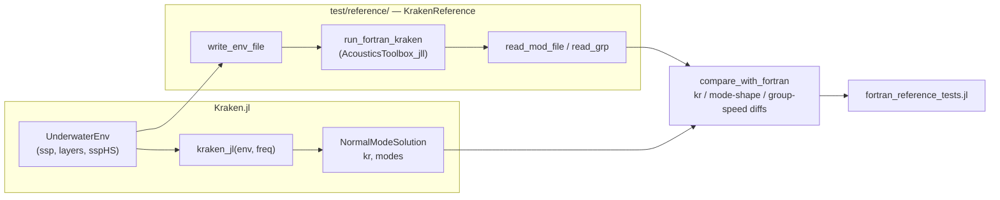
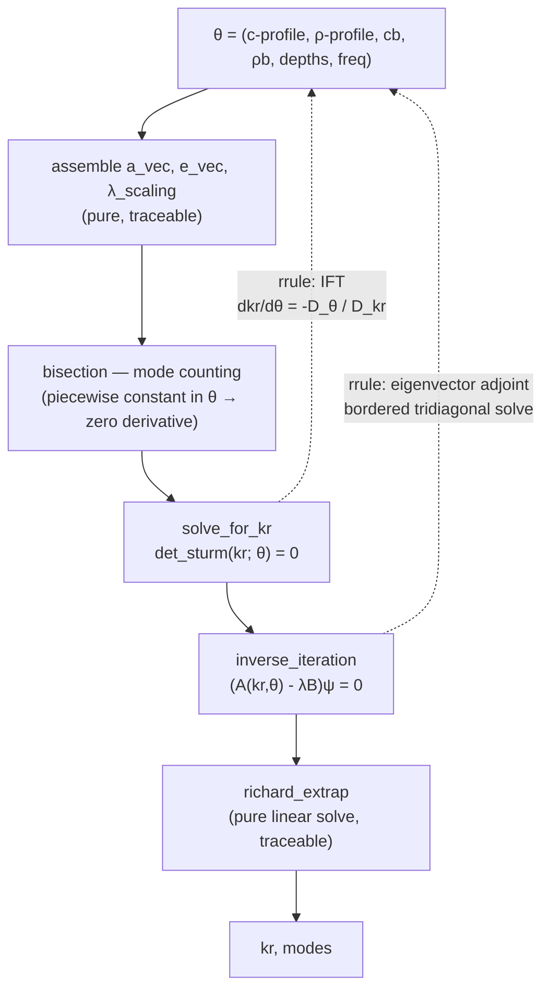

# Plan: Kraken.jl Revival — Trustworthy Solver, Fortran Oracle, Reverse-Mode AD

| Field | Value |
|-------|-------|
| Status | in-progress |
| Created | 2026-08-07 |
| Ticket | N/A |
| Branch | `revival` (off `master`) |

## Context

Kraken.jl is a pure-Julia normal-mode solver that has drifted: the documented test command errors out,
the suite aborts partway through on a stale rename, 9 of 21 declared dependencies are unused, and the
Fortran comparison layer is dead code referencing symbols that exist nowhere. This plan restores a
green, honest test suite; establishes unmodified Fortran KRAKEN as a first-class reference oracle;
delivers reverse-mode AD via implicit-function-theorem rules; and then closes the three highest-value
feature gaps against the original KRAKEN (attenuation, boundary conditions / SSP interpolation,
pressure-field computation).

Everything below the first two milestones depends on being able to *trust* the forward solve, which is
why the Fortran oracle lands before the AD work.

## Development Workflow (applies to every task in this plan)

**Use the Julia MCP (`kaimon`) as the default tool for anything Julia-related.** It runs against a live,
persistent REPL with Revise attached, which is dramatically faster than spawning `julia -e ...` per check and
lets the user watch what is being run. Specifically:

| Instead of | Use |
|---|---|
| `julia -e '...'`, `julia --project=. -e '...'` via Bash | `ex(e="...")` — persistent REPL, Revise auto-reloads `src/` edits, no startup cost per call |
| `Pkg.test()` through Bash | `run_tests(project_path="/Users/arielv/programs/29.02-KRAKEN.jl")` — spawns the correct test env and streams results |
| `grep`/`rg` for a symbol you can name | `grep_code(pattern="...")` — repo-scoped, and every hit carries its enclosing function/struct |
| `grep` when you can only *describe* the code | `search_code(query="...")` — semantic search; the right default when hunting unfamiliar code |
| Reading a file to find a type's fields or a function's methods | `type_info("...")`, `search_methods("...")`, `list_names("Kraken")` — reflection on the live module |
| `julia -e 'using JuliaFormatter; format(".")'` | `format_code(path="...")` |
| `Pkg.add(...)` | `pkg_add(packages=[...])` |

### Sessions

**Spawn the sessions you need; do not wait to be given one.** `start_session(project_path=...)` creates a
REPL for any allowed project, and `ping` / "No session matched" is the signal to call it. Two sessions are
worth keeping alive for this repo, because they are *different environments*:

| Session | `project_path` | Why |
|---|---|---|
| package | `/Users/arielv/programs/29.02-KRAKEN.jl` | `src/` work, solver experiments, the analytic Pekeris cross-checks |
| test env | `/Users/arielv/programs/29.02-KRAKEN.jl/test` | `ForwardDiff`, `FiniteDiff`, `BenchmarkTools`, `Roots` live **only** in `test/Project.toml` — `include`ing `test/automatic_differentiation_tests.jl` or `test/performance_tests.jl` in the package session fails with `ArgumentError: Package ForwardDiff not found in current path` |

Pass the 8-character key explicitly (`ex(e="...", ses="…")`) once more than one session is connected —
tools error out with the available keys rather than guessing. Shut a session down with
`manage_repl(command="shutdown")` when its project is no longer in play, so the key list stays short and
unambiguous; `manage_repl(command="restart")` (same key, fresh state) is the fast fix for world-age or
stale-state errors after a structural change (new `include`, changed `__init__`, added extension).

**Revise is attached and is the whole point of a long-lived session.** Edit `src/`, then immediately re-run
the test file in the same session — no restart, no reload, no re-precompilation. Never call
`Revise.revise()` yourself (it is a stripped no-op), and never `Pkg.activate()` inside a shared REPL (it
changes the user's environment out from under them). Adding a new `export` is one of the few edits Revise
handles cleanly *only* on a fresh `using` — if a name still reads as undefined after you exported it,
restart rather than debugging the export.

### Other rules of thumb

`println` output is stripped, so return a final expression with `q=false` when you need a value back.
Evaluations past ~30 s auto-promote to background jobs; poll `check_eval` at ~30 s intervals rather than
blocking, and do useful work in between instead of spinning on it — a cold session's first
`using Kraken, ForwardDiff, FiniteDiff` takes ~1 minute, and the AD suite ~70 s. `format_code` needs
JuliaFormatter installed *in that session's* environment; when it is not, use `format_code` from a session
that has it rather than adding JuliaFormatter as a project dependency.

**Bash is for git, file moves, and non-Julia tooling. Nothing else.** There is no exception for the full
test suite: `run_tests(project_path=…)` spawns exactly the documented subprocess from the root env, and it
is the only way the user can see the run in their REPL. A `julia -e 'Pkg.test()'` through Bash is invisible
to them, which is the whole reason the rule exists — it is not about speed. (This carve-out used to read
"…and for the `Pkg.test()` runs that must be verified as a subprocess"; it was removed on 2026-08-08 after
it was read as licence to shell out. Also now recorded at the top of `CLAUDE.md`'s Commands section.)
When working in a git worktree, start the session against the **worktree** path — a session on the main
checkout has Revise watching a different copy of `src/` and will happily test code you did not write.

## Verified Baseline (measured 2026-08-07, commit `753875f`)

These are facts established by running the code, not assumptions. Tasks below reference them.

| Observation | Evidence |
|---|---|
| `julia --project=test -e 'Pkg.test()'` (the command in `CLAUDE.md`) **errors immediately** | `ERROR: The Project.toml of the package being tested must have a name and a UUID entry` — `test/Project.toml` has neither; `Pkg.test()` must be run from the *root* env, which then picks up `test/Project.toml` automatically |
| Suite **aborts** before AD tests ever run | `UndefVarError: one_layer_env not defined` at `test/integration_tests.jl:129` |
| 2 pre-abort failures, both **wrong assertions, not solver bugs** | `test/environment_tests.jl:98` asserts Munk `min(c) < 1490` but canonical Munk minimum is exactly 1500.0 m/s; `:106` computes `depths = -ssp[:,1]` then asserts `min_depth > 1000` — sign error |
| `test/fortran_interface_tests.jl` is **dead code** | references `EnvKRAKEN` and `kraken`, which exist in neither `Kraken` nor `KrakenFortran` |
| Tests call an API that does not exist | `one_layer_env(g=1.0)` — no `g` kwarg anywhere; source name is `one_layer_test_dict_KRAKEN` |
| 9 unused deps | `DSP`, `FFTW`, `JLD2`, `QuadGK`, `Parameters`, `ProgressMeter`, `Distributed`, `FiniteDiff` are referenced by no file in `src/`; `CairoMakie` only by `kraken_plots.jl`, which `Kraken.jl` does not `include` |
| Root `Project.toml` has **both** `[extras]`/`[targets]` and a separate `test/Project.toml` | contradictory; `test/Project.toml` wins, `[extras]` is dead weight |
| `Makefile` is dead | targets `src_fortran/source/*.f90`, a directory moved out to KrakenFortran.jl in commit `49d9343`. `CLAUDE.md` still documents `make` as a working command |
| `docs/make.jl` cannot run | `using Documenter, KRAKEN` — module is named `Kraken` |
| No CI whatsoever | no `.github/` directory |
| `soundspeed`, `maxsoundspeed`, `density` are defined but **not exported** | `environment_tests.jl` errors with `UndefVarError` on all three; found during 1.1 once the suite could run — feeds task 1.5 |
| The removed `EnvKRAKEN` API is called from **6 more live files** | `test/performance_tests.jl:273`, `test/timings_vs_fortran.jl:36`, and `examples/testkrak{3,4,5,6}.jl` + `testkrak_mnulti_processing.jl`. Found during 1.4 — feeds tasks 1.6 (perf suite errors on it) and 8.3 (every example is broken) |
| `Kraken` is **already registered in General** (uuid `269dd85f-…`) | so `--project=test` without a dev-link silently resolves to the *released* version, not the working tree; found during 1.1 — also settles the registration question in 8.4 |
| `AcousticsToolbox_jll` ships prebuilt reference binaries | confirmed installed: `kraken.exe`, `krakenc.exe`, `field.exe`, `bounce.exe`, … for all platforms |

### Real bugs found by inspection (not yet covered by any test)

| # | Location | Defect |
|---|---|---|
| B1 | `src/kraken_core.jl:84` | `Base.show(::SampledDensity1D)` prints `ρint.type` — no such field. Any `show` of a density profile throws. |
| B2 | `src/kraken_pekeris.jl` `pressure_f` | calls `get_modal_function(env, krs, freq, zr, zs)` (5 args); only a 3-arg method exists. `MethodError` on every call. Should be `get_modal_function_values`. |
| B3 | `src/kraken_core.jl:427-429` | `if stop_at_k !== nothing && k == stop_at_k; p2, mode_count; end` — an expression statement, not a `return`. The early-exit feature silently does nothing. |
| B4 | `src/kraken_core.jl:478` | `kLeft[Δn]` is indexed without guarding `Δn == 0` → `BoundsError` reachable. |
| B5 | `src/kraken_core.jl` `UnderwaterEnv` | the two constructors disagree on `depth`: `layers[end,3]` vs `ssp[end,1]`. |

## Architecture Decisions

- **Fortran reference = unmodified `kraken.exe` from `AcousticsToolbox_jll`, driven over `.env`/`.mod` files.**
  Rationale: it is the genuine upstream code (validating against a fork proves nothing), it is a registered
  Julia artifact so CI needs no gfortran, and `.env`/`.mod` is the toolbox's stable documented interface.
  Process-spawn cost is irrelevant for a test oracle. An env var `KRAKEN_FORTRAN_BIN` overrides the jll with
  a local build (`/Users/arielv/programs/AcousticsToolboxOALIB/bin`) for version-specific comparisons.

- **KrakenFortran.jl is decoupled, not deleted.** It stops being referenced by Kraken.jl entirely. It remains
  a separate project offering an *in-process* `ccall` path, which is genuinely faster for broadband sweeps —
  useful later, but not as the correctness oracle, because its sources are a MEX-adapted fork of older KRAKEN.

- **Reverse-mode AD via `ChainRulesCore.rrule`, not by tracing the solver.** The solver's in-place cache
  mutation (`create_finite_diff_matrix!` / `return_finite_diff_matrix!`) is fatal for Zygote and painful for
  Enzyme. With an implicit-function-theorem rule attached at `solve_for_kr` and an eigenvector-adjoint rule at
  `inverse_iteration`, the internals become opaque and their mutation stops mattering. One set of rules serves
  Zygote, Mooncake, and Enzyme-via-ChainRules simultaneously.

- **Sturm rescaling does not corrupt the implicit derivative.** `det_sturm`'s `scale_const` multiplies the
  sequence by a factor `S` that is *piecewise constant* in both `kr` and the parameters `θ`. The IFT ratio is
  `-(∂(S·D)/∂θ)/(∂(S·D)/∂kr) = -(S·D_θ)/(S·D_kr) = -D_θ/D_kr`, so `S` cancels exactly. This is why the rule can
  be written against the rescaled determinant directly. Worth an explicit comment in the code.

- **Attenuation follows KRAKEN, not KRAKENC, first.** Real `kraken.exe` solves the *real* eigenproblem and adds
  the imaginary part of `kr` by first-order perturbation. That is a far smaller change than a full complex
  solve and it is what "parity with `kraken.exe`" actually means. The full complex/leaky-mode solve
  (`krakenc.exe` parity) is a deliberate stretch task at the end of that milestone.

  **Validated in M5 (2026-08-09/10), with two limits worth carrying into M6+.** The two solvers agree
  on `Im(kᵣ)` *to first order in α exactly* — the disagreement falls as α² to the `.mod`'s
  single-precision floor. Above that, accuracy is bounded by two separate effects that hit opposite
  ends of the mode spectrum: the half-space term's expansion parameter `2ω α_b/(c_b γ²)` blows up at
  the bottom cutoff (worst for the *least*-trapped mode; only a complex solve fixes it), and the
  single flat trapezoid across a discontinuous α is only first order (worst for the *best*-trapped
  mode; task 5.7 fixes it). Neither affects `Re(kᵣ)`, which stays within 1e-4 throughout.

- **A lossy solve is Zygote-only, and `α = 0` is a kink.** Discovered in 5.4. Mooncake cannot trace
  the complex arithmetic attenuation introduces. And at exactly zero attenuation ForwardDiff and
  Zygote return *opposite* one-sided derivatives without either raising — a discrete-branch effect in
  `is_lossy`, in the same family as the mesh-schedule decision in `kraken_jl`. Both are documented at
  the end of `src/kraken_ad.jl`; anything in M7 that differentiates a lossy field needs to know them.

- **Elastic layers and interfacial roughness are out of scope.** Deselected during planning. They would turn
  the finite-difference scheme into a 4-field system and are the single largest addition; revisit after M8.

- **Breaking API changes are permitted.** Nothing depends on this package yet, and the current names
  (`one_layer_test_dict_KRAKEN` returning a tuple, not a dict) are actively misleading.

- **Plotting extension triggers on `Makie`, not `CairoMakie`** (revised during 2.2). CairoMakie depends
  on Makie, so `using CairoMakie` activates the extension exactly as originally planned — but so does
  `using GLMakie`, which a CairoMakie-only trigger would have excluded for no benefit. The extension
  uses nothing backend-specific: `Figure`, `Axis`, `lines!` are all Makie's API.

- **`kraken.exe` exits 0 even on a fatal error** (established during 3.1). Given a missing or malformed
  `.env` it writes `STOP Fatal Error: Check the print file for details` to stderr and stops with a
  *zero* exit status. Task 3.4's runner must therefore scan the generated `.prt` for `ERROR`; an
  exit-code check would silently pass every failed run and then fail confusingly on a missing `.mod`.

- **Generated `.env` files use C-linear interpolation, not the spline the checked-in files use**
  (decided during 3.2). Every file in `test/standard_envs/` opens with `'SVW'` — cubic spline — but
  `Kraken.jl` interpolates its SSP linearly (`SampledSSP` wraps `LinearInterpolation`). Writing `'S'`
  would have the Fortran solve a *different* problem and charge the difference to the solver. The two
  agree exactly for any medium described by two points, so this only bites `munk_env`, which is
  precisely the case where it would have been mistaken for solver error. Milestone 6 adds the other
  interpolators and this becomes a parameter of the comparison rather than a fixed choice.

- **`.env` densities are g/cm³; Kraken.jl's are kg/m³** (established during 3.2). `pekeris_env` uses
  `ρ0 = 1000.0` where `Pekeris_AV.env` writes `1.0`. The writer applies a `density_scale` factor
  (default `1e-3`) rather than guessing per environment. Only ratios enter the eigenvalue problem, so
  this never showed up as a discrepancy before — it would have shown up in mode *normalization*.

- **The receiver-depth vector is not cosmetic** (established during 3.2). `kraken.exe` tabulates mode
  shapes in the `.mod` file on `zTab`, the merge of the source and receiver depth vectors
  (`MergeVectors` in `kraken.f90`), so `rd` *is* the resolution at which mode shapes come back and
  task 3.5's interpolation grid. The writer defaults it to ~20 points per wavelength over the whole
  water column — the same density KRAKEN picks for its own finite-difference mesh — capped at 2001
  points to bound the `.mod` record length.

- **`AcousticsToolbox_jll` v2025.9's `kraken.exe` reports every group speed as `0.00000`**
  (established during 3.3). Its wavenumbers and mode shapes are correct and agree digit for digit
  with the 2023 OALIB build; only the `VG` column is lost. The *same jll's* `krakenc.exe` is fine,
  and so is the local OALIB build of both binaries — so it is a regression in that one binary, not
  a property of the format or the environment. Consequence: **any group-speed comparison must run
  `complex=true` or point `KRAKEN_FORTRAN_BIN` at a local build.** `KrakenReference.has_group_speeds`
  is the guard; without it this surfaces as a spurious "group speeds differ by 100%" in 3.5 and 4.7.
  (`AcousticsToolbox.jl` carries the same workaround, so it is not specific to this repo.)

- **Neither output file dominates the other on precision** (established during 3.3). The `.mod`
  stores `CMPLX(k)` — single precision, ~7 digits on both parts. The `.prt` prints the same complex
  number through `'( I5, G18.10, G10.2, … )'`, and a Fortran `COMPLEX` consumes two edit descriptors
  — so `Re(kᵣ)` gets **10** digits but `alpha = Im(kᵣ)` gets **2**. Measured on the broadband Pekeris
  case: agreement of 6e-8 on the real part, only ~4e-3 on the imaginary. So wavenumber comparisons
  (3.5, 3.6) should prefer the `.prt`, while the attenuation work in Milestone 5 must read the `.mod`
  — comparing Milestone 5's imaginary parts against the `.prt` would be measuring the print format.

- **The `.prt` group-speed table is subsampled** (established during 3.3). `kraken.f90` prints it
  with `DO mode = 1, M, MAX( 1, M / 30 )`, so a 102-mode run lists 34 rows, every third mode. That is
  why `read_grp` returns mode *indices* alongside values; `length(grp.m) < nmodes` is normal.

- **The solver is right.** First end-to-end measurement (3.5, 2026-08-08): across the five standard
  environments at 25/50/100/200/400 Hz, the maximum relative wavenumber difference against
  `kraken.exe` is **2.7e-5** (worst case: `two_layer_slope` at 25 Hz; the canonical Pekeris case is
  **1.7e-9**) and the minimum mode-shape correlation is **0.99995**. Mode counts agree in 23 of 25
  cases. This is the number the plan's premise — "everything depends on being able to trust the
  forward solve" — was waiting on.

- **Mode counts can differ by one at cutoff, and that is a report, not an error** (established
  during 3.5). `bisection` searches `kr ∈ [ω/(0.9999 cb), max(ω/c)]`, while the generated `.env`
  asks KRAKEN for phase speeds up to `cb` exactly. Kraken.jl's window is therefore very slightly
  *narrower*, so it can miss a mode sitting right at the bottom cutoff — observed on `munk` at 100 Hz
  (204 vs 205) and 400 Hz (817 vs 818), always with Julia one short, exactly as that reasoning
  predicts. `compare_with_fortran` reports both counts and compares the leading `min` of them.

- **Julia mode shapes have no `z = 0` row.** `get_z_vec` starts each layer at `z0 + Δz`, so the mesh
  excludes the surface while KRAKEN's `zTab` includes it. Resampling for the correlation prepends the
  exact pressure-release value `φ(0) = 0` rather than extrapolating — without it the comparison
  clamps to the first interior sample right where the mode is steepest.

- **The Acoustics Toolbox test files are GPL-3 and are NOT vendored** (decided during 3.7). Kraken.jl
  is MIT; copying GPL-licensed input decks into this tree is a licensing decision that is not the
  implementer's to make. The OALIB cases are therefore read *in place* from `KRAKEN_OALIB_TESTS`
  (defaulting to the local checkout) and skip when it is absent, which is what happens in CI. The
  reader itself is covered unconditionally by round-tripping the repo's own `test/standard_envs/`
  files, which are Ariel's, not OALIB's. **Open question for the user:** if a handful of these
  should be vendored to give CI real OALIB coverage, that needs a licensing call first.

- **Toolbox coverage measured (3.7, 2026-08-08): 65 of 402 `.env` files are supported today, and all
  65 cross-validate** — max relative wavenumber difference 3.6e-6, min mode-shape correlation
  0.999992, mode counts matching within one everywhere. The categorized blocker list *is* the
  backlog for the next two milestones:

  | blocker | files | milestone |
  |---|---|---|
  | attenuation | 114 | M5 |
  | top boundary (not vacuum) | 65 | M6 |
  | bottom boundary (not an acoustic half-space) | 50 | M6 |
  | SSP interpolation (n²-linear / spline over a varying profile) | 28 | M6 |
  | added volume attenuation (THORP / Francois-Garrison / biological) | 27 | M5 |
  | bottom half-space is not the fastest medium | 19 | M5 stretch (leaky modes) |
  | elastic layer | 7 | out of scope |
  | interfacial roughness | 5 | out of scope |
  | analytic SSP, profile not starting at the surface | 2 | — |
  | not a KRAKEN deck at all (BELLHOP3D `'H'`/`'Q'` SSP options, malformed) | 20 | n/a |

  Attenuation alone unlocks more files than everything else combined — it is correctly ordered first.

  **Outcome (M5.1, 2026-08-09):** it did. Coverage went from 65 to **167 of 402 files, 101 of them
  lossy**, and `attenuation` no longer appears as a blocker at all. Two rows moved for reasons that
  are not attenuation: `bottom half-space is not the fastest medium` rose 19 → 31 and
  `interfacial roughness` fell 5 → 4, because files previously rejected on attenuation now get far
  enough to be judged on something else — and because a bottom-option parsing bug was fixed
  (`READ(ENVFile,*) BotOpt, Sigma` discards the rest of the record; the reader was taking the last
  number on the line). What remains under an attenuation-shaped name is the *added volume*
  attenuation laws (`TopOpt(4:4)`: Thorp, Francois-Garrison, biological, 27 files) and the
  power-law unit `'m'` (1 file), which are separate features.

- **A declared SSP interpolator is not automatically a blocker** (established during 3.7). A cubic
  spline through a *two-point* medium is the straight line, and any interpolator through an
  isovelocity medium is that constant — so `'S'`/`'P'` over two-point media and `'N'`/`'S'`/`'P'` over
  isovelocity media are exactly C-linear. Confirmed rather than assumed: `Pekeris_AV.env` declares
  `'S'` and reproduces the wavenumbers of the C-linear file this repo generates to all ten printed
  digits. Accepting these costs no fidelity and is what makes most of the 65 supported cases usable.

- **The reader reproduces Fortran's misreadings, which is the point.** `Dickins.env` writes SSP rows
  without a `/` terminator, so list-directed input runs on into the following records; the reader
  reports "SSP of medium 1 never reaches 3000 m". Running `kraken.exe` on that same file confirms it
  reads `betaR = 38.00` and a garbage density — i.e. the file really is broken for KRAKEN, and the
  reader agrees with the Fortran rather than papering over it.

- **The coefficient assembly was already a pure function in disguise** (established during 4.1). The
  extraction of `finite_difference_coefficients` reproduces the old per-layer loop **bit for bit**
  (`==`, not `≈`) across all five standard environments × {25, 100, 400} Hz × mesh factors {1, 4},
  including the 2- and 3-layer cases that exercise interface averaging — and at identical cost
  (0.240 ms vs 0.239 ms on `munk` at 100 Hz, N = 6250). The old loop's mutation was writing each
  slice exactly once into a fresh buffer, so removing it cost nothing. Two subtleties the rewrite had
  to preserve: `moving_average!` built its whole RHS before assigning, so `λ_scaling` is a pairwise
  mean of the *original* values, not a sequential in-place sweep; and `Tridiagonal` stores `a_vec` by
  reference rather than copying, which is the only reason `create_finite_diff_matrix!` can update `A`
  by writing to `cache.a_vec`. `moving_average!` had no other caller and was deleted with the loop.

- **A worktree's test env silently resolves the *released* Kraken** (established during 4.1). The
  trap `CLAUDE.md` documents for fresh clones fires for every new git worktree too, because
  `test/Manifest.toml` is gitignored and so is never carried over — the MCP's `instantiate` then
  resolves `Kraken` from the General registry. It presents as a wall of `UndefVarError: soundspeed
  not defined`, because the exports added in 1.5 do not exist in the released version. The fix is the
  documented one-time `Pkg.develop(path=".")` into `test/`, run per worktree; verify with
  `path = ".."` on the `[[deps.Kraken]]` entry. `Pkg.test()` from the *root* env is immune, which is
  why the two runs disagreed and why the immune one is not the one to trust here.

  **Prevention is a startup guard, not more documentation** — `CLAUDE.md` and `test/README.md`
  already warned about this and it still happened, because both said "fresh clone" and a worktree
  does not read as one. `test/runtests.jl` now calls `check_testing_this_checkout()` before any
  testset: it compares `pkgdir(Kraken)` with the directory `test/` lives in and aborts with the
  exact `Pkg.develop` command when they differ. Works on every Julia version and in both run modes.
  Committing `test/Manifest.toml` was considered and **rejected**: Kraken.jl is a library, so an
  un-pinned test env is what makes CI report upstream breakage; a committed manifest also pins one
  `julia_version` against a 1.10 CI leg, and stays correct only while the `[[deps.Kraken]]` entry
  is relative (`Pkg.develop` from outside the repo writes an absolute path, hard-coding one
  machine into the repo). A `[sources]` entry in `test/Project.toml` would be the declarative fix
  but needs Pkg 1.11+; revisit when the `julia = "1.10"` bound is dropped.

- **The rrule differentiates the Sturm recurrence analytically rather than by nesting ForwardDiff**
  (decided during 4.2, revising this task's own instruction). Nested forward mode is right for
  `D_kr` — one dual number — but not for `D_θ`, because inside the rule `θ` *is* the three
  length-`N` cache vectors: that is the only route by which the sound-speed profile, the density
  profile and the mesh spacing reach the determinant. Forward mode over them costs one sweep per
  entry, O(N²) for an O(N) problem, which would defeat the entire point of reverse mode. The Sturm
  sequence is a product of 2×2 transfer matrices, so its adjoint is a single backward sweep of the
  same length as the forward one. `sturm_sensitivities` runs both sweeps in **1.3 µs against 11 µs
  for the `solve_for_kr` it accompanies** (Pekeris, 100 Hz, N = 125) — a 12% surcharge on the solve.
  All eight partial families (`a_vec`, `e_vec`, `λ_scaling`, `kr`, `cb`, `ρb`, `freq`, and `g`) were
  checked against central differences and agree to ≤ 4e-8, and the rule's forward sweep reproduces
  `det_sturm`'s determinant **bit for bit**, rescaling included — which is what makes them
  derivatives of the same scalar.

- **The mesh is only *half* discrete, and the half that is not carries the depth gradient**
  (established during 4.2, correcting the seam note written in 4.1). That note put
  `AcousticProblemProperties` behind the seam on the grounds that the mesh is piecewise constant in
  the parameters. Only `Nz_vec` is: `Δz_vec = h_vec ./ Nz_vec` is *linear* in the layer thicknesses,
  and `zn_vec` is built from it. Treating `props` as a constant silently drops the
  discretization-error part of `∂kr/∂depth`, worth ~1e-5 relative — four orders above this task's
  1e-9 acceptance, and invisible unless something is compared against it. `props` is therefore on
  the seam and its construction must stay non-mutating.

- **Making the seam traceable took three non-mutating rewrites and three declarations** (established
  during 4.2). None of them changed a number; all of them were places where forward mode had been
  perfectly happy. The rewrites: `get_Nz_vec`/`get_z_vec` filled preallocated arrays; `pekeris_env`
  used `zeros(T, 2, 6)` plus `setindex!` where every one of its four sibling builders already used a
  matrix literal — and its `promote_type` dance was never needed, since `hvcat` promotes to `Dual` on
  its own; and `get_thickness` spelled its concatenation `vcat(0.0, layers[:, 3]...)`, whose splat
  routes the whole thing through `Core._apply_iterate` and cannot be composed with the `getindex`
  pullback feeding it. The declarations: `@non_differentiable n_mesh_points` (the `ceil` inside it is
  an LLVM intrinsic; reverse mode errors on it instead of noticing that an `Int` carries no
  derivative), `@non_differentiable maxsoundspeed` (nothing on the seam consumes its value — it feeds
  an `@assert`, and its `maximum` pullback ends up being accumulated into the assertion's `Bool`),
  and an `rrule` for `layer_mesh`, for the reason below.

- **`range` had to keep its exact arithmetic, so the mesh got a rule instead of a rewrite**
  (established during 4.2 — the one rewrite that had to be reverted). `collect(range(z_top, z_bot,
  Nz))` builds a `StepRangeLen` whose fields are `Base.TwicePrecision`; reverse mode cannot construct
  that, so the obvious move is to open-code the interpolation as a broadcast. Doing so shifts
  interior mesh points by **up to 13 ulp** — 1.4e-14 in absolute terms — and that was enough to fail
  `two_layer_slope` against `kraken.exe` at 25, 50, 100 and 200 Hz, plus the `twolayer_slope_AV`
  reader case, against tolerances of 1e-4 and 1e-5. A clean-`HEAD` baseline run (948 pass, 0 fail)
  was what established the failures were the change's and not pre-existing; it is worth keeping that
  trick in mind, since `git worktree add` plus a copy of `test/Manifest.toml` (whose `Kraken` entry is
  the relative `path = ".."`) gives a runnable baseline checkout in one command. The resolution is the
  same pattern as the rest of this milestone: leave the primal alone and state the derivative, which
  for a mesh is exactly linear interpolation between the endpoints. **The wider lesson is that the
  Richardson extrapolation is far more sensitive to mesh coordinates than a 1e-4 tolerance suggests —
  Milestones 6 and 7 should not assume ulp-level mesh changes are free.**

- **`kraken_jl` typed its Richardson matrix off the wrong thing, and only `pekeris_env`'s
  over-promotion hid it** (found during 4.2). `h_meshes = zeros(eltype(env.c.c), …)` stores powers of
  `props.Δz_vec[1]`, which has nothing to do with the sound-speed vector's element type. It worked
  only because `pekeris_env` built its `ssp` matrix through a `promote_type` that included `cb` and
  `ρb` — parameters that appear nowhere in `ssp`. Removing that accidental over-promotion turned
  `ForwardDiff.derivative(kr_vs_cb, 1600.0)` into a `MethodError: no method matching
  Float64(::Dual)`, i.e. the existing forward-mode tests were relying on it. `h_meshes` is now typed
  from `props.Δz_vec`, and `richard_extrap` promotes its two arguments to a common type rather than
  handing a mixed-precision system to `LinearSolve`.

- **ForwardDiff is not the more accurate reference for a wavenumber gradient** (established during
  4.2, and it changes how 4.6 and 4.7 should be judged). At 250 Hz the two methods disagree by
  **1.3%** on `∂kr₁/∂cb`, and central differences on the primal say the rule is right: 5.6e-6 from
  the rule versus 1.3e-2 from ForwardDiff. The cause is that ForwardDiff differentiates the
  arithmetic of the *last ITP iterate*, so its gradient inherits the root solver's truncation error,
  while the implicit function theorem differentiates the exact root. Tightening `abstol`/`reltol` to
  1e-10 pulls ForwardDiff to within 5e-6 of the rule; at 1e-14 it collapses (96% off, roundoff in the
  iteration's derivative) while the rule's value is unchanged to 13 digits. Consequences: the rule is
  **tolerance-independent and ForwardDiff is not**, so `FiniteDiff` — not ForwardDiff — is the
  arbiter when the two differ; and this task's "matches ForwardDiff to 1e-9" is a statement about
  ForwardDiff's convergence, met at 50 and 100 Hz for every mode, not a bound on the rule.

- **Zygote's overhead is in constructing the SSP interpolant, not in the rules or the solver**
  (measured during 4.2 while writing `examples/reverse_ad.jl` — this is the number 4.8 has to move,
  and it is a much smaller target than it first looked). Reverse mode is currently **correct but not
  yet fast**: against a 50-point sound-speed profile at 100 Hz it costs 7.5 ms versus forward mode's
  1.7 ms, and it does not flatten with parameter count the way the milestone's success criterion
  requires. Decomposed:

  | | ms (N = 50) |
  |---|---|
  | whole reverse gradient | 7.5 |
  | …of which just building `UnderwaterEnv` | 7.0 |
  | …of which one `SampledSSP` interpolant | 3.5 |
  | everything else — mesh, coefficients, solve, both rules | 0.5 |

  So **93% of the time is Zygote tracing the two `DataInterpolations` constructors** inside
  `UnderwaterEnv`; evaluating the interpolant afterwards costs ~0.14 ms and the rules are ~12% of a
  wavenumber solve. The fix is therefore small and local — an `rrule` for `SampledSSP`/
  `SampledDensity` construction, which only stores its arguments — rather than a rewrite of
  `finite_difference_coefficients` as previously supposed. Forward mode's cost grows linearly with
  parameter count exactly as predicted (2.5× → 25.5× the primal from N = 5 to 50), so the crossover
  is real and only this overhead is hiding it.

- **The eigenvector rule attaches one level below `inverse_iteration`, and the normalization stays
  traced** (decided during 4.3, revising that task's own deliverable row). `inverse_iteration` was
  split into `mode_eigenvector` — inverse-iterate, sign-fix, return a unit-2-norm vector, behind the
  seam — and `normalize_mode`, which divides by the square root of the water-column plus half-space
  energy and is *on* the seam. The rule goes on the first. The reason is where the parameters enter:
  the energy integral depends on the density profile and the mesh coordinates directly, not through
  the finite-difference coefficients, so pulling it inside the rule would mean carrying an adjoint
  for the `DataInterpolations` interpolant that the backend already applies in
  `finite_difference_coefficients`. Splitting costs nothing numerically (the primal computes the same
  two steps in the same order) and keeps the rule to the one thing that genuinely cannot be traced.

- **The singular adjoint solve is spelled *project, solve, project*, not as a bordered matrix**
  (established during 4.3). `v`'s adjoint needs `y = M⁺(I - vvᵀ)Δv`, defined by a bordered system
  whose matrix is nonsingular but no longer tridiagonal — solving it as written gives up the O(N)
  structure the whole rule exists to keep. Instead the `v` component is removed from the right-hand
  side, the tridiagonal system is solved as-is (numerically nonsingular: the primal's shift leaves
  `μ ≈ 1e-13‖M‖`), and the `v` component that the near-singularity amplifies back into the answer —
  about 1e-3 relative — is removed again. One step of iterative refinement inside the complement
  cleans up the rest. Every partial family checks out against central differences at ≤ 2e-6, which is
  the *reference's* accuracy, not the rule's.

- **ForwardDiff is the inaccurate side for `∂ψ/∂kr` too, and by much more than it was for `∂kr/∂θ`**
  (established during 4.3, extending the 4.2 decision above). Differentiating the inverse iteration
  in isolation with respect to its own shift, ForwardDiff is **23% off** at the default `reltol=0.01`
  and still 0.4% off at `reltol=1e-14`; central differences converge onto the rule's value from both
  sides as the step shrinks. The cause is the same one as for the root solver — ForwardDiff
  differentiates the arithmetic of the last iterate, and here the iterate count is itself a step
  function of the perturbation, which is why the central differences converge only *first* order.
  None of this shows end to end, where the mode-shape gradients agree with ForwardDiff to **1e-11**
  for both the Pekeris and one-layer-sediment environments and for every one of the first three
  modes: along the composition, `kr` and `θ` move together and the truncation errors largely cancel.
  The practical rule stands — for anything involving an iteration, central differences arbitrate.

- **Zygote silently drops the derivative with respect to an SSP interpolant's knot depths, and it is
  a wrong number rather than an error** (found during 4.3; the reason for the new task 4.5).
  `DataInterpolations`' ChainRules rule treats an interpolant's knot vector as non-differentiable, so
  for any environment whose sound speed or density *varies inside* a layer, every gradient with
  respect to that layer's thickness is missing a term. On `two_layer_slope_env` the wavenumber
  gradient comes out **15% wrong on `h0` and sign-flipped on `h1` and `h2`**, while ForwardDiff and
  central differences agree with each other exactly. **Unmodified Fortran KRAKEN was used as the
  arbiter** — finite-differencing `kraken.exe`'s own `Re(kᵣ)` across perturbed `.env` files is a
  gradient oracle that shares no code with any of this, and it is worth remembering as a technique
  for the rest of the milestone:

  | `∂kr₁/∂θ`, `two_layer_slope_env` @ 100 Hz | Fortran FD | `kraken_jl` FD | ForwardDiff | Zygote |
  |---|---|---|---|---|
  | `h0` | 1.6344e-5 | 1.6344e-5 | 1.6342e-5 | **1.3836e-5** |
  | `h1` | 5.396e-7 | 5.394e-7 | 5.113e-7 | **-1.72e-8** |
  | `h2` | 3.20e-9 | 2.84e-9 | 2.68e-9 | **-4.80e-10** |
  | `c0` (control) | -2.78007e-4 | -2.78007e-4 | -2.780071e-4 | -2.780071e-4 |

  The control row is what makes the other three readable: where the gap does not apply, Fortran and
  both backends agree to seven digits. (The residual few percent between the Fortran column and
  ForwardDiff on `h1`/`h2` is the Richardson-extrapolated wavenumber against the single-mesh one the
  rules currently differentiate — 4.4's territory, not this gap's.) It is upstream of both rules and
  predates them —
  it was invisible through 4.2 only because `pekeris_env` and `one_layer_env` hold the sound speed
  constant within each layer, which makes the missing term identically zero. Isolated, it is one
  line: `soundspeed` at a fixed depth, differentiated with respect to a moving layer boundary, gives
  -1.5 under ForwardDiff and 0.0 under Zygote. `test/reverse_ad_tests.jl` carried this as three
  `@test_broken`s so the suite would flip green on it when 4.5 landed rather than the gap being
  rediscovered. **Closed by 4.5** — the three are plain `@test`s now; the two entries below record
  what the fix turned out to be, which was not only the missing term.

- **The interpolant gap was an interval-selection bug as much as a missing term, and the two look
  nothing alike** (established during 4.5). Writing the `∂c/∂t` term was the easy half and it only
  got `∂kr₁/∂h0` from 15% wrong to **8.6% wrong**, because `get_z_vec` ends each layer's mesh exactly
  on that layer's lower boundary — which is exactly where these environments place the duplicated
  knot (`z0`, `z0 + eps(z0)`) that spells a discontinuity. `searchsortedlast`, which is what
  `DataInterpolations` uses and what the obvious rule copies, puts such a query in the **right-hand**
  interval: the `eps`-wide seam, whose slope is ~1e15 and whose `∂/∂t` and `∂/∂z` partials are equal
  and opposite. Forward mode never notices, because it forms `z - t₁` as one dual subtraction and
  gets an exact zero; reverse mode sends the two 1e15's down unrelated paths and subtracts them at
  the end. Selecting the interval that *ends* at the query (`side = :first, idx_shift = -1`) removes
  the cancellation entirely and changes no value — checked `===`, not `≈`, on every mesh point of
  four standard environments at three frequencies.

  The kicker: ForwardDiff was already taking the left-hand interval, and **by accident**. Its `isless`
  on `Dual` breaks value ties on the partials, so a `Float64` query compares below an equal-valued
  `Dual` knot and `searchsortedlast` lands one lower. The correct answer was arriving through an
  undocumented comparison, which is a good reason not to have used "agrees with ForwardDiff" as the
  only oracle for this milestone.

- **The gap is closed and the Fortran table's residual was 4.4's, exactly as suspected** (measured
  during 4.5). With the rules in, Zygote matches ForwardDiff to **2e-12** on all 13 parameters of
  `two_layer_slope_env`, for the wavenumber, the mode shape, and the full `kraken_jl` solve. Against
  finite-differenced `kraken.exe` (the `.prt`'s 10 digits — the `.mod` is single precision and cannot
  resolve `h1`/`h2` at all, returning a flat 0.0):

  | `∂kr₁/∂θ` @ 100 Hz | Fortran FD | Zygote, single mesh | Zygote, `kraken_jl` | rel. err vs Fortran |
  |---|---|---|---|---|
  | `h0` | 1.6335e-5 | 1.63421e-5 | 1.63333e-5 | 1.0e-4 |
  | `h1` | 5.3950e-7 | 5.1129e-7 | 5.39376e-7 | 2.3e-4 |
  | `h2` | 3.1500e-9 | 2.6845e-9 | 3.14900e-9 | 3.2e-4 |
  | `c0` (control) | -2.780073e-4 | -2.780071e-4 | -2.780075e-4 | 7.4e-7 |

  The 5% and 15% residuals the 4.3 entry left open on `h1`/`h2` were indeed the Richardson-
  extrapolated wavenumber against the single-mesh one — differentiating `kraken_jl`, which is what
  4.4 made possible, closes them to 1e-4, the finite-difference step's own truncation.

- **The performance target was met by the same change, and reverse mode now flattens** (measured
  during 4.5, against the 4.2 decomposition that predicted it). Σkr over an `N`-point sound-speed
  profile at 100 Hz, as multiples of the primal solve:

  | N | primal | forward | reverse (before 4.5) | reverse (after) |
  |---|---|---|---|---|
  | 5 | 0.063 ms | 2.6× | — | 6.8× |
  | 10 | 0.063 ms | 4.9× | — | 6.4× |
  | 25 | 0.061 ms | 13.5× | — | 6.6× |
  | 50 | 0.065 ms | 25.1× | ~115× (7.5 ms) | **6.1× (0.40 ms)** |

  Reverse mode is now flat in `N` — 19× faster at N = 50 than before — and crosses forward mode at
  about a dozen parameters. It is 6× the primal rather than the milestone's stated ~3×; that gap is
  4.8's to characterize, and it is a constant, not a scaling problem. (4.8 characterized it: a ~0.3 ms
  Zygote tape floor, so the ratio falls to 1.9× on a 400 Hz solve. See the decision below.)

- **"One set of rules serves Zygote and Mooncake at once" was half true, and the other half is a
  package extension** (established during 4.6). Mooncake does not consume `ChainRulesCore.rrule`s.
  It derives its own rules from the IR unless a signature is declared a primitive, and left to
  itself on this solver it does not merely run slowly — it stops outright with *"It is not
  permissible to bitcast to a differentiable type during AD"*, from the `TwicePrecision` arithmetic
  inside `range`. The milestone's key decision still holds, but it needs `ext/KrakenMooncakeExt.jl`
  to hold it: one `Mooncake.@from_rrule` per rule in `kraken_ad.jl`, plus a `@zero_derivative` for
  `bisection`, and nothing that states a derivative.

  What the extension actually had to supply is the **tangent bridge**. `@from_rrule` translates
  between the two tangent representations on every call, and Mooncake's translation covers scalars,
  arrays and tuples but not `ChainRulesCore.Tangent`s over composite types — which is what all three
  of this package's rules return, since their arguments are `UnderwaterEnv`,
  `AcousticProblemProperties`, `AcousticProblemCache` and the two sampled profiles. Nor does it
  cover `ZeroTangent` (only `NoTangent`), which the `solve_for_kr` rule emits for the root bracket.
  Four `increment_and_get_rdata!` methods close both gaps, walking Mooncake's fdata/rdata field
  split and pulling the matching ChainRules field. They are mechanical, but they use Mooncake
  internals (`FData`/`RData`/`MutableTangent`), which is why `Project.toml` pins `Mooncake = "0.5"`.
  Result: Zygote and Mooncake agree with each other to **3e-14** on every environment × target in
  the table, which is the tightest comparison in the milestone — they are evaluating the same rules,
  so anything looser would mean the bridge, not the rules.

- **Finite differences cannot measure `∂/∂cb` or `∂/∂thickness` here, and the reason is the mesh
  rather than the rules** (established during 4.6, and the direct consequence of 4.4's decision).
  `Nz = max(10, ceil(h / Δz))` with `Δz = c_b / (20 f)`, so the mesh point count is a step function
  of `cb` and of every layer thickness — and of nothing else. The gradient is the derivative at a
  fixed mesh schedule, which is correct and standard, but it makes the primal genuinely
  discontinuous in those parameters, and a central difference straddles the jumps. `∂(∫ψ dz)/∂depth`
  for `pekeris_env` at 100 Hz, by relative step:

  | step | 1e-6 | 1e-5 | 1e-4 | AD (all four backends) |
  |---|---|---|---|---|
  | central difference | 5.29 | 1.82 | 1.47 | **1.4356** |

  There is no window that converges: shrinking the step lands on more jumps, growing it adds
  truncation. So the multi-backend table finite-differences only the parameters that leave the mesh
  alone — the sound speeds and densities — where central differences agree with all four backends to
  **2.6e-7**. Differencing the others measures the mesh, not the gradient. Note what this does *not*
  say: ForwardDiff, Zygote and Mooncake agree with each other on those parameters to 1e-12, and
  4.5's Fortran table shows the layer-thickness derivatives are right; it is only the finite
  difference that cannot see them.

- **`test_rrule` reaches `solve_for_kr` but cannot reach `mode_eigenvector`, for a reason worth
  keeping** (established during 4.6). It runs clean on `solve_for_kr` (32 assertions across two
  environments) once told three things: that the `DataInterpolations` interpolant is opaque (its
  `EnumX` extrapolation field has no `to_vec`), that `props.Nz_vec` is an `Int` count carried across
  unperturbed, and that the step must be capped at `max_range=1e-6` — the adaptive default is ~1e-3
  against `a_vec` entries of ~2e-3, which perturbs the discretized problem by tens of percent until
  the root leaves its bracket.

  `mode_eigenvector` fails all three ways at once, and the first is structural: **`test_rrule`
  requires a non-mutating primal**, and this one shifts `cache.a_vec` in place and unshifts it on
  the way out. A backend never sees that, because the cache is restored; `to_vec` does, because its
  reconstruction hands the same arrays to every probe. Measured with the cotangent pinned so both
  sides compute the same scalar: with respect to `kr` alone, finite differences give 3.9617 against
  the rule's 3.96168 — add `cache` to the argument list and the same finite difference collapses to
  1e-14. Behind that sit two more: the primal is the last iterate of an iteration and is not smooth
  at the scale the adaptive stepper probes (the 4.3 finding), and `get_g`'s `sqrt(kr² - q²)` makes
  `kr` inadmissible a short way below the root, which the stepper's magnitude estimation walks into
  (`DomainError`). The rule's direct check stays what 4.3 built for it: hand-stepped central
  differences, every partial family, entry by entry.

- **`LinearSolve` was not the obstruction at the top level; two lines of bookkeeping were**
  (established during 4.4, settling that task's own open question). `richard_extrap` needed no
  change — `Zygote.gradient` through `solve(LinearProblem(A, b))` matches `ForwardDiff` to 14 digits,
  so the contingency of replacing it with a plain `\` never applied. What blocked reverse mode was
  the refinement loop's own bookkeeping: `h_meshes[i_power, :] = h_extrap(…)` and
  `push!(krs_all, …)`, both of which grow state that outlives the expression that made it. They are
  now `vcat` onto a length-`n_meshes` vector of mesh spacings and a vector of wavenumber vectors,
  with the Vandermonde matrix broadcast into shape by `h_extrap_matrix(hs) = hs .^ permutedims(0:2:…)`
  only when the extrapolation needs it. `n_meshes` is 5, so rebuilding both per level is free, and
  the primal is unchanged: the matrix `h_extrap_matrix` builds is entry-for-entry the submatrix
  `h_meshes[1:i, 1:i]` used to be sliced out of.

- **At the top level the rule is *not* tolerance-independent, because the root itself moves**
  (established during 4.4, and it qualifies the 4.2 decision above rather than contradicting it).
  Tightening `kraken_jl`'s `abstol`/`reltol` from the default `1e-6` to `1e-10` shifts the Zygote
  gradient by 4.6e-6 and the ForwardDiff one by 6.7e-6, and the two agree with each other to
  **1.2e-10** at the tight setting versus 6.7e-6 at the loose one. The implicit-function derivative is
  tolerance-independent *at a fixed root*; end to end the root is an output of the solver, so a loose
  root tolerance moves the point the rule is evaluated at and everything downstream of it. Central
  differences on the primal confirm both backends at the tight setting (agreeing to 3.5e-6 at
  `h = 1e-4`, and diverging below `h = 1e-6` as roundoff takes over — the step has to be *large* here,
  which is the opposite of the usual instinct). Consequence for 4.6 and 4.7: any end-to-end backend
  comparison must tighten the tolerance first, or it measures the root solver.

- **`kraken_jl` forwards `abstol`/`reltol` to the coarsest mesh only** (noticed during 4.4; left
  alone deliberately). Levels 2…`n_meshes` call `find_kr(env, props_new, cache; method=method)` and
  get NonlinearSolve's own defaults, which are *tighter* than the documented `1e-6` — so the keyword
  makes the level-1 roots looser than the refinement levels rather than controlling the solve as a
  whole. Fixing it would change the primal on every refinement level, and the plan has already
  established (see the `range` entry above) that the Richardson extrapolation is more sensitive to
  small perturbations than the cross-validation tolerances suggest. Left as a separate change so it
  can be re-validated against `kraken.exe` on its own rather than inside an AD task.

- **`integral_trapz` was reimplemented and `Integrals` dropped as a dependency** (during 4.3). The
  mode normalization is on the seam, so its integral has to be traceable; `Integrals`'
  `SampledIntegralProblem` was pulling a solver stack into a two-line trapezoid rule that reverse mode
  then had to follow. The open-coded version agrees with it to 1e-16 relative — the difference is
  summation order — and only rescales mode shapes, so unlike the `range` case above it is nowhere
  near the Richardson extrapolation's sensitivity.

- **The AD is right, and the last disagreement with Fortran was Fortran's mesh** (established during
  4.7). Finite-differencing `kraken.exe` itself gives a gradient oracle for any parameter, and every
  row clears it: sound-speed, density and thickness derivatives for the Pekeris and one-layer
  environments agree with reverse mode to between 6e-7 and 2.1e-3, against a 1% bound. Group speeds
  agree to ≤1.2e-4 across all five standard environments. Two things this pinned down:
  **(a)** `two_layer_slope`'s group speeds looked 3.4e-3 off, above the 0.1% bar, and the cause was
  KRAKEN's *automatic* mesh being too coarse across its 20 m layers to compute an accurate numerical
  `dω/dkᵣ` — tightening Kraken.jl's tolerances moved it in the sixth digit, pinning `nmesh = 4000`
  dropped it 29× to 1.2e-4. Any future derivative comparison against Fortran should pin the mesh.
  **(b)** Reverse-vs-forward agreement must be measured against the gradient's *scale*, not
  entrywise. These gradients span four orders of magnitude, and an entrywise `rtol = 1e-8` fails on
  `∂kᵣ/∂h1` at 1.3e-7 while the two methods agree to 2.1e-11 on scale — the entrywise bound was
  demanding precision below what either method reaches, not detecting an error. `reverse_ad_tests.jl`
  had already established this idiom as `relerr_norm`; 4.7 rediscovered it the hard way.

- **The scaling claim holds out to 500 parameters** (measured during 4.8). Σkr over an `N`-point
  profile at 100 Hz: forward mode goes 1.1× → 25.7× → 47.3× → **253×** the primal at N = 1, 50, 100,
  500, while reverse mode reads 5.3× → 5.8× → 5.7× → **5.4×**. At N = 500 reverse mode is 47× faster
  in wall clock (0.42 ms vs 20.0 ms). `test/performance_tests.jl` asserts the N ∈ {1, 5, 10, 50}
  rows — the shape, not the values — because these are sub-millisecond timings and a tight bound
  would flake on a CI runner.

- **The milestone's "~3× a forward solve" target is met — the 6× was a fixed overhead measured on a
  problem too small to amortize it** (established during 4.8, closing the question 4.5 left open).
  Reverse mode's *absolute* cost has a ~0.3 ms floor that is Zygote's tape, not the rules: at N = 50
  the forward pass under Zygote costs 2.7× the plain primal and the pullback another 4.2×. That floor
  is constant, so the ratio is worst when the solve is trivially cheap. Holding the parameter count
  at 50 and making the physics bigger instead:

  | Frequency | Modes | primal | reverse | reverse / primal |
  |---|---|---|---|---|
  | 25 Hz | 1 | 0.008 ms | 0.349 ms | 46× |
  | 100 Hz | 5 | 0.064 ms | 0.431 ms | 6.7× |
  | 200 Hz | 9 | 0.214 ms | 0.667 ms | **3.1×** |
  | 400 Hz | 18 | 0.835 ms | 1.60 ms | **1.9×** |

  So the milestone's success criterion holds on any problem where the cost matters, and the 6.1×
  recorded in 4.5 should be read as "0.3 ms of overhead on a 0.07 ms solve" rather than as a
  multiplier that follows you to larger problems. Quote a *ratio* only alongside the problem size it
  was measured at.

- **The docs build was already red before 4.8 touched it, and CI had not caught it** (found during
  4.8). Four `@ref`s added with the 4.1/4.2 docstrings — `create_finite_diff_matrix!` in
  `kraken_core.jl` and `kraken_ad.jl`, `a_element` and `e_element` in `kraken_core.jl` — point at
  internals that have no docstring, and Documenter 1 treats an unresolvable `@ref` as a build
  failure. `@autodocs Modules=[Kraken]` documents everything *documented*, exported or not, so an
  `@ref` to an unexported name is fine **iff** that name has a docstring: `layer_mesh` and
  `linear_interp_partials` are unexported and resolve, these four are undocumented and do not. Fixed
  by demoting them to plain code spans. The reason CI stayed green is that the docs job only runs on
  `master`, `revival` and pull requests, and Milestone 4 has been developed on `plan-4-reverse-ad`
  without one — worth remembering before trusting a green badge on a topic branch.

- **`docs/src/ad.md`'s example blocks execute, on purpose** (decided during 4.8). The inversion is an
  `@example`, not a fenced `julia` block, so the docs build is what verifies it still converges — an
  inversion example that has quietly stopped converging is worse than none. The cost is Zygote and
  ForwardDiff in `docs/Project.toml` and ~60 s of docs build time. The static tables (cost vs
  parameter count) stay hand-written, because they are wall-clock timings and would turn every docs
  build into a benchmark run on whatever runner CI allocated; `test/performance_tests.jl` is where
  those are actually asserted.

- **Modal inversion is non-convex and reverse-mode AD does not change that** (established during
  4.8). The docs example recovers an 8-point sound-speed profile from 14 wavenumbers at three
  frequencies, and where it starts decides whether it works: from a linear prior 5.3 m/s away it
  converges to 0.2 m/s RMSE in 400 Adam iterations, and from truth + 3 m/s to 1e-3; from a flat
  1500 m/s profile it stalls ~18 m/s away with the misfit five orders of magnitude above zero. The
  misfit *is* exactly 0 at the truth, so this is the optimizer meeting a local minimum, not a broken
  gradient. Any future inversion work here needs a prior, restarts, or a global stage — not a better
  AD backend. Also: fix the mode count per frequency from the data, since a trial profile can support
  a different number of modes than the truth (the flat start has 9 at 200 Hz where the truth has 8).

- **The declared `julia = "1.10"` compat bound is real and enforced** (established during 2.6). It was
  not: `@views x[1:(end-1)] .-= y` is a syntax error on 1.10, so the package could not even load
  there. Fixed in `create_finite_diff_matrix!`/`return_finite_diff_matrix!` rather than raising the
  bound, because 1.10 is the current LTS. Keep new code loadable on 1.10 — CI's `1.10` matrix entry
  is what catches this, and it exists precisely because developing on 1.12 while claiming 1.10 is how
  the bound rotted in the first place.

## Diagrams

Where the reference oracle attaches:

Where the AD rules attach (dashed = replaced by a custom rule, never traced):

## Milestones Overview

1. **A test suite that runs and tells the truth** — `Pkg.test()` completes green; failures mean real defects.
2. **A package you can install and trust** — no unused deps, no dead files, no tracked binaries, real bugs fixed, CI on every push.
3. **Fortran KRAKEN as a first-class oracle** — any environment can be checked against unmodified `kraken.exe` in one call.
4. **Reverse-mode AD** — gradients of wavenumbers and mode shapes w.r.t. every environment parameter, at a cost independent of parameter count.
5. **Attenuation & complex wavenumbers** — realistic lossy environments matching `kraken.exe`.
6. **Boundary conditions & SSP interpolation** — the environment options KRAKEN users expect, not just pressure-release + linear.
7. **Pressure field & transmission loss** — the actual quantity users want, differentiable end-to-end.
8. **Documentation & release** — a docs site that builds and a tagged v0.3.

---

## Milestone 1: A Test Suite That Runs and Tells the Truth

**Why this matters:** Right now you cannot answer "does my solver still work?" — the documented command
errors before running anything, and the suite aborts a third of the way through so the AD tests (the ones
guarding your end goal) have not executed since commit `753875f`. Until this milestone ships, every other
change is unverifiable. After it, `Pkg.test()` is a trustworthy signal: green means working, red means a
real defect.

**Success criteria:** From a clean checkout, `julia --project=. -e 'using Pkg; Pkg.test()'` runs every test
file to completion with zero failures and zero errors, and the printed test count includes the numerical,
AD, and integration suites.

**Key decisions:** Standard-environment helpers are renamed to what the tests already expect
(`one_layer_env`, not `one_layer_test_dict_KRAKEN` — the current name promises a `Dict` and returns a tuple).
The Munk assertions are corrected to the true canonical profile (minimum 1500.0 m/s at 1300 m), *not* loosened
to make them pass — the assertions were wrong, the solver was right. `fortran_interface_tests.jl` is deleted
rather than repaired, because Milestone 3 replaces it wholesale with a different architecture.

### Deliverable Spec — Before/After

Currently the documented test command aborts with a Pkg error, and running `runtests.jl` by hand aborts at
`integration_tests.jl:129` after 2 failures, never reaching `numerical_methods_tests.jl` or
`automatic_differentiation_tests.jl`. After this milestone, `Pkg.test()` from the root environment runs all
five wired-in test files to completion and reports zero failures.

### 1.1 [x] Fix the test-environment wiring so `Pkg.test()` works *(completed 2026-08-07)*
- **Files:** `Project.toml`, `test/Project.toml`, `CLAUDE.md`, `test/README.md`
- **What:** The suite is invoked wrongly and configured twice. Remove the `[extras]` and `[targets]` sections
  from the root `Project.toml` — they are dead because `test/Project.toml` takes precedence. Leave
  `test/Project.toml` without `name`/`uuid` (that is correct for a test environment) and add a `[compat]`
  section for its deps. Correct the invocation everywhere it is documented: it is
  `julia --project=. -e 'using Pkg; Pkg.test()'` run from the *root* env, never `--project=test`. Update the
  command tables in `CLAUDE.md` and `test/README.md` to match, including the two single-file invocations.
- **Acceptance:** `julia --project=. -e 'using Pkg; Pkg.test()'` gets past Pkg setup and begins executing
  test items (it may still fail on 1.2/1.3 defects — that is expected at this point).
- **Dependencies:** None

### 1.2 [x] Rename the standard-environment helpers to the API the tests expect *(completed 2026-08-08)*
- **Files:** `src/kraken_standard_environments.jl`, `test/environment_tests.jl`, `test/integration_tests.jl`, `test/performance_tests.jl`, `README.md`, `CLAUDE.md`
- **What:** Rename and re-export: `one_layer_test_dict_KRAKEN` → `one_layer_env`,
  `one_layer_slope_test_dict_KRAKEN` → `one_layer_slope_env`, `two_layer_slope_test_dict_KRAKEN` →
  `two_layer_slope_env`, `munk_test_dict_KRAKEN` → `munk_env`. `pekeris_env` already has the right name. The
  `_dict_` names are wrong — these return a 3-tuple, not a dict. Update every call site including the tests
  listed above. `test/integration_tests.jl:129` calls `one_layer_env(g=1.0)`; there is no `g` kwarg and never
  was — change that call to use the existing keywords (`c1=1550.0`) and delete the stale comment above it
  about `g=0.0` producing an invalid sediment.
- **Acceptance:** `grep -r "_test_dict_KRAKEN" .` returns nothing; `integration_tests.jl` loads without
  `UndefVarError`.
- **Dependencies:** 1.1

### 1.3 [x] Correct the two wrong Munk assertions *(completed 2026-08-08)*
- **Files:** `test/environment_tests.jl`
- **What:** Both failures at lines 98 and 106 are defective assertions, not solver bugs — do not weaken them,
  fix them. Line 98 asserts the Munk minimum sound speed is below 1490 m/s; the canonical Munk profile as
  implemented has its minimum at exactly 1500.0 m/s (at z = 1300 m, where `zhat = 0`). Assert the correct
  value and location instead. Line 106 computes `depths = -ssp[:, 1]`, negating already-positive depths, then
  asserts `1000 < min_depth < 1500`; drop the negation. Add a short comment recording that 1500.0 m/s @ 1300 m
  is the defining property of this profile, so the assertion is not "fixed" back later.
- **Acceptance:** The "Munk Profile" test item in `environment_tests.jl` passes; the assertions still fail if
  `munk_env`'s coefficients are perturbed.
- **Dependencies:** 1.2

### 1.4 [x] Remove dead and untracked-scratch test files *(completed 2026-08-08)*
- **Files:** delete `test/fortran_interface_tests.jl`, `test/ad_tests.jl`, `test/integration_tests.jl.4320.cov`, `test/.DS_Store`; edit `test/runtests.jl`, `test/README.md`, `CLAUDE.md`
- **What:** `fortran_interface_tests.jl` references `EnvKRAKEN` and `kraken`, which exist in no loaded module —
  it cannot ever have run. Milestone 3 replaces it, so delete it along with its `KRAKEN_RUN_FORTRAN_TESTS`
  block in `runtests.jl`. `ad_tests.jl` is superseded Enzyme scratch work (`automatic_differentiation_tests.jl`
  is the real one) — delete it. Remove the stray coverage and `.DS_Store` files and make sure `.gitignore`
  covers `*.cov` and `.DS_Store`. Update the file tables in `test/README.md` and `CLAUDE.md` to match reality.
- **Acceptance:** `test/` contains only files that `runtests.jl` references plus `timings_vs_fortran.jl`;
  `runtests.jl` has no reference to a nonexistent file.
- **Dependencies:** 1.1

### 1.5 [x] Get the never-executed numerical and AD suites to green *(completed 2026-08-08)*
- **Files:** `test/numerical_methods_tests.jl`, `test/automatic_differentiation_tests.jl`, `src/kraken_core.jl` (as needed)
- **What:** These two files have not run since the NonlinearSolve migration in `753875f`, so their state is
  unknown. Run them, triage every failure, and fix it at the correct layer — if the test encodes a stale API
  (e.g. `Roots.A42()` where the solver now takes `ITP()`), fix the test; if the solver is wrong, fix the
  solver and say so in the commit message. Do not delete or `@test_broken` a failing assertion without
  recording in the commit message why the expectation was invalid.
- **Acceptance:** Both files run standalone with zero failures; the commit message enumerates each failure
  found and whether the test or the source was at fault.
- **Dependencies:** 1.2, 1.3

### 1.6 [x] Wire and verify the optional performance suite *(completed 2026-08-08)*
- **Files:** `test/performance_tests.jl`, `test/runtests.jl`
- **What:** `performance_tests.jl` runs only under `KRAKEN_RUN_PERFORMANCE_TESTS=true` and has the same
  never-executed risk as 1.5. Run it and fix what breaks — note it contains at least one certain bug, a
  Python-style format string `"$(elapsed_time:.3f)s"` around line 75 which is not valid Julia interpolation.
  It also contains a "Julia vs Fortran Performance" testset at line ~273 calling the removed `EnvKRAKEN`
  API (found during 1.4) — delete that testset rather than repairing it, since the Fortran comparison is
  rebuilt on a different architecture in Milestone 3 and timing comparisons belong with it.
  Timing thresholds should be generous enough not to flake on CI; if a threshold cannot be made both
  meaningful and stable, convert that assertion into a reported measurement rather than a pass/fail.
- **Acceptance:** `KRAKEN_RUN_PERFORMANCE_TESTS=true julia --project=. -e 'using Pkg; Pkg.test()'` passes.
- **Dependencies:** 1.5

### 1.7 [x] Full-suite green run and baseline record *(completed 2026-08-08)*
- **Files:** `test/README.md`
- **What:** Run the complete suite (default and with performance tests enabled) and confirm zero failures.
  Record the resulting test count and wall-clock time in `test/README.md` as a baseline, so later milestones
  can notice if coverage silently shrinks.
- **Acceptance:** Two clean runs, counts recorded.
- **Dependencies:** 1.4, 1.6

---

## Milestone 2: A Package You Can Install and Trust

**Why this matters:** A colleague who clones this repo today pulls in CairoMakie, FFTW, DSP, and JLD2 —
none of which the package uses — waits through their precompilation, and gets a `MethodError` the first time
they `show` a density profile. Meanwhile nothing checks that any commit still works. After this milestone the
package installs lean, the four latent bugs are gone, and every push is checked on Linux and macOS across
supported Julia versions, so drift like the current state cannot recur silently.

**Success criteria:** A fresh `Pkg.add(url=...)` in an empty environment resolves without CairoMakie or any
other unused dependency, `using Kraken` precompiles in noticeably less time than today, all five listed bugs
have regression tests, and a green CI badge reflects a real run.

**Key decisions:** CairoMakie moves to a package extension (weakdep) rather than being deleted — plotting stays
available to anyone who loads CairoMakie, at zero cost to everyone else. The dead `Makefile` is deleted rather
than repaired: it builds `src_fortran/`, which was moved to KrakenFortran.jl in `49d9343`, and Milestone 3
makes local Fortran compilation unnecessary anyway.

### Deliverable Spec

| Item | Action | Rationale |
|---|---|---|
| `DSP`, `FFTW`, `JLD2`, `QuadGK`, `Parameters`, `ProgressMeter`, `Distributed`, `FiniteDiff` | remove from `Project.toml` | referenced by no file in `src/` |
| `CairoMakie` | move to `[weakdeps]` + `ext/KrakenMakieExt.jl` | only used by `kraken_plots.jl` |
| `src/kraken_basic.jl` | delete | 0 bytes, but `include`d |
| `src/kraken_plots.jl` | move to `ext/KrakenMakieExt.jl` | |
| `src/kraken_broadband.jl` | keep out of the package, move to `dev/` | promoted properly in Milestone 7 |
| `src/kraken.so`, `src/kraken.dll` | `git rm` | tracked binaries; the `.dylib` is already gitignored |
| `Makefile` | delete | builds a directory that no longer exists in this repo |
| `docs/build/`, `docs/Manifest.toml` | `git rm --cached` + gitignore | generated artifacts |
| `KRAKEN.jl.sublime-workspace` (222 KB) | delete | editor state |
| B1–B5 (see Context) | fix, each with a regression test | |
| `.github/workflows/CI.yml` | add | test matrix + format check |

### 2.1 [x] Prune unused dependencies *(completed 2026-08-08)*
- **Files:** `Project.toml`
- **What:** Remove the eight dependencies listed in the spec table above, along with their `[compat]` entries.
  Before removing each, re-confirm with a grep across `src/` that it is genuinely unreferenced (`Statistics`,
  `LinearAlgebra`, `Integrals`, `LinearSolve`, `NaNMath`, `Roots`, `NonlinearSolve`, `StaticArrays`,
  `DataInterpolations`, `UnPack`, `DocStringExtensions`, `NamedArrays` are all in use — keep them). Note
  `NamedArrays` is used only by `kraken_standard_environments.jl`, and only in dead code paths that build a
  `NamedArray` and then immediately overwrite the variable with a plain matrix — delete that dead code and
  drop `NamedArrays` too if nothing else needs it.
- **Acceptance:** `Pkg.resolve()` succeeds; `using Kraken` works in a fresh depot; `Pkg.status()` shows no
  removed package.
- **Dependencies:** 1.7

### 2.2 [x] Move plotting into a package extension *(completed 2026-08-08)*
- **Files:** create `ext/KrakenMakieExt.jl`, delete `src/kraken_plots.jl`, edit `Project.toml`, `src/Kraken.jl`
- **What:** Declare `CairoMakie` under `[weakdeps]` with an `[extensions]` entry, move the plotting functions
  from `kraken_plots.jl` into the extension module, and define the function stubs they extend in
  `src/Kraken.jl` so they are exported and give a helpful "load CairoMakie to enable plotting" message when
  the extension is not loaded. Requires `julia = "1.10"` or newer, which the compat already states.
- **Acceptance:** `using Kraken` does not load CairoMakie; `using Kraken, CairoMakie` makes the plot functions
  work; calling a plot function without CairoMakie loaded gives an actionable error, not a `MethodError`.
- **Dependencies:** 2.1

### 2.3 [x] Delete dead source files and stage the broadband code *(completed 2026-08-08)*
- **Files:** delete `src/kraken_basic.jl`, `Makefile`, `KRAKEN.jl.sublime-workspace`; move `src/kraken_broadband.jl` → `dev/kraken_broadband.jl`; edit `src/Kraken.jl`, `CLAUDE.md`
- **What:** `kraken_basic.jl` is a zero-byte file that `Kraken.jl` `include`s — remove both. The `Makefile`
  builds `src_fortran/source/*.f90`, which this repo does not contain (moved to KrakenFortran.jl in `49d9343`),
  so it cannot work; delete it and remove the `make` entry from the `CLAUDE.md` command list. Move
  `kraken_broadband.jl` to a `dev/` directory to make its "manually `include`d, not part of the package" status
  structural rather than a comment; Milestone 7 promotes it properly.
- **Acceptance:** `src/` contains only files that `Kraken.jl` includes; `make` is no longer documented anywhere;
  `using Kraken` still works.
- **Dependencies:** 2.2

### 2.4 [x] Untrack binaries and generated artifacts *(completed 2026-08-08)*
- **Files:** `.gitignore`, `git rm` of `src/kraken.so`, `src/kraken.dll`, `docs/build/**`, `docs/Manifest.toml`, all `.DS_Store`
- **What:** Remove the tracked Fortran shared libraries — Milestone 3 obtains reference binaries from
  `AcousticsToolbox_jll`, so no binary belongs in this tree. `git rm --cached` the generated `docs/build/` and
  `docs/Manifest.toml`. Extend `.gitignore` to cover `docs/build/`, `.DS_Store`, `*.cov`, and `*.mod`/`*.prt`
  outputs. Note `.gitignore` already lists `Manifest.toml` and `*.dylib`, so only the `.so`/`.dll` and docs
  artifacts need action.
- **Acceptance:** `git ls-files | grep -E '\.(so|dll|dylib)$|docs/build|DS_Store|\.cov$'` returns nothing;
  `git status` is clean after a docs build.
- **Dependencies:** 2.3

### 2.5 [x] Fix bugs B1–B5 with regression tests *(completed 2026-08-08)*
- **Files:** `src/kraken_core.jl`, `src/kraken_pekeris.jl`, `test/numerical_methods_tests.jl`, `test/environment_tests.jl`
- **What:** Fix each defect from the Context table and add a test that fails without the fix. **B1**: the
  `SampledDensity1D` show method prints a nonexistent `.type` field — mirror the working `SampledSSP1D` method.
  **B2**: `pressure_f` calls a 5-argument `get_modal_function` that does not exist; it wants
  `get_modal_function_values`. **B3**: the `stop_at_k` early exit is an expression statement, not a `return` —
  decide whether the feature is wanted; if yes make it return, if no delete the parameter entirely rather than
  leaving a silently-inert option. **B4**: guard the `kLeft[Δn]` index against `Δn == 0`. **B5**: the two
  `UnderwaterEnv` constructors compute `depth` differently (`layers[end,3]` vs `ssp[end,1]`) — pick one,
  document why, and make both agree.
- **Acceptance:** Five new tests, each verified to fail on the pre-fix code and pass after.
- **Dependencies:** 2.4

### 2.6 [x] Add GitHub Actions CI *(completed 2026-08-08)*
- **Files:** create `.github/workflows/CI.yml`, `.github/workflows/Format.yml`, `README.md`
- **What:** Test matrix over Julia `1.10` (the declared lower bound), `lts`, and `1`, on `ubuntu-latest` and
  `macos-latest`, running `Pkg.test()` from the root env. A separate job runs JuliaFormatter in check mode
  against `.JuliaFormatter.toml` (blue style, indent 4, margin 120). Add status badges to the README. Note the
  local dev machine runs Julia 1.12.6 while compat declares 1.10 — the matrix must actually confirm 1.10 works,
  and if it does not, raise the compat bound rather than silently supporting only recent versions.
- **Acceptance:** CI passes on all matrix entries on a pushed branch; the format job fails if a file is
  reformatted and fixed if `format(".")` is run.
- **Dependencies:** 2.5

### 2.7 [x] Repair the docs build *(completed 2026-08-08)*
- **Files:** `docs/make.jl`, `docs/Project.toml`, `docs/src/index.md`
- **What:** `docs/make.jl` says `using Documenter, KRAKEN` but the module is `Kraken`, so the build has never
  run. Fix the module name, give `makedocs` a real `sitename` and `modules=[Kraken]`, and replace the
  placeholder `index.md` (currently "Example.jl Documentation") with the README content plus an `@autodocs`
  block. This is scaffolding only — Milestone 8 writes the actual guide content.
- **Acceptance:** `julia --project=docs docs/make.jl` completes without error and produces `docs/build/index.html`
  containing the real docstrings.
- **Dependencies:** 2.6

---

## Milestone 3: Fortran KRAKEN as a First-Class Oracle

**Why this matters:** KRAKEN has been the reference normal-mode model for four decades. Right now Kraken.jl
has no way to check itself against it — the file that claimed to do so references symbols that do not exist.
After this milestone, any environment you can express in Kraken.jl can be run through the unmodified Fortran
binary in a single call, with wavenumber, mode-shape, and group-speed differences reported. That turns "I
think the solver is right" into "here is the maximum relative wavenumber error against KRAKEN across nine
environments, and CI fails if it grows." Every subsequent feature milestone gets validated against this.

**Success criteria:** `compare_with_fortran(env, freq)` returns a comparison report for any supported
environment, CI runs it across all the standard environments plus a selection of the OALIB test cases, and
adding a new environment to the regression set requires only adding it to a list.

**Key decisions:** Reference binaries come from `AcousticsToolbox_jll` (verified to ship `kraken.exe`,
`krakenc.exe`, `field.exe` for all platforms) so CI needs no Fortran toolchain; `KRAKEN_FORTRAN_BIN` overrides
this with a local build for anyone comparing against a specific toolbox version. The `.mod` binary reader is
adapted from the two existing implementations rather than written from scratch — `AcousticsToolbox.jl`'s
`_read_mod` (`~/.julia/packages/AcousticsToolbox/*/src/kraken.jl`) is the cleaner of the two and handles the
record-length layout correctly; `KrakenFortran.jl/src/io.jl` covers the multi-frequency record stepping. This
code lives under `test/reference/` as a test-only module, not in `src/` — validation machinery is not part of
the package's public surface. KrakenFortran.jl is not touched.

### Deliverable Spec

| Function | Required args | Optional args | Description |
|---|---|---|---|
| `write_env_file(path, env, freq)` | `path`, `env::UnderwaterEnv`, `freq` | `title`, `clow`, `chigh`, `rmax`, `sd`, `rd`, `nmesh` | Serialize an `UnderwaterEnv` to KRAKEN `.env` format |
| `run_fortran_kraken(env, freq)` | `env`, `freq` | `complex=false`, `bindir`, `keep_files=false` | Write `.env`, invoke `kraken.exe`/`krakenc.exe`, return parsed results |
| `read_mod_file(path)` | `path` | `freq` | Parse binary `.mod`: returns `(; ϕ, kᵣ, depths, nmodes)` |
| `read_grp(path)` | `path` (a `.prt`) | — | Parse the Group Speed table: returns `(; m, kᵣ, v)` |
| `compare_with_fortran(env, freq)` | `env`, `freq` | `nmodes`, `atol`, `rtol` | Returns `(; kr_absdiff, kr_reldiff, mode_corr, group_speed_reldiff, n_julia, n_fortran)` |
| env var `KRAKEN_FORTRAN_BIN` | — | — | Directory overriding the jll's binaries |

### 3.1 [x] Scaffold the reference module and binary resolution *(completed 2026-08-08)*
- **Files:** create `test/reference/KrakenReference.jl`, edit `test/Project.toml`, `test/runtests.jl`
- **What:** Create a test-only module `KrakenReference` under `test/reference/`. Add `AcousticsToolbox_jll` to
  `test/Project.toml`. Implement binary resolution: prefer `ENV["KRAKEN_FORTRAN_BIN"]` if set (pointing at a
  directory containing `kraken.exe`), otherwise fall back to `AcousticsToolbox_jll.kraken` / `.krakenc`.
  Provide a `fortran_available()` predicate so the regression tests can skip gracefully rather than error if
  neither source resolves.
- **Acceptance:** `KrakenReference.fortran_available()` returns `true` on this machine both with and without
  `KRAKEN_FORTRAN_BIN=/Users/arielv/programs/AcousticsToolboxOALIB/bin` set, and resolves to the expected path
  in each case.
- **Dependencies:** 2.7

### 3.2 [x] Implement the `.env` writer *(completed 2026-08-08)*
- **Files:** `test/reference/env_writer.jl`
- **What:** Serialize an `UnderwaterEnv` (plus frequency and source/receiver settings) into KRAKEN `.env`
  format. Use the checked-in files in `test/standard_envs/` as the format specification — they cover both the
  single-medium case (`Pekeris_AV.env`) and the multi-medium case (`onelayer_AV.env`, where each medium gets
  its own `NMESH SIGMA Z(NSSP)` line followed by its SSP rows, terminated by `/`). The record order is: title,
  freq, NMEDIA, top options, then per-medium mesh line + SSP rows, then `BOTOPT SIGMA`, the halfspace row,
  `CLOW CHIGH`, `RMAX`, `NSD` + source depths, `NRD` + receiver depths. Default `clow`/`chigh` should bracket
  the environment's sound speeds the way the checked-in files do rather than being hardcoded.
- **Acceptance:** Writing `pekeris_env()` and `one_layer_env()` produces files that `kraken.exe` reads without
  error (check the generated `.prt` for `ERROR`); the numeric fields match the corresponding checked-in
  `.env` files to within formatting differences.
- **Dependencies:** 3.1

### 3.3 [x] Implement the `.mod` and `.prt` readers *(completed 2026-08-08)*
- **Files:** `test/reference/mod_reader.jl`
- **What:** Implement `read_mod_file` for the binary `.mod` format (record-length prefix, 80-char title,
  `nfreq`/`nmedia`/`ntot`/`nmat` header, depth array at record 4, mode count at record 5, complex mode shapes
  from record 7 onward, wavenumbers in the record after the modes). Adapt from `AcousticsToolbox.jl`'s
  `_read_mod`, extending it to handle `nfreq > 1` using the record-stepping logic in
  `KrakenFortran.jl/src/io.jl`. Also implement `read_grp` to parse the `Group Speed` table out of the `.prt`
  text file — this is the reference for validating AD-computed group speeds in Milestone 4.
- **Acceptance:** Reading the checked-in `test/standard_envs/Pekeris_AV.mod` yields the same number of modes
  and the same leading wavenumbers as the values in the companion `Pekeris_AV.prt`.
  *Adjusted during 3.3:* task 2.4 untracked every `.mod`/`.prt` and `.gitignore` now excludes them, so there
  is no checked-in `Pekeris_AV.mod` to read. The test runs `kraken.exe` on the checked-in
  `Pekeris_AV.env` and asserts the same agreement between the `.mod` and `.prt` it produces — same
  property, and it works on a fresh clone and in CI, which reading an untracked file would not.
- **Dependencies:** 3.2

### 3.4 [x] Implement the runner *(completed 2026-08-08)*
- **Files:** `test/reference/runner.jl`
- **What:** `run_fortran_kraken(env, freq; complex=false, keep_files=false)` writes the `.env` into a temporary
  directory, invokes `kraken.exe` (or `krakenc.exe` when `complex=true`) with the file root as its single
  command-line argument, scans the `.prt` for `ERROR`/`WARNING` lines and raises a descriptive exception on
  error, then reads back the `.mod` and group-speed table. `keep_files=true` preserves the directory for
  manual inspection. Temporary directories must be cleaned up even when the binary fails.
- **Acceptance:** `run_fortran_kraken(UnderwaterEnv(pekeris_env()...), 100.0)` returns 5 modes with leading
  wavenumber ≈ 0.4179; a deliberately malformed environment raises an exception quoting the Fortran error text
  rather than failing on a missing `.mod` file.
- **Dependencies:** 3.3

### 3.5 [x] Implement the comparison utility *(completed 2026-08-08)*
- **Files:** `test/reference/compare.jl`
- **What:** `compare_with_fortran(env, freq)` runs both solvers and returns a structured comparison. Mode
  shapes cannot be compared elementwise because the two solvers use different depth meshes — interpolate the
  Julia modes onto the Fortran `.mod` depth grid before comparing, and compare via normalized inner product
  (correlation) rather than raw difference, since sign and normalization conventions may differ. Report mode
  counts from both sides separately: a count mismatch is itself a finding, not a reason to error. Include
  group-speed comparison using the `.prt` table.
- **Acceptance:** For `pekeris_env()` at 100 Hz, relative wavenumber differences are below 1e-5 and mode-shape
  correlations above 0.999; the returned object prints a readable summary table.
- **Dependencies:** 3.4

### 3.6 [x] Cross-validation regression suite *(completed 2026-08-08)*
- **Files:** create `test/fortran_reference_tests.jl`, edit `test/runtests.jl`, `test/README.md`
- **What:** Run `compare_with_fortran` across all five standard environments at several frequencies (at
  minimum 25, 50, 100, 200, 400 Hz where modes exist), asserting per-environment tolerances. Structure the
  environment list as data so adding a case is a one-line change. Gate the file on
  `KrakenReference.fortran_available()` — skipping with an informative message, never erroring. Record the
  measured maximum error per environment in `test/README.md` so tolerance regressions are visible in diffs.
- **Acceptance:** The suite passes locally against both the jll binaries and the local OALIB build; the
  recorded error table is committed.
- **Dependencies:** 3.5

### 3.7 [x] Extend validation to OALIB's own test cases *(completed 2026-08-08)*
- **Files:** `test/reference/env_reader.jl`, `test/fortran_reference_tests.jl`
- **What:** Implement the reverse direction — parse a KRAKEN `.env` file into an `UnderwaterEnv` — so the
  hundreds of environments in `/Users/arielv/programs/AcousticsToolboxOALIB/tests/` become available as test
  cases. Select a handful that fall inside the currently supported feature set (single/multi-layer acoustic
  media, pressure-release surface, acoustic halfspace bottom, no attenuation, no elastic layers) and add them
  to the regression list. Cases outside the supported set must be detected and reported as "unsupported
  feature: X" rather than silently mis-parsed — that error list becomes the concrete backlog for Milestones
  5 and 6.
- **Acceptance:** At least three OALIB `.env` files parse and cross-validate; running the reader across the
  whole OALIB `tests/` tree produces a categorized report of which features block the rest.
- **Dependencies:** 3.6

### 3.8 [x] Document the KrakenFortran.jl relationship *(completed 2026-08-08)*
- **Files:** `CLAUDE.md`, `README.md`, `docs/src/index.md`
- **What:** `CLAUDE.md` currently states the Fortran comparison layer "lives in a separate package,
  KrakenFortran.jl" and documents a `KRAKEN_RUN_FORTRAN_TESTS` variable — both now false. Update it to
  describe the `test/reference/` architecture, the `AcousticsToolbox_jll` binary source, and the
  `KRAKEN_FORTRAN_BIN` override. Record explicitly that KrakenFortran.jl is a separate, optional in-process
  `ccall` path that Kraken.jl does not depend on, and why (its sources are a MEX-adapted fork, so it is a
  performance option rather than a correctness oracle). Remove the README's claim that Fortran access is
  available "through Julia calls to the shared library".
- **Acceptance:** No documentation in this repo references `KrakenFortran.jl`, `kraken.dylib`, or `make` as
  part of the Kraken.jl workflow.
- **Dependencies:** 3.7

---

## Milestone 4: Reverse-Mode AD

**Why this matters:** This is the end goal. Forward-mode already works, but its cost scales linearly with the
number of parameters — fine for a group-speed derivative w.r.t. one frequency, unusable for geoacoustic
inversion where you fit a whole sound-speed profile. Reverse mode gives the gradient w.r.t. all parameters at
roughly the cost of one solve, which is what makes gradient-based inversion, uncertainty propagation, and
neural-network-coupled models practical. After this milestone a user can write a transmission-loss misfit and
call `Zygote.gradient` on it against a 50-point SSP.

**Success criteria:** `Zygote.gradient(θ -> loss(kraken_jl(env(θ), freq)), θ)` for a 50-parameter `θ` agrees
with `ForwardDiff` to 1e-8 relative and runs in under ~3× the cost of a single forward solve, versus
forward-mode's ~50×.

**Key decisions:** Rules are written with `ChainRulesCore` and attached at two seams — `solve_for_kr` and
`mode_eigenvector` (the eigenvector half of `inverse_iteration`; 4.3 split the energy normalization back out
onto the traced side) — rather than making the whole solver traceable. This is the decisive choice: it means the
in-place cache mutation, the `argmax`, the sign-fixing branch, and the iterative refinement never need to
change, and one set of rules serves Zygote, Mooncake, and Enzyme-via-ChainRules at once. `bisection`'s mode
counting is integer-valued and piecewise constant in the parameters, so it correctly contributes zero
derivative and is marked `@non_differentiable`. Same for the mesh-refinement loop's choice of `n_meshes`.
Correctness is judged against `ForwardDiff` and `FiniteDiff`, not against Fortran — Fortran has no gradients.

### Deliverable Spec

| Item | Description |
|---|---|
| `rrule(::typeof(solve_for_kr), span, env, props, cache)` | Implicit function theorem on `det_sturm(kr; θ) = 0` |
| `rrule(::typeof(mode_eigenvector), kr, env, props, cache)` | Eigenvector adjoint via bordered tridiagonal solve. Attached to the *eigenvector* half of `inverse_iteration`; the energy normalization stays traced — see the Architecture Decisions |
| `rrule(::typeof(soundspeed \| density), prof, z)` | Linear-interpolant adjoint over values, knots *and* query depth — added in 4.5, replacing `DataInterpolations`' rule, which holds knots fixed and so drops every layer-thickness term |
| `rrule(::Type{SampledSSP1D \| SampledDensity1D}, …)` | Constructor stores its arguments; keeps reverse mode out of `DataInterpolations` entirely, which is where 93% of its time went |
| `@non_differentiable bisection(...)` | Mode counting is integer / piecewise constant |
| `frule`-compatibility retained | Existing ForwardDiff path must not regress |
| `ext/KrakenMooncakeExt.jl` | Declares each of the rules above a Mooncake primitive and bridges the two tangent representations — added in 4.6, because Mooncake does not read `rrule`s |
| `test/reverse_ad_tests.jl` | Zygote + Mooncake vs ForwardDiff + FiniteDiff, on `kr`, on modes, on a scalar loss |
| Benchmark | gradient cost vs parameter count, reverse vs forward |

### 4.1 [x] Isolate the differentiable seam *(completed 2026-08-08)*
- **Files:** `src/kraken_core.jl`
- **What:** Before any rules can be written, the dependence of the finite-difference coefficients on the
  environment parameters must be a pure function. Extract the coefficient assembly currently inside
  `AcousticProblemCache` into a pure `(env, props) -> (a_vec, e_vec, λ_scaling)` function that allocates
  rather than mutates, and have the cache constructor call it. Leave the mutating hot path
  (`create_finite_diff_matrix!`) alone — it sits *behind* the rules and is never traced. Document at the top
  of the file which functions are on the differentiable seam and which are opaque, so future changes do not
  accidentally move the boundary.
- **Acceptance:** Existing tests and the ForwardDiff suite still pass unchanged; the new pure function is
  callable standalone and its output matches the cache's fields exactly.
- **Dependencies:** 3.8

### 4.2 [x] Implement the implicit-function-theorem rule for `solve_for_kr` *(completed 2026-08-08)*
- **Files:** `src/kraken_ad.jl` (new), `src/Kraken.jl`, `Project.toml` — plus, as it turned out,
  `src/kraken_core.jl` and `src/kraken_standard_environments.jl` (the seam was not yet traceable:
  four functions still mutated preallocated arrays or splatted, see the Architecture Decisions), and
  `test/reverse_ad_tests.jl` + `test/Project.toml` + `test/runtests.jl` — the test file 4.6 was going
  to create, brought forward so this task's acceptance is checked by something committed rather than
  by a REPL session. 4.6 extends it with the other backends rather than creating it.
- **What:** Add `ChainRulesCore` as a dependency and write an `rrule` for `solve_for_kr`. The root `kr*`
  satisfies `D(kr*, θ) = 0` where `D` is `det_sturm`'s determinant output, so `∂kr*/∂θ = -D_θ / D_kr`, both
  evaluated at the converged root. Obtain `D_kr` and `D_θ` with ForwardDiff on `det_sturm` — nesting
  forward-mode inside the reverse rule is the standard and cheapest construction here. Add a comment recording
  why the Sturm rescaling is harmless: `scale_const` multiplies the sequence by a factor that is piecewise
  constant in both `kr` and `θ`, so it cancels in the ratio (see Architecture Decisions). Mark `bisection`
  `@non_differentiable`.
- **Acceptance:** `Zygote.gradient` of a single wavenumber w.r.t. `c0`, `cb`, `ρ0`, `ρb`, and `depth` matches
  `ForwardDiff.gradient` to 1e-9 relative for the Pekeris environment; the rule is exercised at 3 frequencies.
- **Dependencies:** 4.1

### 4.3 [x] Implement the eigenvector adjoint for `inverse_iteration` *(completed 2026-08-08)*
- **Files:** `src/kraken_ad.jl`, `src/kraken_core.jl` (the split described below, plus two more
  non-mutating rewrites — `find_kr` and the `Vector` method of `inverse_iteration` both filled
  preallocated arrays), `Project.toml` (`Integrals` dropped), `test/reverse_ad_tests.jl`
- **What:** Mode shapes come from inverse-iterating a tridiagonal system; differentiating through the
  iteration is both expensive and unstable, so write the rule directly. For the normalized eigenvector `ψ` of
  `(A(kr,θ) - λ(θ)B)ψ = 0`, the adjoint requires solving a bordered system that projects out the `ψ` direction
  (the unbordered system is singular by construction). Exploit tridiagonal structure so the solve stays O(N).
  Handle the normalization convention explicitly: the forward pass normalizes against water-column plus
  half-space energy and flips sign so `w0[1] > 0` — the sign flip is piecewise constant and contributes
  nothing, but the energy normalization does depend on `θ` and must be differentiated.
- **Acceptance:** `Zygote.gradient` of a scalar functional of a mode shape (e.g. its value at a fixed depth,
  or its L2 norm over a depth window) matches `ForwardDiff` to 1e-7 relative for both the Pekeris and
  one-layer environments.
- **Dependencies:** 4.2

### 4.4 [x] Make the top-level `kraken_jl` differentiable end to end *(completed 2026-08-08)*
- **Files:** `src/kraken_core.jl`, `test/reverse_ad_tests.jl` (`src/kraken_ad.jl` needed no change —
  the obstruction was mutation in the refinement loop, not a missing rule)
- **What:** With 4.2 and 4.3 in place, the remaining path through `kraken_jl` is the Richardson extrapolation
  and the mesh-refinement loop. `richard_extrap` is a linear solve followed by `sqrt` and is traceable as-is —
  confirm it, and if `LinearSolve` obstructs reverse mode, replace that specific call with a plain `\`. The
  mesh count and convergence break are discrete decisions in `θ`; mark them non-differentiable so the gradient
  is taken at fixed mesh schedule. Document that consequence: the returned gradient is the derivative
  conditional on the selected mesh sequence, which is the correct and standard treatment, but it means the
  gradient is discontinuous at parameter values where the mesh count changes.
- **Acceptance:** `Zygote.gradient(θ -> sum(kraken_jl(env(θ), 100.0).kr), θ)` matches `ForwardDiff.gradient`
  to 1e-8 relative for a 5-parameter `θ`.
- **Dependencies:** 4.3

### 4.5 [x] Give the SSP and density interpolants their own reverse-mode rule *(completed 2026-08-08)*
- **Files:** `src/kraken_ad.jl`, `test/reverse_ad_tests.jl`, `examples/reverse_ad.jl` (its caveat
  section and both performance tables described the gap and the old timings)
- **What:** Added during 4.3, which found the gap and validated it against Fortran (see the
  Architecture Decisions). `DataInterpolations`' ChainRules rule treats an interpolant's knot vector
  as non-differentiable, so Zygote silently returns a gradient that is missing `∂c/∂t` — wrong by 15%
  on one layer thickness and *sign-flipped* on two others for `two_layer_slope_env`, with no error
  raised. Write an `rrule` for `soundspeed(::SampledSSP1D, z)` and `density(::SampledDensity1D, z)`
  covering all three of the values, the knots, and the query depths. Linear interpolation is local —
  each query touches exactly two knots — so the adjoint is O(N) and can be written out: with
  `w = (z - t_i)/(t_{i+1} - t_i)`, `∂c/∂u_i = 1-w`, `∂c/∂u_{i+1} = w`, `∂c/∂t_i = -Δu(1-w)/Δt`,
  `∂c/∂t_{i+1} = -Δu·w/Δt`, `∂c/∂z = Δu/Δt`. Match the primal's interval selection and extrapolation
  exactly rather than reimplementing them — the environments here deliberately place duplicated knots
  (`z0`, `z0+eps(z0)`) to represent discontinuities, and the adjoint has to land on the same side.
  This is also the fix the 4.2 performance decision identified: **93% of Zygote's time** is spent
  tracing the two interpolant constructors, so a rule that stores its arguments removes the
  milestone's main overhead at the same time.
- **Acceptance:** The three `@test_broken`s in the "known gap" testset flip to passing and are
  changed to `@test`; the `two_layer_slope_env` wavenumber and mode-shape gradients agree with
  ForwardDiff to 1e-8 on *all* parameters; the Fortran finite-difference table in the Architecture
  Decisions is reproduced with Zygote in the ForwardDiff column.
- **Dependencies:** 4.4

### 4.6 [x] Multi-backend AD test suite *(completed 2026-08-08)*
- **Files:** extend `test/reverse_ad_tests.jl` (created in 4.2, along with the `Zygote` entry in
  `test/Project.toml` and the `include` in `test/runtests.jl`) — plus, as it turned out,
  `ext/KrakenMooncakeExt.jl` (new) and `Project.toml`: Mooncake does not read `ChainRulesCore`
  rules, so "one set of rules serves Zygote and Mooncake at once" needed a translation layer to
  be true, and that layer belongs in the package rather than in the test file (see the
  Architecture Decisions)
- **What:** Add `Mooncake`, `DifferentiationInterface`, and `ChainRulesTestUtils` to the test
  environment. Test three targets — wavenumbers, mode shapes, and a scalar loss over both — across the
  Pekeris, one-layer, and Munk environments, comparing Zygote and Mooncake against ForwardDiff and FiniteDiff
  through a single `DifferentiationInterface` harness so backends are rows in a table rather than duplicated
  code. Include `ChainRulesTestUtils.test_rrule` checks on the two rules directly, which catch errors the
  end-to-end comparison can mask.
- **Acceptance:** All backend × environment × target combinations pass; adding a backend is a one-line change.
- **Dependencies:** 4.5

### 4.7 [x] Validate AD gradients against Fortran *(completed 2026-08-09)*
- **Files:** `test/fortran_reference_tests.jl`
- **What:** Two independent checks, neither of which shares any code with the AD implementation.
  First, group speeds: KRAKEN computes them numerically and writes them into the `.prt` Group Speed
  table, which Milestone 3 already parses, while Kraken.jl gets them as `2π / (dkr/dω)` by
  differentiation. Second — and this is the sharper test, added after it caught the interpolant gap
  during 4.3 — **finite-difference `kraken.exe` itself**: perturb one environment parameter, write two
  `.env` files, run the Fortran binary on each, and central-difference its `Re(kᵣ)`. That gives a
  gradient oracle for *any* parameter rather than just frequency, and it is what showed Zygote's
  layer-thickness derivatives to be 15% off and sign-flipped while ForwardDiff was right. Cover at
  least one thickness, one sound speed and one density per standard environment, and include a
  parameter both backends already agree on as a control row.
- **Acceptance:** Group speeds agree with the Fortran table to within 0.1% for all standard environments where
  Fortran reports them; the finite-difference gradients agree with reverse mode to within the step's own
  truncation error (~1% at the steps the `.prt`'s 10 printed digits allow).
- **Dependencies:** 4.6, 3.6

### 4.8 [x] Benchmark and document the scaling win *(completed 2026-08-09)*
- **Files:** `test/performance_tests.jl`, `docs/src/ad.md` (new), `README.md` — plus, as it turned
  out, `docs/make.jl` + `docs/Project.toml` (the new page's `@example` blocks execute, so the docs
  environment needs Zygote and ForwardDiff), `docs/src/index.md` (pointers to the new page), and
  `src/kraken_core.jl` + `src/kraken_ad.jl`: the docs build was **already red** on four
  `@ref`s added during 4.1/4.2 that point at undocumented internals (see the Architecture Decisions)
- **What:** Benchmark gradient cost against parameter count (1, 5, 10, 50 SSP points) for reverse vs forward
  mode, confirming reverse is roughly constant while forward scales linearly. Write a docs page with a worked
  gradient-based inversion example — recover a sound-speed profile from synthetic wavenumbers — since that is
  the use case that motivates the whole milestone. Replace the README's "currently only using ForwardDiff.jl"
  caveat.
- **Acceptance:** Benchmark table committed; the inversion example in the docs runs and converges.
- **Dependencies:** 4.7

---

## Milestone 5: Attenuation & Complex Wavenumbers

**Why this matters:** Every environment matrix in this package already carries `αp` and `αs` columns, and the
solver ignores them completely — so every result is for a lossless ocean. Real seabeds are lossy, and without
attenuation the predicted transmission loss is wrong in a way that grows with range, making the model unusable
for the applications people actually want it for. After this milestone the attenuation columns mean something
and results match `kraken.exe` on OALIB's own attenuation test cases.

**Success criteria:** Running OALIB's `SedAtten` and `VolAtt` test environments through Kraken.jl produces
complex wavenumbers matching `kraken.exe` to within 1e-5 relative on the real part and 1e-3 on the imaginary
part, and the M4 gradients still validate.

**Measured outcome (5.3, 2026-08-09) — the criterion needed amending, and here is why.** Agreement is
met for weakly attenuating environments (`TLslices/atten.env`: 44 modes, Re 7.2e-7, Im 1.8e-3) and is
*not reachable by any implementation of this method* for a strongly attenuating half-space
(`SedAtten/calibK.env`: Re 1.8e-4, Im 1.1e-2). The reason is quantified rather than assumed:

- Kraken.jl and `kraken.exe` agree on `Im(kᵣ)` **to first order in α exactly** — shrink α and the
  disagreement falls as α², bottoming out at 2.6e-6, the single-precision floor of the `.mod` file.
  A formula error would leave a floor proportional to α; there isn't one.
- What remains is second order. The half-space term is `Im √(γ² + 2iω α_b/c_b)` with
  `γ² = kᵣ² − (ω/c_b)²`, so its expansion parameter `v = 2ω α_b/(c_b γ²)` blows up at the bottom
  cutoff: 0.15 for `calibK` mode 1, **3.2** for `pekeris` mode 5. At `v ≈ 3` the first-order method
  is itself only good to tens of percent, and the two codes retain different second-order terms.
  Task 5.6 (the full complex solve, `krakenc.exe` parity) is the answer for that regime — this is
  the concrete argument for promoting it from a stretch.

The other half of the criterion — "and the M4 gradients still validate" — is met: `reverse_ad_tests.jl`
is green throughout, and 5.4 added 50 assertions covering the new path. Two limits found there are
worth carrying forward: at `α = 0` ForwardDiff and Zygote return *opposite* one-sided derivatives
(both silently), and Mooncake cannot trace the complex path at all, so reverse mode over a lossy
environment means Zygote. Both are written up under task 5.4.

`VolAtt` turned out to be unusable for this comparison and was replaced by `TLslices/atten.env`:
every `VolAtt` file puts an acousto-elastic half-space *above* the surface and gives the bottom the
water's own sound speed, so there is no trapped spectrum at all — they are free-space transmission-
loss cases, not modal ones, and two of them additionally use `TopOpt(4:4)` volume-attenuation laws
(Thorp, Francois-Garrison), which are a separate unimplemented feature. `TLslices/atten.env` is a
better test regardless: 44 modes, loss in *both* media, and the only case exercising dB/(km·Hz).

**Key decisions:** Follow `kraken.exe`, not `krakenc.exe`: solve the real eigenproblem and add the imaginary
part of `kr` by first-order perturbation. This is what the reference implementation does, it is a much smaller
change than a complex root-find, and it keeps the M4 rrules real-valued. The full complex solve for leaky
modes is task 5.6, explicitly a stretch. KRAKEN's attenuation *units* (the third character of the top-options
string: `N` nepers/m, `F` dB/(kmHz), `M` dB/km, `W` dB/wavelength, `Q` quality factor, `L` loss parameter)
must all be supported at parse time, because OALIB test cases use several of them.

### Deliverable Spec

| Config key | Type | Default | Description |
|---|---|---|---|
| ssp column 5 (`αp`) | `Float64` per depth | `0.0` | Compressional attenuation, currently ignored |
| `atten_units` | `Symbol` | `:dB_per_wavelength` (`W`) | One of `:nepers_per_m`, `:dB_per_m`, `:dB_per_kmHz`, `:dB_per_wavelength`, `:Q`, `:loss_parameter` |
| `sspHS` row 2 column 5 | `Float64` | `0.0` | Halfspace attenuation |
| `NormalModeSolution.kr` | `Vector{ComplexF64}` when lossy | — | Real part unchanged; imaginary part is modal attenuation |

**Corrections applied during 5.1**, both read off `CRCI` in `misc/AttenMod.f90`, which is the
definition of these units:

- `'M'` is dB per **metre** (`alphaT = alpha / 8.6858896`), not dB/km. The key is `:dB_per_m`; the
  spec's `:dB_per_km` does not exist.
- `'F'` is dB/(m·kHz), which is the same quantity as the `:dB_per_kmHz` named above — a naming
  question only, and the key kept the plan's spelling.
- The field is `atten_units`, not `attenuation_units`, and it is a keyword on the `UnderwaterEnv`
  constructors rather than a global setting, because a `.env` declares it per file.
- A seventh convention exists, `'m'` (dB/m with a frequency power law). It needs per-medium `β` and
  `f_T` records this package does not model, so the reader names it as unsupported rather than
  silently reading it as `'M'`.

### 5.1 [x] Parse and normalize attenuation to nepers/m *(completed 2026-08-09)*
- **Files:** `src/kraken_core.jl`, `src/kraken_standard_environments.jl`, `test/reference/env_reader.jl`
- **What:** Add an attenuation profile to `UnderwaterEnv` alongside the sound-speed and density profiles,
  populated from ssp column 5 and the halfspace row. Implement conversion from each of KRAKEN's six unit
  conventions into nepers/m, since the conversion is frequency-dependent for some of them. Extend the `.env`
  reader from 3.7 to pick the unit character out of the top-options string.
- **Acceptance:** Unit-conversion tests against hand-computed values for all six conventions; OALIB
  attenuation test files parse with the correct unit detected.
- **Dependencies:** 4.7

### 5.2 [x] Compute modal attenuation by perturbation *(completed 2026-08-09)*
- **Files:** `src/kraken_core.jl`
- **What:** After the real solve converges, compute the imaginary part of each `kr` by the standard
  perturbation integral over the mode shape weighted by the attenuation and density profiles, including the
  half-space contribution. Return complex wavenumbers when any attenuation is nonzero and real ones otherwise,
  so lossless results and all existing tests are bit-identical.
- **Acceptance:** A lossless environment produces exactly the same `kr` values as before this task; a lossy
  Pekeris variant produces negative imaginary parts that grow with `αb`.
- **Dependencies:** 5.1

### 5.3 [x] Cross-validate attenuation against `kraken.exe` *(completed 2026-08-09)*
- **Files:** `test/fortran_reference_tests.jl`, `test/reference/env_writer.jl`
- **What:** Extend the `.env` writer to emit attenuation values and the units character, then add OALIB's
  `SedAtten` and `VolAtt` cases to the regression list with tolerances on both real and imaginary parts.
  Imaginary parts are small and relatively noisier, so they warrant a separate looser tolerance rather than
  reusing the wavenumber tolerance.
- **Acceptance:** Both OALIB attenuation cases pass at the stated tolerances; the recorded error table in
  `test/README.md` is updated.
- **Dependencies:** 5.2

### 5.4 [x] Keep AD working through the attenuation path *(completed 2026-08-10)*
- **Files:** `src/kraken_ad.jl`, `test/reverse_ad_tests.jl`
- **What:** The perturbation integral is a new differentiable path from the mode shapes and the attenuation
  profile to `imag(kr)`. It is traceable arithmetic, so it should need no new rule — but it makes `kr` complex,
  which changes what a "gradient" means downstream. Establish and document the convention (gradients of
  real-valued losses of complex quantities), and extend the AD tests to cover derivatives w.r.t. `αp` and `αb`.
- **Acceptance:** Zygote and ForwardDiff agree on `d(imag(kr))/dαb` and on a real-valued loss over complex
  `kr`, for a lossy Pekeris environment.
- **Dependencies:** 5.3
- **Already done in 5.2, do not redo:** the two `rrule`s for the new `attenuation` interpolant
  (`attenuation(::SampledAttenuation1D, z)` and the `SampledAttenuation1D` constructor) are in
  `src/kraken_ad.jl` already. They were not deferred to here because 5.2 is what created the
  dependency of `imag(kr)` on `env.α`, and without them `DataInterpolations`' own rule holds the
  knots fixed — a silently *wrong number*, which is the trap that survived tasks 4.2 and 4.3 before
  `kraken.exe` caught it. They are currently unexercised by any test; covering them is 5.4's job.
- **Known gotcha, corrected by measurement in 5.4:** `α = 0` is a genuine kink — `imag(kr)` is
  identically zero below it and linear above — and the two AD modes take **opposite sides of it**,
  silently. ForwardDiff's `iszero` on a `Dual` sees the seed, so `is_lossy` returns true and the
  lossy branch is traced: it reports the *right-hand* derivative (-0.0372 on the Pekeris case).
  Zygote evaluates `is_lossy` on the primal, gets false, and the attenuation path never reaches the
  tape: it reports the *left-hand* one, zero. One hair above zero they agree to 1e-15. Differentiate
  at a nonzero attenuation. (An earlier note here guessed the mechanism backwards — that forward
  mode would report the zero. It does not.)
- **Mooncake cannot differentiate a lossy solve.** The complex arithmetic in `add_attenuation`
  (`sqrt` of a `Complex`) trips `ArgumentError: It is not permissible to bitcast to a differentiable
  type during AD`. The failing call is inside Mooncake's own `Complex` handling, so no rule in
  `src/kraken_ad.jl` fixes it; reverse mode over a lossy environment means Zygote today. The
  lossless path is unaffected and both backends still cover it. Pinned as an explicit expected
  failure so that Mooncake gaining complex support surfaces as a test flipping to green.

### 5.5 [x] Update standard environments and docs for attenuation *(completed 2026-08-10)*
- **Files:** `src/kraken_standard_environments.jl`, `docs/src/`, `README.md`
- **What:** Add lossy variants of the standard environments (an `αb` keyword on `pekeris_env` and
  `one_layer_env`), and document the units convention and the perturbational approximation — including its
  limitation, that it is first-order and degrades for strongly attenuating seabeds where `krakenc.exe` is the
  right tool. Remove "Compressional wave attenuation in environment" from the README's missing-features list.
- **Acceptance:** Docs build; the lossy standard environments are covered by the cross-validation suite.
- **Dependencies:** 5.4

### 5.7 [x] Integrate the perturbation and the normalization medium by medium *(completed 2026-08-10)*
- **Files:** `src/kraken_core.jl`, `test/fortran_reference_tests.jl`
- **What:** `modal_attenuation` and `normalize_mode` both run a **single** `integral_trapz` over the
  whole flattened depth mesh. Where the integrand is discontinuous — α jumps at the top of a lossy
  sediment layer, and so does ρ — that quadrature is only *first order* in the mesh spacing.
  `kraken.f90`'s `Normalize` instead integrates medium by medium with half-weights at each interface,
  which is exact there. `props.zn_vec` is already per layer, so the change is to integrate each
  layer's slice separately and sum. Both functions must change together: the perturbation is a ratio
  against the normalization and they have to stay weighted alike.
- **Why it matters (measured 2026-08-09, task 5.5):** on `one_layer_env(; α1=0.4)` the modal
  attenuation disagrees with `kraken.exe` by **8%** on the best-trapped mode — and it is the
  best-trapped mode precisely because its whole loss comes from an exponentially small tail inside
  the sediment, sampled where the quadrature is weakest. The error is clean first order: 8.1% → 4.0%
  → 1.9% → 0.88% → 0.36% at 20/40/80/160/320 points per wavelength, converging onto Fortran's value.
  This is the *second* accuracy limit on `Im(kᵣ)`, entirely separate from the half-space cutoff term,
  and unlike that one it is fixable without a complex solve.
- **Acceptance:** `one_layer_env(; α1=0.4)` agrees with `kraken.exe` on `Im(kᵣ)` to better than 1e-2
  at the default mesh, and the lossless cross-validation tolerances in
  `"cross-validation against kraken.exe"` are unchanged or tighter.
- **Watch out:** this changes the primal mode normalization, so `NormalModeSolution.modes` moves.
  Mode *correlation* is normalization-invariant so those assertions should hold, but the Milestone 4
  mode-shape gradient tests compare against ForwardDiff on the same primal and will simply follow.
- **Dependencies:** 5.5

**Outcome.** Done as designed and it worked: `one_layer_env(; α1=0.4)` went from **8.1e-2 to 2.9e-3**
against `kraken.exe` (27x), the mixed-loss variant from 8.7e-3 to 7.5e-4 (12x), and the measured
convergence order on the first went from 1.12 to **2.00**. The two single-medium `pekeris` rows are
unchanged to three digits, which is the control: no interior interface, nothing to straddle, and
their residual is the bottom-cutoff limit that this does not touch. `Re(kᵣ)`, mode counts and mode
correlations are unchanged throughout, so no lossless tolerance moved.

Three things learned that are worth keeping:

- **The interface property has to come from *inside* the medium.** Querying the interpolant exactly
  on the knot returns the medium *above* (a convention `linear_interp_partials` chooses deliberately,
  for its own good reasons), so `medium_property` extrapolates as `2p₁ - p₂` from the medium's own
  first two samples. That is exact rather than approximate — the profiles are piecewise linear and a
  layer's first sample sits exactly `Δz` below its top, with interior spacing also `Δz`. `nextfloat`
  would have been the obvious alternative and is not traceable: it has no `Dual` method.
- **Do not measure a convergence order against `kraken.exe`.** Its automatic mesh carries ~1.6e-3 of
  its own error on this case, which is a floor, not a slope — measured against Fortran the apparent
  order collapses to 0.57, 0.19, 0.05 as our error drops below its. The test uses Kraken.jl's own
  fine solution as the reference and says why.
- **The surface sliver came back for free.** The flat integral silently skipped `[0, Δz]`; the
  per-medium one includes it. Numerically worth nothing, since `ψ(0) = 0` makes that integrand zero,
  but the mesh no longer has a hole in it.

### 5.6 [ ] (Stretch) Full complex solve for leaky modes
- **Files:** `src/kraken_core.jl`, `test/fortran_reference_tests.jl`
- **What:** Implement the `krakenc.exe`-equivalent path: complex root-finding on the complex determinant,
  admitting modes with phase speeds above the bottom sound speed. This requires a complex-plane root finder
  rather than the current bracketing `ITP()` and a different mode-counting strategy, since Sturm sequences do
  not apply to complex arithmetic. Treat this as genuinely optional — the perturbational path already delivers
  the milestone's success criteria. If it is attempted, validate against `krakenc.exe` on OALIB's `MunkLeaky`
  cases.
- **Acceptance:** Leaky modes for `MunkLeaky` match `krakenc.exe`, or the task is closed with a written note
  on what blocked it.
- **Dependencies:** 5.5

---

## Milestone 6: Boundary Conditions & SSP Interpolation

**Why this matters:** A user coming from Fortran KRAKEN with an existing `.env` file expects their top-option
and SSP-interpolation choices to be honored. Today the surface is hardcoded pressure-release and the SSP is
always linearly interpolated, so most real `.env` files either fail to load or silently produce a different
problem than the one described. The categorized "unsupported feature" report from task 3.7 is the concrete
list this milestone works through. After it, the fraction of OALIB test environments Kraken.jl can reproduce
goes up substantially.

**Success criteria:** The share of OALIB `tests/*.env` files (KRAKEN-applicable ones) that Kraken.jl can load
and cross-validate rises measurably against the 3.7 baseline, and each supported option has a passing
comparison against `kraken.exe`.

**Key decisions:** SSP interpolation is not cosmetic — KRAKEN's `N` (n²-linear) and `C` (c-linear) options
produce genuinely different eigenvalues on the same input data, so this is a correctness feature, not a
convenience. Reflection-coefficient-file boundaries (`F`) are excluded: `kraken.f90` itself errors on them
("The option to read a file for the reflection loss is not implemented in KRAKEN"), so there is nothing to
match against.

### Deliverable Spec

| Option | Code | Where | Status after milestone |
|---|---|---|---|
| Vacuum above surface | `V` | top | supported (current hardcoded behavior) |
| Rigid surface | `R` | top | new |
| Acoustic halfspace above | `A` | top | out of scope — see 6.1's outcome |
| Acoustic halfspace below | `A` | bottom | supported (current behavior) |
| Vacuum below | `V` | bottom | new |
| Rigid below | `R` | bottom | new |
| Reflection coefficient file | `F` | either | out of scope — Fortran KRAKEN itself rejects it |
| c-linear SSP | `C` | ssp | supported (current behavior) |
| n²-linear SSP | `N` | ssp | new |
| Cubic spline SSP | `S` | ssp | new |
| Analytic SSP | `A` | ssp | out of scope |

### 6.1 [x] Introduce boundary-condition types *(completed 2026-09-14)*
- **Files:** `src/kraken_core.jl`
- **What:** Add explicit top and bottom boundary-condition fields to `UnderwaterEnv` with a small type
  hierarchy (`PressureRelease`, `RigidBoundary`, `AcousticHalfspace`), defaulting to today's behavior
  (pressure-release top, acoustic-halfspace bottom) so nothing existing changes. This is structural only —
  the solver still handles just the defaults after this task.
- **Acceptance:** All existing tests pass unchanged; `UnderwaterEnv` shows its boundary conditions.
- **Dependencies:** 5.5

**Outcome.** `abstract type BoundaryCondition` with three singleton subtypes, exported; `UnderwaterEnv`
gained `top_bc::TB` and `bottom_bc::BB` as two new *type parameters* (so the struct stays concrete), and
both constructors take `top_bc`/`bottom_bc` keywords defaulting to `PressureRelease()` /
`AcousticHalfspace()`. `show` now ends in `[top: PressureRelease(), bottom: AcousticHalfspace()]`.
Decisions worth carrying into 6.2:

- **The types are tags and carry no data.** A half-space's `cb`/`ρb`/`αb` stay on the environment,
  because that is where both rrules (`Tangent{typeof(env)}(; cb, ρb)`) and the Mooncake rdata bridge
  read them. A data-carrying `AcousticHalfspace(c, ρ, α)` would have made two sources of truth for the
  same number. A **top** acoustic half-space therefore has nowhere to keep its properties
  (`sspHS` row 1 is read by nothing), and it stays that way.
- **Top acoustic half-space (`A`) is out of scope** (decided 2026-09-14). Every OALIB `.env` file whose top
  option is `A` (59 of them) is a transparent-surface or BELLHOP case, not a modal problem. They live
  mainly in `Bellhop3DTests/*`, `BeamPattern`, `free`, `halfspace`, `LloydMirror`, `terrain`,
  `TabRefCoef` and `VolAtt`, and almost all set the half-space above to the water's own sound speed
  (`0.0 1500.0 …`). With no trapped spectrum, there is nothing for KRAKEN to find — the same reason
  `VolAtt` was set aside in 5.3. The physical cases do not need it either. Air (343 m/s, ρ≈0.0012)
  makes every mode radiate upward, which only a complex solve (5.6) could handle, and its impedance
  mismatch makes it indistinguishable from `PressureRelease` in practice. Ice is elastic, and elastic
  layers are already out of scope. `AcousticHalfspace` remains a valid *bottom* condition, and
  `assert_supported_boundaries` keeps refusing it on top.
- **Solving a non-default pair is refused, not silently defaulted.** `AcousticProblemProperties` calls
  `assert_supported_boundaries(env)`, which dispatches on the two types and throws an `ArgumentError`
  for everything but `PressureRelease()` over `AcousticHalfspace()`. Constructing works (6.2 needs to).
  6.2 extends the dispatch table; it branches on types only, so AD cannot take different sides of it.
- **`test/reverse_ad_tests.jl`'s `env_with` helper builds `UnderwaterEnv` positionally** and had to
  learn the two fields. Anything else that calls the inner constructor directly will need the same.
- **The boundary types have their own `show`.** The default prints a singleton as `Kraken.RigidBoundary()`
  in any module that has not imported the name — which includes TestItemRunner's sandbox — so the env's
  `show` and the error message changed with where they were printed. Caught only by the real
  TestItemRunner run; an in-REPL run with `using Kraken` in scope passed the same assertions.
- **Verified by per-file runs, not `Pkg.test()`** (see `test/README.md` for why): environment +
  integration 365/365, reverse AD 183 + 84 + 50 + 42, forward AD 48, numerical methods 96, Fortran
  reference green with OALIB coverage unchanged at 167/402. Before any of it would start, the test env
  needed `Pkg.develop(path="."); Pkg.instantiate()` again — the session died on `KeyError: Mooncake`.

### 6.2 [x] Implement rigid and vacuum boundaries in the finite-difference scheme *(completed 2026-09-14)*
- **Files:** `src/kraken_core.jl`
- **What:** The boundary condition determines the first and last rows of the tridiagonal system and the `g`
  term in `det_sturm`. Implement the rigid (zero normal derivative) and vacuum cases at both surface and
  bottom, dispatching on the types from 6.1. Keep the acoustic-halfspace path numerically identical to today's
  to avoid perturbing the validated results.
- **Acceptance:** Existing lossless results are bit-identical; a rigid-bottom Pekeris variant produces the
  analytically known wavenumbers for that case.
- **Dependencies:** 6.1

**Outcome.** Every top ∈ {vacuum, rigid} × bottom ∈ {half-space, rigid, vacuum} solves; only a top
half-space is refused (6.1's scope decision). Also touched `src/kraken_ad.jl`, since both rules hard-coded
the half-space row. Measured:

- **Bit-identical, not merely close.** `kr` and mode shapes for all 14 standard-environment cases
  (every `*_env` at 50 and 100 Hz, plus the `αb = 0.5` variants) compared with `==` against a baseline
  serialized before the first edit.
- **Analytic isovelocity waveguide** (c = 1500, D = 100 m, 100 Hz), the new `M6.2` test item:
  vacuum/rigid, vacuum/vacuum and rigid/vacuum find exactly the 13 analytic modes, with worst relative
  `kr` error 1.8e-9, 7.6e-13 and 1.8e-9. Rigid/rigid finds all 14 at 3.9e-8, the plane wave included.
  Normalized mode shapes agree to ~1e-9 of the amplitude, because the sampled sine is an exact
  eigenvector of the FD operator. A uniformly lossy column gives `Im(kᵣ²) = Im(ω²/c̃²)` to 5e-16, which
  checks that the ends close the attenuation and normalization integrals identically.

How it maps onto `BCImpedance` in `kraken.f90` (`f ψ + g ψ'/ρ = 0`), and decisions worth keeping:

- **A boundary is a mesh point exactly when `ψ` is unknown there.** Vacuum (`f=1, g=0`) is not: at
  the surface the mesh already started at `Δz`, and at the bottom the last layer now stops at `D − Δz`.
  Rigid (`f=0, g=1`) is: a `z = 0` node for a rigid surface, and the existing `z = D` node for a rigid
  bottom. Eliminating the ghost point halves that row's diagonal and `kr²` weight but not its
  off-diagonal, which keeps the matrix symmetric. A rigid bottom is therefore the old half-space row
  with `g = 0`. Fortran instead keeps Dirichlet nodes and decouples their rows, which is the same system.
- **`Nz_vec` now counts mesh *points*, not intervals.** `Δz_vec = h ./ n_intervals` is unchanged in
  meaning; `Nz_vec` differs from the interval count by +1 for a rigid top and −1 for a vacuum bottom.
  Everything downstream (`layer_ranges`, the Sturm loop, `sum(Nz_vec) == size(modes, 1)`) already
  treated it as a point count.
- **Bit-identity was designed, not hoped for.** The half-space methods are the old expressions spelled
  the same way, and the two generalized spots are IEEE-exact rewrites: `0.5 * a` → `ζ * a` with
  `ζ = 0.5`, `2 * (…)` → `(…) / 0.5`, `/ 2` → `* 0.5`.
- **Per-medium integrals close the ends by dispatch** (`close_medium`). A vacuum bottom appends
  `ψ(D) = 0`, `z = D` and the extrapolated `2pₙ − pₙ₋₁`; a rigid surface prepends nothing, since `z = 0`
  is already sampled. `medium_mode` and `medium_property` gained an `env` argument for this.
- **Search band for a perfect bottom is `kr ∈ [0, max(ω/c)]`**, and the mesh target spacing uses
  `maxsoundspeed(env.c)` in place of `cb`. `sspHS`'s bottom row is ignored.
- **Rigid over rigid needed `kr_search_max`.** An isovelocity column between rigid plates has the plane
  wave ψ = const at `kr = ω/c` *exactly*. That is `bisection`'s upper bound, where `det_sturm` returns
  roundoff (−1e-22) and already counts the mode as above the band. The bracket fails ("non-enclosing
  interval"), a mode goes missing on one mesh, and the Richardson extrapolation takes `sqrt` of a
  negative `kr²`. For that pair only, the bound is widened by a relative 1e-8. No mode can exceed
  `max(ω/c)`, so nothing spurious enters. A graded profile never triggers it.
- **Rigid over rigid also needed `initial_mode_guess`.** Inverse iteration started from
  `normalize(ones(N))`, which between two rigid boundaries *is* the plane-wave eigenvector of a
  homogeneous column, orthogonal to every other mode. Mode 2 satisfied the 1% stopping test while still
  sitting on it and came back as a copy of mode 1 (shape error 7.6, i.e. amplitude + plane wave). It was
  caught only by the full TestItemRunner run, since the earlier REPL check looked at the plane wave alone.
  For that pair the start is now a decaying exponential, which overlaps every cosine mode. A linear ramp
  would not do: it is orthogonal to the even ones. Every other pair keeps `ones`, and bit-identity held.
- **Verified by per-file runs:** environment + integration 399/399, reverse AD 183 + 84 + 50 + 42,
  forward AD 48, numerical methods 96, Fortran reference 809/809. The last four ran before the
  start-vector fix, which only reaches the rigid/rigid path.
- **The rules dispatch, not branch.** `sturm_sensitivities`, `shifted_matrix` and the eigenvector
  pullback take `ζ = bottom_row_factor(env.bottom_bc)`. `half_space_sensitivities` returns zeros for a
  non-half-space bottom, since `g ≡ 0` there. That keeps `sqrt(kr² − (ω/cb)²)` from being evaluated
  on an unused `cb`, where it could be NaN. The rigid top lives entirely in `cache.a_vec[1]` and
  `λ_scaling[1]`, which the rules already differentiate, so it needed no rule change. Whether the
  gradients are *right* for the new options is 6.6's job.

Loose ends for later tasks:

- **6.4/6.5:** `test/reference/compare.jl` prepends `φ(0) = 0` only when the grid starts below 0, so a
  rigid top already works. It does not append `φ(D) = 0` for a vacuum bottom, so the resampling would
  clamp there. The writer also needs a `cHigh` large enough for `kraken.exe` to search down to `kr ≈ 0`.
- **Mesh density differs from Fortran for perfect bottoms.** 20 points per wavelength at the fastest
  *water* speed; KRAKEN uses its own `NG`. Richardson extrapolation makes this a cost question, not an
  accuracy one.

### 6.3 [x] Implement n²-linear and cubic-spline SSP interpolation *(completed 2026-09-16)*
- **Files:** `src/kraken_core.jl`
- **What:** Add an interpolation-mode field to `SampledSSP` supporting c-linear (current), n²-linear (linear
  in `1/c²`), and cubic spline via `DataInterpolations`. The mode must flow through from the `.env` top-options
  character. Keep c-linear the default so existing results do not move.
- **Acceptance:** All three modes agree at the SSP sample depths and differ between them; existing tests
  unchanged under the default.
- **Dependencies:** 6.2

**Outcome.** `SampledSSP1D` gained a `mode::Symbol` field; `SampledSSP(depth, c, mode)` and
`UnderwaterEnv(...; ssp_interp=mode)` select it, `SSP_INTERPOLATION_CHARS` maps `C`/`N`/`S` onto
`:c_linear`/`:n2_linear`/`:cubic_spline` for 6.4's reader, and `DEFAULT_SSP_INTERPOLATION = :c_linear`.
Also touched `src/kraken_ad.jl` and `ext/KrakenMooncakeExt.jl`. Measured: all 14 baseline cases still
compare `==` against the pre-6.2 serialized baseline, and at 45 m on a four-point profile the three modes
read 1487.5 / 1487.44 / 1484.54 m/s — agreeing at every sample depth and differing between them.

- **n²-linear is a transform on both sides of the interpolant, not another interpolant.** The stored
  interpolant carries `n² = 1/c²` and `soundspeed` returns `v^(-1/2)`, which is `n2Linear` in
  `sspMod.f90` (`c = 1/√((1-R)·n²ₜₒₚ + R·n²_bot)`) exactly. The `c` field still holds sound speeds, so
  the constructor rule is unchanged, but the `soundspeed` rrule chains through `dc/dv = -½v^(-3/2)`
  on the way in and `dn²ᵢ/dcᵢ = -2/cᵢ³` on the way out. Both are pinned against ForwardDiff — w.r.t.
  values *and* knot depths — because a wrong chain here is a wrong number, not an error.
- **Cubic spline is limited to single-medium profiles, and refuses otherwise.** This package spells a
  layer interface as two samples one `eps` apart, and one spline through the whole column returns
  **~1e17** there (measured), not merely an inexact value. KRAKEN splines each medium separately
  (`CSPLINE` over `ILoc+1 … NPts(Medium)`); doing the same needs a per-medium profile type that does
  not exist yet, so the constructor throws with that explanation instead.
- **Reverse mode refuses a spline rather than answering wrongly.** A spline's coefficients solve a
  system over every knot, so `linear_interp_partials` does not describe its derivative. The rrule
  throws and names ForwardDiff, which traces `DataInterpolations` straight through (verified for both
  a value and a knot depth).
- **Density and attenuation stay linear under every mode.** That matches `cLinear`/`n2Linear`, which
  interpolate `rho` linearly whatever `c` does — but **not** `cCubic`, which splines density too. Only
  visible for a spline profile whose density varies inside a medium.

Loose ends for 6.4/6.5:

- **The writer's `DEFAULT_TOPOPT` is still `"CVW"`,** which is now a real choice rather than a
  limitation: it must follow `env.c.mode` the way column 3 already follows `env.atten_units`.
- **`DataInterpolations.CubicSpline` is a natural spline; KRAKEN's `CSPLINE` uses `IBCBeg = IBCEnd = 0`,
  de Boor's not-a-knot end condition.** Expect the two to disagree near the ends of a splined profile —
  that is a genuine difference to measure in 6.5, not a bug to hunt.

### 6.4 [x] Wire options through the `.env` reader and writer *(completed 2026-09-16)*
- **Files:** `test/reference/env_reader.jl`, `test/reference/env_writer.jl`
- **What:** Parse the top-options string into interpolation mode, top boundary condition, and attenuation
  units, and the `BOTOPT` line into the bottom boundary condition; emit them correctly on write. Round-tripping
  an OALIB `.env` through read-then-write must preserve semantics.
- **Acceptance:** Round-trip test over the OALIB `tests/` tree: every file that reads successfully writes back
  to a file that `kraken.exe` accepts and that yields the same wavenumbers as the original.
- **Dependencies:** 6.3

**Outcome.** The reader maps `TopOpt(1)` `C`/`N`/`S` onto `env.c.mode`, `TopOpt(2)` `V`/`R` onto
`env.top_bc` and `BotOpt(1)` `A`/`V`/`R` onto `env.bottom_bc`. It also returns the per-medium `nmesh`.
The writer fills top-option columns 1–3 and `botopt` from the environment and emits the half-space
record only for `A`. Also touched `test/fortran_reference_tests.jl` (the acceptance test lives there)
and `CLAUDE.md`. Measured:

- **OALIB round trip: 94 of 94 comparable decks are bit-identical.** Mode count, every `Re(kᵣ)` from
  the `.prt` overlay and every `Im(kᵣ)` from the `.mod` compare with `==` between `kraken.exe` on a copy
  of the original and on `write_env_file(read_env_file(path))`. That covers 15 `N`, 5 `S` (one
  broadband), 2 rigid-bottom and 1 vacuum-bottom decks. No OALIB KRAKEN deck has a rigid top, so the
  synthetic `M6.4` testsets cover that. **115 of the 211 readable decks are not comparable**, because
  `kraken.exe` fails on them *as shipped*. They are BELLHOP inputs whose NMESH is "too coarse" for
  KRAKEN, or whose trailing records stop it before a `.mod`. The test counts them rather than failing.
  Two `Dickins/*_rd.env` decks take 72 s and 167 s in `kraken.exe` alone; both were exact on
  2026-09-16 and are skipped by name.
- **Coverage (categorize_env_tree): 211 of 402**, up from 167 at 5.1/6.1. The remaining blockers are
  top boundary 65 (all `A`), fastest-medium 34, volume attenuation 27, profile not starting at the
  surface 21, elastic 9, roughness 6, bottom boundary 6 (`F`), and 1 each of SSP interpolation, power
  law and analytic. Recording the before/after in `test/README.md` is left to 6.5.
- **Verified by a per-file run:** `fortran_reference_tests.jl` 1055/1055.

Decisions worth keeping:

- **A declared `S` or `P` reads as `:c_linear` wherever the two are the same problem**, meaning every
  medium isovelocity or every medium two points. KRAKEN splines per medium, and a spline through two
  points is the line. Otherwise a single-medium `S` is `:cubic_spline`, and a multi-medium curved `S`
  or any curved `P` is refused, named "cubic spline over N media" or "PCHIP". The rewrite of such a
  file says `C`, and the round trip shows it solves the same problem (`BeamPattern/MunkS.env`,
  `Pekeris_AV.env`).
- **Column letters are placeholders, generalizing 5.3's column-3 rule.** A column still holding
  `DEFAULT_TOPOPT`'s letter is replaced from the environment; any other letter is the caller's and is
  kept. `UnderwaterEnvFORTRAN` has no mode or boundary conditions, so only column 3 moves for it.
- **A perfect bottom writes `CHIGH = PERFECT_BOTTOM_CHIGH = 1e7`**, the value the toolbox's own
  `iso.env` and `head/*.env` use. `kraken.f90` only uses it as `ω²/cHigh²`. The reader leaves `sspHS`'s
  bottom row zero for `V`/`R`, which is what `TopBot` does, and exempts those bottoms from
  "fastest medium".
- **`ssp2.env` is still refused, now for physics:** its half-space equals its fastest water speed
  (1600.33 m/s). Its `N` is read.

Loose ends for 6.5:

- `compare.jl` still does not append `φ(D) = 0` for a vacuum bottom (6.2's note), so mode-shape
  correlation there resamples with a clamp at the bottom.
- `src/kraken_core.jl` and `test/environment_tests.jl` are not JuliaFormatter-v2 clean on `revival`
  (three reflowed expressions from 6.2/6.3). CI's format check pins v2, so it should be failing already.
  Left untouched here to keep this commit to 6.4's files.

### 6.5 [x] Cross-validate every new option and re-measure OALIB coverage *(completed 2026-09-16)*
- **Files:** `test/fortran_reference_tests.jl`, `test/README.md`
- **What:** Add a comparison case per new boundary condition and per interpolation mode. Re-run the 3.7
  coverage survey and record the before/after fraction of OALIB KRAKEN cases that Kraken.jl can reproduce, so
  the milestone's value is measured rather than asserted.
- **Acceptance:** All new options pass cross-validation; the coverage delta is recorded in `test/README.md`.
- **Dependencies:** 6.4

**Outcome.** Every boundary pair and interpolation is compared against `kraken.exe`, and so are seven
newly readable toolbox decks. The coverage delta is in `test/README.md`. **Two options do not fully
pass, and both are `src/` defects rather than test gaps**, pinned as `@test_broken` and split out as
6.7 and 6.8 below. Also touched `test/reference/compare.jl`, which now appends `φ(D) = 0` for a
vacuum bottom (6.2's loose end). Verified by a per-file run: `fortran_reference_tests.jl` 1137 pass,
5 broken.

- **Boundary conditions agree to 1e-8 or better** on `pekeris_env` at 100 Hz for all five non-default
  pairs, with equal mode counts and correlation > 0.99999. The one looser case is a grazing mode at
  50 Hz (6.1e-5 at `kᵣ = 0.046`).
- **C-linear and n²-linear are identified, not merely consistent.** `munk_env` cannot show that: at
  25 Hz its n²-linear solve matched Fortran's n²-linear run to 6.4e-6 and its C-linear run to 6.8e-6.
  So the suite uses a five-point duct and asserts the whole Julia × Fortran matrix. The diagonal is
  7e-8, and off the diagonal it is 1.2e-4 or worse.
- **Reproduction, not just parsing**, is the milestone's criterion, so that is what was measured: a
  file counts if it parses, `kraken.exe` runs it as shipped, and every compared `kᵣ` agrees within 1e-3.
  **81 → 97** (parsing went 167 → 211; runnable 81 → 100). `revival`'s reader and this branch's were run
  over the same tree against the same `src/`.
- **The Munk decks' 0.994 correlation is pre-existing, not the interpolators.** Their worst modes are the
  last trapped ones at the half-space cutoff, and the same decks forced to C-linear give the same numbers.

Found, and not fixable in a test task:

- **Perfect bottoms crash at mode cutoffs** (`DomainError` in `richard_extrap`, and one
  `SingularException` band in inverse iteration). 10/721 and 6/721 frequencies for Pekeris
  vacuum/rigid over 20–200 Hz, every one at or beside a cutoff. Two toolbox decks hit it. → 6.7.
- **`:cubic_spline` is a natural spline; KRAKEN's is not-a-knot.** That end condition accounts for all
  of the 3.1e-4 on the duct: a densely sampled not-a-knot profile matches Fortran's spline run to
  2.1e-7. → 6.8.
- **Mode-shape correlation is meaningless past ~1000 modes** in the harness, because the writer caps
  the receiver grid at 2001 points (`_default_nrd`). `MunkS_500Hz.env` and `DoubleSeamount` read ~0 on
  both branches. Not a solver issue, and nothing asserts on those decks. Noted rather than tasked.

### 6.6 [x] Confirm AD still holds across the new options *(completed 2026-09-17)*
- **Files:** `test/reverse_ad_tests.jl`
- **What:** Each new boundary condition changes the matrix rows the rrules differentiate through, and each
  interpolation mode changes the parameter-to-coefficient map. Extend the AD suite to cover at least one
  environment per new option, so a later change cannot break gradients silently for a non-default
  configuration.
- **Acceptance:** Zygote matches ForwardDiff for every boundary condition and interpolation mode.
- **Dependencies:** 6.5, 6.7, 6.8 — both change code on the differentiable path (the Richardson
  extrapolation and the spline coefficients), so gradients checked before them would be re-checked after.

**Outcome.** It found one real break, now fixed: **a rigid top over a rigid bottom gave an all-NaN reverse
gradient.** It also found that ForwardDiff cannot be the reference under a rigid top. The new section
`"Reverse-mode AD across boundary conditions and SSP interpolation"` at the end of
`test/reverse_ad_tests.jl` runs a single-medium environment with four sound-speed knots,
`θ = [c₁, c₂, c₃, c₄, z₂, cb, ρb, depth]`, at 50 Hz, over every top × bottom pair and all three
interpolation modes. The loss is `solution_loss`, so wavenumbers, mode shapes and Richardson
extrapolation are all on the path. Also touched `src/kraken_ad.jl`. Measured:

- **Zygote matches central differences in all 12 linear configurations**, at 1.6e-8 to 3.2e-7 over
  the parameters a difference can measure (the four speeds, the knot depth `z₂`, and `ρb`). `cb` and
  `depth` move the mesh count and are left out, as in the backend table. Over a rigid or vacuum
  bottom, `∂/∂cb` and `∂/∂ρb` are exactly zero.
- **Pressure-release tops: Zygote matches ForwardDiff to ≤ 5e-12** for every bottom and for both
  `:c_linear` and `:n2_linear`.
- **Mooncake matches Zygote to < 1e-11** on one configuration per new option (rigid top, rigid
  bottom, vacuum bottom, n²-linear).
- **`:cubic_spline`: reverse mode throws `ArgumentError`, as 6.3 decided, and ForwardDiff goes
  through.** On all six boundary pairs it matches central differences to ≤ 6.3e-7 under a
  pressure-release top and ≤ 5.7e-5 under a rigid one. So for splines, "Zygote matches ForwardDiff"
  means "reverse mode refuses and forward mode is right".
- **Verified by a full `Pkg.test()`** through kaimon's `run_tests`: 2446 pass, 0 fail, 21.8 min.
  Format clean with JuliaFormatter 2.13.

The NaN, and its fix:

- **The eigenvector pullback factored an exactly singular matrix.** The rule does
  `lu(shifted_matrix(kr, …); check=false)` at the converged root. At the tests' 1e-10 root tolerance,
  the lowest of seven modes on the rigid/rigid guide (`kᵣ = 0.0905`) has a last pivot of exactly
  `0.0`, where its neighbours' are ~1e-18. The solve returned NaN, the NaN reached every entry through
  `sum(abs2, modes)`, and nothing raised. This is the pullback's version of the zero pivot 6.7 fixed
  in the primal, whose retry the rule never got. It depends on the tolerance: at the default the same
  gradient is finite. Wavenumber gradients were never affected.
- **The fix:** when `!issuccess(F)`, refactor with the diagonal moved by `1e3·eps·max|d|`. Both solves
  are already projected onto the complement of `v`, the only direction the shift changes materially.
  Afterwards rigid/rigid matches central differences to 2.8e-7, like its neighbours. Any
  factorization that succeeded before takes the old path unchanged.

Loose end, not fixed:

- **ForwardDiff is unreliable under a rigid top, and forward-mode users get no warning.** It
  differentiates the ITP solver's last iterate rather than the root (4.2's mechanism). Under a
  pressure-release top that costs ~1e-12. Under a rigid top the error varies with configuration and
  frequency: 3e-13 over a half-space at 50 Hz but 6e-4 at 100 Hz, 3e-6 over a rigid bottom, 1.4e-3
  over a vacuum. On a single refinement mesh (100 Hz, rigid over half-space, `∂kᵣ/∂c₁`), Zygote
  matches central differences on every mode, while ForwardDiff is 0.3% out on some modes. Tightening
  the tolerance to 1e-13 fixes some modes and worsens others. The rigid-top tests therefore use
  central differences as the arbiter and hold ForwardDiff to a gross-break bound of 1e-2. A real fix
  is a `Dual` method for `solve_for_kr` that applies the implicit function theorem, the forward twin
  of the existing rrule. That is its own task.

### 6.7 [x] Stop perfect-bottom solves from crashing at mode cutoffs *(completed 2026-09-16)*
- **Files:** `src/kraken_core.jl`, `test/fortran_reference_tests.jl`, `test/integration_tests.jl`
- **What:** With a vacuum or rigid bottom, a mode whose `kᵣ` sits at or near zero can have its
  extrapolated `kᵣ²` cross zero, and `richard_extrap` then throws a `DomainError` from `sqrt`. KRAKEN
  keeps only `kᵣ² > ω²/cHigh²` and drops the rest. Do the equivalent: a mode that is not propagating
  after extrapolation is not a mode, so truncate it the way `kraken_jl` already truncates `M` when a finer
  mesh finds fewer modes. Also resolve the `SingularException` from inverse iteration's LU at
  183.25–183.75 Hz on vacuum/rigid Pekeris (a shift landing exactly on an eigenvalue). The discard is a
  discrete choice of *which* modes exist, so keep it out of the AD tape the way the mesh-stopping decision
  already is (`ignore_derivatives`).
- **Acceptance:** The three `@test_broken` in `"M6.5: every boundary condition against kraken.exe"` pass
  (switch them to `@test`). The 20–200 Hz, 0.25 Hz sweep from 6.5 has zero failures for both bottoms, and
  at each former failure frequency the mode count matches `kraken.exe`. `Dickins/Precalc/DickinsK.env`
  solves. Every existing result is bit-identical (the 6.2 baseline check).
- **Dependencies:** 6.5

**Outcome.** Two separate mechanisms, both fixed in `src/kraken_core.jl`. The new test item went into
`test/environment_tests.jl` beside 6.2's analytic item, whose closed forms it reuses, rather than
`integration_tests.jl`. Measured:

- **The Pekeris sweep (20–200 Hz, 0.25 Hz steps) has 0 failures for vacuum and for rigid**, down from
  10 and 6. At all 14 former failure frequencies the mode count equals `kraken.exe`'s and `kᵣ` agrees to
  ≤ 3.6e-9.
- **44 pre-change solutions are bit-identical** (`kr` and `modes` compared with `==`). The set is every
  standard environment at 50 and 100 Hz, lossless and with `αb = 0.5`; every top × bottom pair at 50,
  100 and 137 Hz; and n²-linear and spline Munk over all three bottoms. It was serialized before the
  first edit, since 6.2's baseline no longer exists.
- **`Dickins/Precalc/DickinsK.env` solves** (45 s, 1226 modes). See the note below on its agreement.
- **Verified by per-file runs:** reverse AD 359, forward AD 48, numerical methods 96, Fortran reference
  1140 + 2 broken (the spline, 6.8).

What each failure was:

- **`DomainError`: a mode converging on `kᵣ = 0`.** At a cutoff its `kᵣ` halves with the mesh spacing
  (0.028, 0.014, 0.0071, …) and the extrapolated `kᵣ²` is roundoff, ±2e-14, and `sqrt` throws on the
  negative ones. `kraken_jl` now extrapolates `kᵣ²` (`richard_extrap_squared`), drops trailing modes at
  or below `√eps · max(ω/c)²` (`propagating_count`, under `ignore_derivatives` like the mesh schedule),
  and takes the square root after. A half-space mode is never within reach of that floor, so every
  half-space result is untouched. `M == 0` stops the refinement instead of indexing `errs[0]`.
- **`SingularException`: a shift below the diagonal's roundoff.** `mode_eigenvector` shifts by
  `kr − 1e3·eps(kr)`, which moves the diagonal by ~`2e3·eps·kr²·λ` — for `kᵣ = 0.057` on the coarse mesh
  (a mode that exists only there, at 183.5 Hz), 1.6e-19 against entries of 5e-3. The last pivot came out
  exactly zero. The first attempt is unchanged; only on `SingularException` does it retry with
  `δ = 1e3·eps·max|a| / min(λ)` in `kᵣ²`. A first version sized `δ` without the `/ min(λ)` and landed on
  1e-15, which is itself a singular shift for this matrix; that is why the division is there.
  `iterate_eigenvector` restores the cache in a `finally`, so a failed attempt cannot leave it shifted.

Not caused by this, but surfaced by `DickinsK.env` solving at all:

- **Lossy sediment degrades the modes that reach it.** Modes 1–264 (trapped above the 1550 m/s sediment)
  agree with Fortran to 3e-8 and correlation 1.0. Modes 265+ reach into 1000 m of 0.5 dB/λ sediment and
  drift to 1.6e-3 in `kᵣ`, with mode-shape correlation down to 0.19 around 265–300. With the attenuation
  zeroed, all 1212 modes agree to 2.6e-6 (correlation ≥ 0.992), so it is the lossy-medium limit 5.3/5.5
  already documented, at a scale those cases did not reach. Worth its own look if lossy sediments matter.
- **Mode counts differ on decks that narrow `CHIGH`.** `DickinsK.env` sets 10000 m/s, so `kraken.exe`
  drops `kᵣ < ω/cHigh` = 0.1445 (1212 modes) where Kraken.jl keeps all 1226. The leading modes match.

### 6.8 [x] Match KRAKEN's not-a-knot cubic spline *(completed 2026-09-16)*
- **Files:** `src/kraken_core.jl`, `src/kraken_ad.jl` (if the spline type changes), `test/fortran_reference_tests.jl`
- **What:** `SampledSSP`'s `:cubic_spline` is `DataInterpolations.CubicSpline`, a natural spline.
  KRAKEN's `cCubic` calls `CSPLINE` with `IBCBEG = IBCEND = 0`, which `misc/splinec.f90` documents as
  not-a-knot, so the two solve different problems on a coarsely sampled profile: 3.1e-4 on 6.5's duct.
  Use the not-a-knot end condition, either through a DataInterpolations option if one exists or with a
  small spline of our own. `"the spline gap is the end condition"` in the reference suite already has a
  reference not-a-knot implementation to check against. Keep ForwardDiff working through it, since reverse
  mode refuses a spline and names ForwardDiff as the way.
- **Acceptance:** The two spline `@test_broken` in `"M6.5: every SSP interpolation against kraken.exe"`
  pass (Julia spline vs Fortran `S` < 1e-6 at 50 and 100 Hz), and the 6.3 ForwardDiff checks on a spline
  profile still pass. The duct matrix's spline row then looks like the C and N rows.
- **Dependencies:** 6.5

**Outcome.** DataInterpolations has no not-a-knot option in any installed version, so `:cubic_spline` is
now `NotAKnotSpline` in `src/kraken_core.jl`, a line-for-line transcription of `CSPLINE` in
`misc/splinec.f90` with `IBCBEG = IBCEND = 0`. It keeps `CSPLINE`'s special cases: two points give the
line and three the parabola. It evaluates the piece `cCubic` picks, and outside the knots it returns the
end value like the linear interpolants. `src/kraken_ad.jl` changed only a comment. Measured:

- **The duct's spline diagonal is 5.2e-9 at 50 Hz and 9.6e-9 at 100 Hz**, down from 3.1e-4. That is
  tighter than the C and N diagonals (7e-8 to 3e-7), and the off-diagonal is unchanged at ~1.8e-3. Both
  `@test_broken` are `@test`, and `"the spline gap is the end condition"` now also asserts that the
  independent not-a-knot reference matches Kraken.jl's own spline solve (and that the natural one does
  not).
- **`Munk/MunkS.env` reads 6.1e-5 / 0.99449** (was 5.4e-5 / 0.99386), the same as its C-linear control,
  so what remains is 6.5's cutoff modes, not the interpolator.
- **ForwardDiff goes through values and knot depths.** The coefficients are generic in the element
  type; the knot-depth gradient matches central differences to ~1e-7. Reverse mode still refuses a
  spline, as 6.3 decided. New assertions in `"M6.3: SSP interpolation modes"`: not-a-knot reproduces a
  cubic exactly (a natural spline cannot), a three-point parabola and a two-point line, constant
  extrapolation, and the knot-depth gradient.
- **Verified by per-file runs** (not one `Pkg.test()`), with `KRAKEN_OALIB_TESTS` set: environment +
  integration 1442, Fortran reference 1141 with 0 broken (was 1140 + 2 broken), numerical methods 96,
  forward AD 48, reverse AD 183 + 84 + 50 + 42. Format check clean with JuliaFormatter 2.13.

Not touched: `cCubic` also splines density, and Kraken.jl keeps it linear (6.3's note). Splining per
medium, which `Munk/MunkB_ray.env` would need, is still refused.

---

## Milestone 7: Pressure Field & Transmission Loss

**Why this matters:** Wavenumbers and mode shapes are intermediate quantities. What users want is the acoustic
field — transmission loss versus range and depth, or a received waveform. That code exists in
`kraken_broadband.jl` but is not part of the package, not tested, and not validated against anything. After
this milestone, computing TL is a supported, tested, Fortran-validated call — and because it runs on top of
Milestone 4's rules, it is differentiable, which is what makes gradient-based geoacoustic inversion on
measured TL data possible.

**Success criteria:** `transmission_loss(sol, ranges, zs, zr)` matches `field.exe` to within 0.5 dB over a
standard Pekeris case, and `Zygote.gradient` of a TL misfit w.r.t. a sound-speed profile runs and matches
ForwardDiff.

**Key decisions:** The staged `dev/kraken_broadband.jl` is the starting point but gets a proper API rather
than being included as-is: it currently hardcodes `max_modes=41`, mixes TL and complex-pressure return types
through a boolean flag, and interpolates modes with a depth vector that is prepended with `0.0` in one method
and not the other. Validation is against `field.exe` (also shipped by `AcousticsToolbox_jll`), driven through
`.flp` files, extending the Milestone 3 harness.

### Deliverable Spec

| Function | Required args | Optional args | Description |
|---|---|---|---|
| `acoustic_field(sol, ranges, zs, zr)` | `sol::NormalModeSolution`, `ranges`, `zs`, `zr` | `nmodes`, `mode=:coherent` | Complex pressure field |
| `transmission_loss(sol, ranges, zs, zr)` | same | `nmodes`, `mode` | TL in dB |
| `mode` values | — | `:coherent`, `:incoherent` | Matches `field.exe` task codes C (or blank) / I. **Corrected in 7.2:** there is no S — see that task's outcome |
| `broadband_field(env, freqs, ...)` | `env`, `freqs`, geometry | `nmodes` | Per-frequency field for pulse synthesis |
| `write_flp_file` / `run_fortran_field` | — | — | Test-only, extends `test/reference/` |

### 7.1 [x] Promote the field code into the package with a clean API *(completed 2026-09-17)*
- **Files:** create `src/kraken_field.jl`, delete `dev/kraken_broadband.jl`, edit `src/Kraken.jl`, `Project.toml`
- **What:** Rework the staged broadband code into `acoustic_field` and `transmission_loss` with the signatures
  above. Fix the defects carried over from the staged version: replace the `TL::Bool` flag with two separate
  functions, make `nmodes` default to all available modes rather than 41, and reconcile the two different
  depth vectors used for mode interpolation (one method prepends `0.0`, the other does not — at most one can
  be right). Return plain arrays with documented dimension order rather than `NamedArray`, to avoid
  reintroducing that dependency.
- **Acceptance:** `transmission_loss` runs on a Pekeris solution and produces a physically sensible TL field
  (monotone decay with range, interference structure in depth).
- **Dependencies:** 6.6

**Outcome.** `src/kraken_field.jl` exports `acoustic_field`, `transmission_loss` and `mode_amplitudes`;
`dev/` is gone, and with it the last piece of code that lived outside the package. No new dependency —
`NamedArrays` stays dropped and `DataInterpolations` is not used here either. Every convention in the
new file is transcribed from the Acoustics Toolbox rather than from a textbook, because 7.4 validates
against `field.exe`:

- **The phase and amplitude come from `Evaluate` in `KrakenField/EvaluateMod.f90`**, whose factor is
  `i·√(2π)·e^{iπ/4}` and which divides by `√r` for a point source. That is the conjugate of Jensen et
  al. (5.13) times 4π, and the 4π is deliberate — `Evaluate`'s header says "Normalized to pressure of
  point source at 1 meter", so `-20log10|p|` is TL with nothing further subtracted. The staged code had
  *both* conventions, one per method (`i·e^{-iπ/4}/(ρ√(8πr))` for the scalar method, the 4π form for the
  TL branch), which is why it could not be checked against anything.
- **`1/ρ(zₛ)` is restored.** `Evaluate` has no density factor because KRAKEN carries ρ in g/cm³, where
  water is 1; Kraken.jl carries kg/m³ and normalizes `∫φ²/ρ dz = 1` in those units, so its modes are
  √1000 larger. Dividing by ρ(zₛ) in kg/m³ cancels both factors exactly, reproducing `field.exe` for a
  water-column source while staying correct for a source in a sediment, where KRAKEN's omission is not.
- **The depth vector question had a third answer.** Neither staged method was right: one prepended `0.0`
  to `zn` without prepending a mode value (a length mismatch), the other omitted it and extrapolated
  across the surface. `tabulated_modes` puts back the boundary samples the *mesh* omits — `φ(0) = 0`
  under a pressure-release surface, `φ(D) = 0` under a vacuum bottom — because those are the points the
  finite-difference system has no unknown for, not points that do not exist.
- **Interpolation is linear, not quadratic**, and a receiver below the last mesh point rides
  `φ(D)·exp(-γ(z-D))`. That is `ReadOneMode` in `KrakenField/ReadModes.f90`: `Weight` returns linear
  weights, and the half-space tail is its own branch. The staged `QuadraticInterpolation` was defensible
  but unverifiable.
- **Verified against the analytic Pekeris path**, which is an independent solve: at 100 Hz, 5 km, the
  new field over `pekeris_env()` equals `pressure_f`'s times `-4πi` to 0.06% in magnitude and 0.03° in
  phase — exactly the ratio the two prefactors predict, so both the 4π and the density bookkeeping are
  pinned, not merely plausible.
- **Fixed defects carried over:** `nmodes` defaults to all modes rather than 41, the `TL::Bool` flag is
  two functions, the return is a plain `length(zr) × length(ranges)` matrix rather than a `NamedArray`,
  and the `exp(2iπf·t₀)` time shift is gone from the single-frequency field — it belongs to 7.3's
  synthesis, not to a field at one frequency.
- **`mode` exists but only accepts `:coherent`.** The keyword is in the signature now so 7.2 does not
  change it under callers; the other two raise an `ArgumentError` naming the task.

Five new `@testitem`s in `test/integration_tests.jl` (boundary samples, interpolation and the
half-space tail, a physically sensible TL field, the analytic cross-check, and the rejections). Full
`Pkg.test()` green: 2484 passing, 0 failures, 0 errors. Format check clean; docs build green, with the
three new exports in the API reference. `dev` dropped from `.github/format_check.jl`'s path list.

Note: the docs environment's manifest was stale (`KeyError: Zygote` on precompile) and needed
`Pkg.instantiate()` — pre-existing, unrelated to this task, and the same failure mode as the test env.

### 7.2 [x] Implement coherent, incoherent, and semicoherent summation *(completed 2026-09-17)*
- **Files:** `src/kraken_field.jl`
- **What:** Implement the three mode-summation conventions matching `field.exe`'s task codes. Note the phase
  convention: KRAKEN uses `exp(-i·kr·R)`, which is why `AcousticsToolbox.jl` conjugates its field results —
  pick one convention, document it prominently, and make sure the Fortran comparison in 7.4 accounts for it,
  since a sign error here produces results that look plausible but are wrong.
- **Acceptance:** Incoherent TL is smooth where coherent TL shows interference nulls; all three modes run on
  all standard environments.
- **Dependencies:** 7.1

**Outcome.** Two conventions, not three — `mode` takes `:coherent` and `:incoherent`, and
`:semicoherent` raises an `ArgumentError` that explains itself. The plan's Deliverable Spec said the
three matched `field.exe`'s task codes C / I / S; the third does not exist, and this is the same kind
of drift as the units table, caught the same way — by reading the Fortran instead of trusting the
table. Evidence, all in `~/programs/AcousticsToolboxOALIB`:

- **`KrakenField/field.f90` accepts exactly two.** Its `SELECT CASE ( Opt( 4 : 4 ) )` has `CASE ('C', ' ')`
  and `CASE ('I')`, and a `CASE DEFAULT` that calls `ERROUT` with *"Unknown option for coherent vs.
  incoherent mode addition"*. Asking `field.exe` for an S run is a fatal error, not a third result.
- **The Matlab port agrees.** `Matlab/Kraken/evalri.m` branches on `Opt(4:4) ~= 'I'` and nothing else.
- **Semi-coherent is BELLHOP's.** `Bellhop/influence.f90` and `bellhop.f90` weight an incoherent TL by
  the Lloyd-mirror source pattern `√2·sin(ω·zₛ·sinθ/c)`, indexed by *ray take-off angle*. The toolbox's
  own `tests/Munk/runtestsM.m` runs its semi-coherent cases through `bellhopM`, never through `field`;
  `MunkK.flp`'s `OPT` is `'RA'`, whose fourth character is blank, i.e. coherent.
- **And it has no mode-sum meaning.** Translating the weight to modes gives `√2·sin(γ_m·zₛ)` with `γ_m`
  the vertical wavenumber at the source — but `φ_m(zₛ)` already contains the surface image, so applying
  it again double-counts. Inventing it would have produced a curve that looked plausible and matched
  nothing, which is precisely what this task's own note warns about.

The incoherent sum is `|Q|·√(Σ_m |term_m|²)/√r`. `Evaluate` writes it as `SQRT(SUM((Cmat*Hank)**2))`
after forcing `ik = REAL(ik)` — which strips the oscillation and keeps the attenuation decay — and so
carries `1/√k`'s phase into the square; `evalri.m`, and `Evaluate`'s own commented-out line directly
above it, take `ABS` of the whole term. The two agree exactly for a lossless solve and differ by a
phase for a lossy one. We follow the `ABS` form, the one that is actually a magnitude. **7.4 should
expect that difference** if it compares a lossy incoherent case against the Fortran.

Measured on `pekeris_env()` at 100 Hz, 1–20 km:

- **Incoherent is ~12000× smoother along range** by mean absolute second difference (5.3e-4 vs 6.2 dB),
  and its dynamic range is 49–82 dB against the coherent field's 44–116 dB — the deep nulls are the
  whole difference.
- **Incoherent TL is exactly cylindrical spreading.** Lossless means every `|exp(-i kᵣ r)|` is 1, so the
  only range dependence left is the `1/√r`: measured `TL(17 km) - TL(3 km) = 10log₁₀(17/3)` to 3.6e-15 dB.
  That is an identity rather than a tolerance, and it pins the whole incoherent path.
- **The incoherent field is exactly real and positive**, and **with one mode the two conventions agree
  bit for bit** — there is nothing to interfere with.
- **Both modes run on all five standard environments** (pekeris, one_layer, one_layer_slope,
  two_layer_slope, munk at 50 Hz), all finite and inside 20–150 dB.

Four new `@testitem`s in `test/integration_tests.jl`. The 7.1 rejection test was updated: `:incoherent`
no longer throws, so it now checks `:semicoherent` and a misspelling instead.

### 7.3 [ ] Broadband synthesis
- **Files:** `src/kraken_field.jl`
- **What:** Implement per-frequency field computation across a frequency vector with time-domain synthesis,
  including the time-alignment offset the staged code applies. Solving independently per frequency is
  embarrassingly parallel — structure the loop so threading can be added, but do not add it yet; correctness
  first, and a parallel version is worthless until 7.4 confirms the serial one.
- **Acceptance:** A synthesized pulse for a Pekeris waveguide shows the expected modal dispersion (higher
  modes arriving later), verified against the analytic Pekeris path in `kraken_pekeris.jl`.
- **Dependencies:** 7.2

### 7.4 [ ] Cross-validate the field against `field.exe`
- **Files:** `test/reference/flp_writer.jl`, `test/reference/runner.jl`, `test/fortran_reference_tests.jl`
- **What:** Extend the reference harness to write `.flp` files and invoke `field.exe` (also in
  `AcousticsToolbox_jll`), then read the resulting `.shd` binary. Compare TL fields over a range-depth grid,
  reporting maximum and RMS dB difference. Expect and account for the phase-convention difference noted in 7.2.
- **Acceptance:** TL matches `field.exe` to within 0.5 dB RMS on the Pekeris and one-layer environments;
  the comparison covers both summation modes (`C` and `I`). *Was "all three" — 7.2 established that
  `field.exe` has no third task code, so there is no S run to compare against.*
- **Dependencies:** 7.3

### 7.5 [ ] Make the field differentiable end to end
- **Files:** `src/kraken_field.jl`, `test/reverse_ad_tests.jl`, `docs/src/ad.md`
- **What:** The field computation sits on top of the M4 rules, so it should be differentiable without new
  rules — verify that, and fix whatever obstructs it (mode-shape interpolation is the likely culprit, since
  `DataInterpolations` constructors may not be reverse-mode friendly). Then extend the inversion example from
  4.8 into the realistic case: recover a seabed sound speed from synthetic TL data.
- **Acceptance:** `Zygote.gradient` of a TL misfit w.r.t. `cb` and a 10-point SSP matches ForwardDiff to 1e-6
  relative; the TL inversion example converges.
- **Dependencies:** 7.4

---

## Milestone 8: Documentation & Release

**Why this matters:** Everything above is only useful to you until someone else can find out how to use it.
The README currently opens with "Documentation is currently under construction," documents an AD workflow
whose function signature no longer matches the code, and lists missing features that this plan has since
delivered. After this milestone there is a published docs site, an accurate README, and a tagged version, so
the work is citable and installable.

**Success criteria:** The docs site builds in CI and deploys, every exported symbol has a docstring, the
README's examples run verbatim as written, and v0.3.0 is tagged.

**Key decisions:** `Kraken` is *already* registered in General under this repo's UUID (established during task
1.1), so the naming question is settled and releasing is a version bump rather than a new registration. That
raises the stakes on the Milestone 1.2 renames — they are breaking changes to a published package and must be
called out in the CHANGELOG and reflected in a minor-version bump.

### Deliverable Spec — Before/After

Currently `docs/make.jl` cannot run (wrong module name), `docs/src/index.md` is Documenter's placeholder, and
the README's group-speed example calls `find_kr(env, props, cache; method=Roots.A42())` while the solver has
moved to NonlinearSolve's `ITP()`. After this milestone the docs site builds and deploys from CI with a guide,
an API reference, an AD page, and a Fortran-validation page, and every code block in the README is executed by
a doctest.

### 8.1 [ ] Docstring coverage for the public API
- **Files:** `src/*.jl`
- **What:** Ensure every exported symbol has a docstring with signature, arguments, and at least one example.
  Fix the docstrings that are currently wrong: `find_kr(::PekerisUnderwaterEnv, ...)` documents a `p` argument
  and a `NewtonRaphson()` default that its signature does not have. Add `Documenter`'s `checkdocs=:exports` so
  missing docstrings fail the build. Also settle the export list: `soundspeed`, `maxsoundspeed`, and `density`
  are public API in spirit (the tests call them unqualified) but appear in no `export` statement — either
  export them or have the tests qualify them, consistently.
- **Acceptance:** Docs build with `checkdocs=:exports` and no warnings.
- **Dependencies:** 7.5

### 8.2 [ ] Write the documentation site
- **Files:** `docs/src/index.md`, `docs/src/guide.md`, `docs/src/environments.md`, `docs/src/ad.md`, `docs/src/validation.md`, `docs/src/api.md`, `docs/make.jl`
- **What:** Build out the site: a getting-started guide, an environments page covering the ssp/layers/sspHS
  matrix layout and all the boundary and interpolation options from Milestone 6, the AD page from 4.8/7.5, a
  validation page presenting the Fortran comparison results as a table (this is the package's main credibility
  claim and deserves to be visible), and an autodocs API reference.
- **Acceptance:** All pages build; the validation page numbers are generated from the recorded results rather
  than hand-copied.
- **Dependencies:** 8.1

### 8.3 [ ] Rewrite the README and refresh the examples
- **Files:** `README.md`, `examples/*.jl`
- **What:** Rewrite the README around what the package now does. The current group-speed example passes
  `method=Roots.A42()` to a `find_kr` that now takes `ITP()` — convert the README's code blocks to doctests so
  this class of drift fails CI. Audit the seven `examples/testkrak*.jl` files: they predate several API
  changes. Five of the seven (`testkrak{3,4,5,6}.jl` and `testkrak_mnulti_processing.jl`) call the removed
  `EnvKRAKEN` API and cannot run at all — established during 1.4. Rewrite the ones worth keeping with
  descriptive names and delete the rest rather than leaving numbered scripts of unknown provenance.
- **Acceptance:** README doctests pass in CI; every file in `examples/` runs.
- **Dependencies:** 8.2

### 8.4 [ ] Deploy docs from CI and tag v0.3.0
- **Files:** `.github/workflows/Docs.yml`, `Project.toml`, `CHANGELOG.md`
- **What:** Add a docs workflow that builds and deploys on push to master and on tags. Write a CHANGELOG
  covering this plan's work, noting the breaking renames from Milestone 1.2 explicitly. Bump the version to
  0.3.0 and tag. Prepare but do not submit General-registry registration — surface the name-collision question
  for a decision rather than deciding it here.
- **Acceptance:** Docs deploy and are reachable; v0.3.0 tagged; CHANGELOG lists the breaking changes.
- **Dependencies:** 8.3
